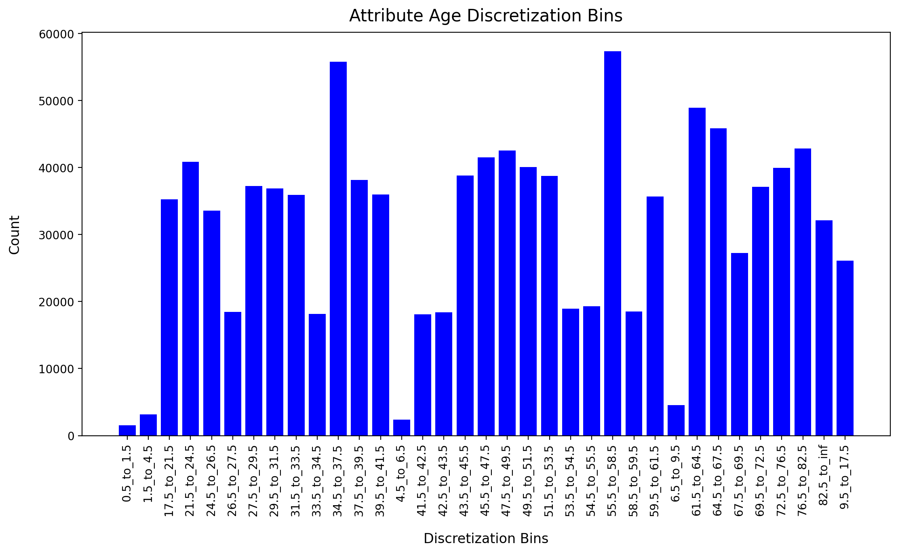

# **Data Mining and Machine Learning**

### Prof. Marcelloni Francesco
### Prof. Ducange Pietro
---

# **Classifier for predicting COVID-19 patients hospitalization based on medical preconditions**

### The scientific community and infection control agencies face enormous challenges in controlling the increasing intensity of the COVID-19 pandemic: the disease has spread rapidly around the world.

### Machine learning is simply making healthcare smarter. This powerful subset of artificial intelligence has demonstrated truly life-impacting potential in healthcare – particularly in the area of medical diagnosis. Previous studies showed that patients who were elderly and had diabetes, cardiovascular disease, chronic respiratory diseases, or cancer presented an increased risk for COVID-19-related mortality worldwide. The rapid global spread of the virus SARS-CoV-2 has provoked a spike in demand for hospital care. Hospital systems across the world have been over-extended, including the one case we are most familiar with, Northern Italy. As a result, decisions on how to best **allocate very limited medical resources** have come to the forefront: who to test, who to admit into hospitals, who to treat in an Intensive Care Unit (ICU), who to support with a ventilator. Therefore, I used a **Random Forest** prediction model based on the outcomes of COVID-19 patients to predict the likelihood of:
### 1. **Hospitalization**
### 2. **Intubation**
### 3. **ICU**
### 4. **Death**

<div style="text-align:center"></div>


```python
# imports and utility functions
import time
import decimal
import imblearn
import itertools
import numpy as np
import pandas as pd
import seaborn as sns
from sklearn import tree
from sklearn import metrics
from sklearn import datasets
from datetime import datetime
from matplotlib import ticker
from collections import Counter
import matplotlib.pyplot as plt
from MDLP import MDLP_Discretizer
from IPython.core.display import HTML
from pomegranate import BayesianNetwork
from IPython.display import display_html
from sklearn.metrics import roc_auc_score
from sklearn.model_selection import KFold
from sklearn.feature_selection import chi2
from sklearn.naive_bayes import GaussianNB
from sklearn.metrics import confusion_matrix
from sklearn.naive_bayes import CategoricalNB
from IPython.display import Markdown, display
from sklearn.ensemble import AdaBoostClassifier
from sklearn.metrics import classification_report
from sklearn.metrics import plot_confusion_matrix
from sklearn.model_selection import StratifiedKFold
from sklearn.ensemble import RandomForestClassifier
from sklearn.model_selection import train_test_split
from imblearn.under_sampling import RandomUnderSampler
from sklearn.feature_selection import mutual_info_classif

# displays pandas dataframes side by side
def tables_side_by_side(*args):
    html_str = ''
    for df in args:
        html_str += df.to_html()
    display_html(html_str.replace('table', 'table style="display:inline;"'), raw=True)

# parses dates with different formats
def multiformat_date_parse(text):
    for fmt in ('%Y-%m-%d', '9999-99-99'):
        try:
            return datetime.strptime(text, fmt)
        except ValueError:
            pass
    raise ValueError('No valid date format found.')

# utility function for plotting
def autolabel(rects, xpos='center'):
    ha = {'center': 'center', 'right': 'left', 'left': 'right'}
    offset = {'center': 0, 'right': 1, 'left': -1}

    for rect in rects:
        height = rect.get_height()
        ax.annotate('{}'.format(height),
                    xy=(rect.get_x() + rect.get_width() / 2, height),
                    xytext=(offset[xpos]*3, 3),
                    textcoords="offset points",
                    ha=ha[xpos], va='bottom', rotation='vertical')

# plots the confusion matrix
def generate_confusion_matrix(cnf_matrix, classes, normalize=False, title='Confusion matrix'):
    if normalize:
        cnf_matrix = cnf_matrix.astype('float') / cnf_matrix.sum(axis=1)[:, np.newaxis]
        print("Normalized confusion matrix")
    else:
        print('Confusion matrix, without normalization')

    plt.imshow(cnf_matrix, interpolation='nearest', cmap=plt.get_cmap('Blues'))
    plt.title(title)
    plt.colorbar()

    tick_marks = np.arange(len(classes))
    plt.xticks(tick_marks, classes, rotation=45)
    plt.yticks(tick_marks, classes)

    fmt = '.2%' if normalize else 'f'
    thresh = cnf_matrix.max() / 2.

    for i, j in itertools.product(range(cnf_matrix.shape[0]), range(cnf_matrix.shape[1])):
        plt.text(j, i, format(cnf_matrix[i, j], fmt), horizontalalignment="center",
                 color="white" if cnf_matrix[i, j] > thresh else "black")

    plt.tight_layout()
    plt.ylabel('True label')
    plt.xlabel('Predicted label')

    return cnf_matrix
```

# **Dataset**

### The dataset required for such type of analysis was not easy to find: usually COVID-19 datasets only contain daily values (numbers) of confirmed cases and deaths. They rarely come equipped with the medical preconditions of the patients. Luckily, the Federal government of Mexico provided such a dataset. It is splitted in three main files:
### **1. COVID19MEXICO.csv:** the main data file containing, among others, patients sex, age, admission date, COVID-19 test result; if the patient required hospitalization, intubation or Intensive care unit (ICU); if the patient was affected also by Pneumonia, Diabetes, Asthma, Hypertension, Cardiovascular disease (CVD), Immunosuppression, etc...;


```python
# dataset visualization
dateparse = lambda x: datetime.strptime(x, '%Y-%m-%d')
data = pd.read_csv("./datasets/COVID19MEXICO.csv", parse_dates=['FECHA_ACTUALIZACION', 'FECHA_INGRESO', 'FECHA_SINTOMAS'], date_parser=dateparse, dtype={'ID_REGISTRO': 'string', 'PAIS_ORIGEN': 'string', 'FECHA_DEF': 'string', 'ORIGEN': 'string', 'SECTOR': 'string', 'ENTIDAD_UM': 'string', 'SEXO': 'string', 'ENTIDAD_NAC': 'string', 'ENTIDAD_RES': 'string', 'MUNICIPIO_RES': 'string', 'TIPO_PACIENTE': 'string', 'INTUBADO': 'string', 'NEUMONIA': 'string', 'NACIONALIDAD': 'string', 'EMBARAZO': 'string', 'HABLA_LENGUA_INDIG': 'string', 'INDIGENA': 'string', 'DIABETES': 'string', 'EPOC': 'string', 'ASMA': 'string', 'INMUSUPR': 'string', 'HIPERTENSION': 'string', 'OTRA_COM': 'string', 'CARDIOVASCULAR': 'string', 'OBESIDAD': 'string', 'RENAL_CRONICA': 'string', 'TABAQUISMO': 'string', 'OTRO_CASO': 'string', 'TOMA_MUESTRA_LAB': 'string', 'RESULTADO_LAB': 'string', 'TOMA_MUESTRA_ANTIGENO': 'string', 'RESULTADO_ANTIGENO': 'string', 'CLASIFICACION_FINAL': 'string', 'MIGRANTE': 'string', 'PAIS_NACIONALIDAD': 'string', 'PAIS_ORIGEN': 'string', 'UCI': 'string'})
data
```


<div>
<style scoped>
    .dataframe tbody tr th:only-of-type {
        vertical-align: middle;
    }

    .dataframe tbody tr th {
        vertical-align: top;
    }

    .dataframe thead th {
        text-align: right;
    }
</style>
<table border="1" class="dataframe">
  <thead>
    <tr style="text-align: right;">
      <th></th>
      <th>FECHA_ACTUALIZACION</th>
      <th>ID_REGISTRO</th>
      <th>ORIGEN</th>
      <th>SECTOR</th>
      <th>ENTIDAD_UM</th>
      <th>SEXO</th>
      <th>ENTIDAD_NAC</th>
      <th>ENTIDAD_RES</th>
      <th>MUNICIPIO_RES</th>
      <th>TIPO_PACIENTE</th>
      <th>...</th>
      <th>OTRO_CASO</th>
      <th>TOMA_MUESTRA_LAB</th>
      <th>RESULTADO_LAB</th>
      <th>TOMA_MUESTRA_ANTIGENO</th>
      <th>RESULTADO_ANTIGENO</th>
      <th>CLASIFICACION_FINAL</th>
      <th>MIGRANTE</th>
      <th>PAIS_NACIONALIDAD</th>
      <th>PAIS_ORIGEN</th>
      <th>UCI</th>
    </tr>
  </thead>
  <tbody>
    <tr>
      <th>0</th>
      <td>2021-09-11</td>
      <td>z482b8</td>
      <td>2</td>
      <td>12</td>
      <td>09</td>
      <td>2</td>
      <td>09</td>
      <td>09</td>
      <td>012</td>
      <td>1</td>
      <td>...</td>
      <td>2</td>
      <td>2</td>
      <td>97</td>
      <td>2</td>
      <td>97</td>
      <td>1</td>
      <td>99</td>
      <td>México</td>
      <td>97</td>
      <td>97</td>
    </tr>
    <tr>
      <th>1</th>
      <td>2021-09-11</td>
      <td>z49a69</td>
      <td>1</td>
      <td>12</td>
      <td>23</td>
      <td>1</td>
      <td>23</td>
      <td>23</td>
      <td>004</td>
      <td>2</td>
      <td>...</td>
      <td>1</td>
      <td>2</td>
      <td>97</td>
      <td>2</td>
      <td>97</td>
      <td>2</td>
      <td>99</td>
      <td>México</td>
      <td>97</td>
      <td>1</td>
    </tr>
    <tr>
      <th>2</th>
      <td>2021-09-11</td>
      <td>z23d9d</td>
      <td>1</td>
      <td>12</td>
      <td>22</td>
      <td>2</td>
      <td>24</td>
      <td>22</td>
      <td>009</td>
      <td>1</td>
      <td>...</td>
      <td>2</td>
      <td>2</td>
      <td>97</td>
      <td>2</td>
      <td>97</td>
      <td>6</td>
      <td>99</td>
      <td>México</td>
      <td>97</td>
      <td>97</td>
    </tr>
    <tr>
      <th>3</th>
      <td>2021-09-11</td>
      <td>z24953</td>
      <td>1</td>
      <td>12</td>
      <td>09</td>
      <td>1</td>
      <td>09</td>
      <td>09</td>
      <td>010</td>
      <td>1</td>
      <td>...</td>
      <td>1</td>
      <td>1</td>
      <td>2</td>
      <td>2</td>
      <td>97</td>
      <td>7</td>
      <td>99</td>
      <td>México</td>
      <td>97</td>
      <td>97</td>
    </tr>
    <tr>
      <th>4</th>
      <td>2021-09-11</td>
      <td>zz8e77</td>
      <td>2</td>
      <td>12</td>
      <td>09</td>
      <td>2</td>
      <td>09</td>
      <td>09</td>
      <td>002</td>
      <td>1</td>
      <td>...</td>
      <td>2</td>
      <td>2</td>
      <td>97</td>
      <td>2</td>
      <td>97</td>
      <td>6</td>
      <td>99</td>
      <td>México</td>
      <td>97</td>
      <td>97</td>
    </tr>
    <tr>
      <th>...</th>
      <td>...</td>
      <td>...</td>
      <td>...</td>
      <td>...</td>
      <td>...</td>
      <td>...</td>
      <td>...</td>
      <td>...</td>
      <td>...</td>
      <td>...</td>
      <td>...</td>
      <td>...</td>
      <td>...</td>
      <td>...</td>
      <td>...</td>
      <td>...</td>
      <td>...</td>
      <td>...</td>
      <td>...</td>
      <td>...</td>
      <td>...</td>
    </tr>
    <tr>
      <th>10181672</th>
      <td>2021-09-11</td>
      <td>m1acf43</td>
      <td>2</td>
      <td>12</td>
      <td>15</td>
      <td>2</td>
      <td>15</td>
      <td>15</td>
      <td>999</td>
      <td>1</td>
      <td>...</td>
      <td>99</td>
      <td>2</td>
      <td>97</td>
      <td>1</td>
      <td>1</td>
      <td>3</td>
      <td>99</td>
      <td>México</td>
      <td>97</td>
      <td>97</td>
    </tr>
    <tr>
      <th>10181673</th>
      <td>2021-09-11</td>
      <td>m00a379</td>
      <td>2</td>
      <td>12</td>
      <td>15</td>
      <td>2</td>
      <td>15</td>
      <td>15</td>
      <td>999</td>
      <td>1</td>
      <td>...</td>
      <td>99</td>
      <td>2</td>
      <td>97</td>
      <td>1</td>
      <td>1</td>
      <td>3</td>
      <td>99</td>
      <td>México</td>
      <td>97</td>
      <td>97</td>
    </tr>
    <tr>
      <th>10181674</th>
      <td>2021-09-11</td>
      <td>m074e50</td>
      <td>2</td>
      <td>12</td>
      <td>15</td>
      <td>1</td>
      <td>15</td>
      <td>15</td>
      <td>999</td>
      <td>1</td>
      <td>...</td>
      <td>99</td>
      <td>2</td>
      <td>97</td>
      <td>1</td>
      <td>2</td>
      <td>7</td>
      <td>99</td>
      <td>México</td>
      <td>97</td>
      <td>97</td>
    </tr>
    <tr>
      <th>10181675</th>
      <td>2021-09-11</td>
      <td>m11d2cb</td>
      <td>2</td>
      <td>12</td>
      <td>15</td>
      <td>2</td>
      <td>15</td>
      <td>15</td>
      <td>999</td>
      <td>1</td>
      <td>...</td>
      <td>99</td>
      <td>1</td>
      <td>3</td>
      <td>2</td>
      <td>97</td>
      <td>6</td>
      <td>99</td>
      <td>México</td>
      <td>97</td>
      <td>97</td>
    </tr>
    <tr>
      <th>10181676</th>
      <td>2021-09-11</td>
      <td>m1813dd</td>
      <td>2</td>
      <td>3</td>
      <td>15</td>
      <td>2</td>
      <td>15</td>
      <td>15</td>
      <td>999</td>
      <td>1</td>
      <td>...</td>
      <td>99</td>
      <td>2</td>
      <td>97</td>
      <td>1</td>
      <td>1</td>
      <td>3</td>
      <td>99</td>
      <td>México</td>
      <td>97</td>
      <td>97</td>
    </tr>
  </tbody>
</table>
<p>10181677 rows × 40 columns</p>
</div>


### **2. Descriptores.xlsx:** contains additional clarifications regarding each feature;


```python
# dataset visualization
descriptores = pd.read_excel("./datasets/Descriptores.xlsx")
descriptores.tail(5)
```


<div>
<style scoped>
    .dataframe tbody tr th:only-of-type {
        vertical-align: middle;
    }

    .dataframe tbody tr th {
        vertical-align: top;
    }

    .dataframe thead th {
        text-align: right;
    }
</style>
<table border="1" class="dataframe">
  <thead>
    <tr style="text-align: right;">
      <th></th>
      <th>Nº</th>
      <th>NOMBRE DE VARIABLE</th>
      <th>DESCRIPCIÓN DE VARIABLE</th>
      <th>FORMATO O FUENTE</th>
    </tr>
  </thead>
  <tbody>
    <tr>
      <th>35</th>
      <td>36</td>
      <td>CLASIFICACION_FINAL</td>
      <td>Identifica si el paciente es un caso de COVID-...</td>
      <td>CATÁLOGO: CLASIFICACION_FINAL</td>
    </tr>
    <tr>
      <th>36</th>
      <td>37</td>
      <td>MIGRANTE</td>
      <td>Identifica si el paciente es una persona migra...</td>
      <td>CATÁLOGO: SI_ NO                              ...</td>
    </tr>
    <tr>
      <th>37</th>
      <td>38</td>
      <td>PAIS_NACIONALIDAD</td>
      <td>Identifica la nacionalidad del paciente.</td>
      <td>TEXTO, 99= SE IGNORA</td>
    </tr>
    <tr>
      <th>38</th>
      <td>39</td>
      <td>PAIS_ORIGEN</td>
      <td>Identifica el país del que partió el paciente ...</td>
      <td>TEXTO, 97= NO APLICA</td>
    </tr>
    <tr>
      <th>39</th>
      <td>40</td>
      <td>UCI</td>
      <td>Identifica si el paciente requirió ingresar a ...</td>
      <td>CATÁLOGO: SI_ NO                              ...</td>
    </tr>
  </tbody>
</table>
</div>


### **3. Catalogos.xlsx:** contains additional clarifications regarding the possible values for each feature.


```python
# dataset visualization
catalogos_si_no = pd.read_excel("./datasets/Catalogos.xlsx", "Catálogo SI_NO")
catalogos_sexo = pd.read_excel("./datasets/Catalogos.xlsx", "Catálogo SEXO")
catalogos_lab = pd.read_excel("./datasets/Catalogos.xlsx", "Catálogo RESULTADO_LAB")
catalogos_antigeno = pd.read_excel("./datasets/Catalogos.xlsx", "Catálogo RESULTADO_ANTIGENO")
catalogos_paciente = pd.read_excel("./datasets/Catalogos.xlsx", "Catálogo TIPO_PACIENTE")
tables_side_by_side(catalogos_si_no, catalogos_sexo, catalogos_lab, catalogos_antigeno, catalogos_paciente)
```


<table style="display:inline;" border="1" class="dataframe">
  <thead>
    <tr style="text-align: right;">
      <th></th>
      <th>CLAVE</th>
      <th>DESCRIPCIÓN</th>
    </tr>
  </thead>
  <tbody>
    <tr>
      <th>0</th>
      <td>1</td>
      <td>SI</td>
    </tr>
    <tr>
      <th>1</th>
      <td>2</td>
      <td>NO</td>
    </tr>
    <tr>
      <th>2</th>
      <td>97</td>
      <td>NO APLICA</td>
    </tr>
    <tr>
      <th>3</th>
      <td>98</td>
      <td>SE IGNORA</td>
    </tr>
    <tr>
      <th>4</th>
      <td>99</td>
      <td>NO ESPECIFICADO</td>
    </tr>
  </tbody>
</table style="display:inline;"><table style="display:inline;" border="1" class="dataframe">
  <thead>
    <tr style="text-align: right;">
      <th></th>
      <th>CLAVE</th>
      <th>DESCRIPCIÓN</th>
    </tr>
  </thead>
  <tbody>
    <tr>
      <th>0</th>
      <td>1</td>
      <td>MUJER</td>
    </tr>
    <tr>
      <th>1</th>
      <td>2</td>
      <td>HOMBRE</td>
    </tr>
    <tr>
      <th>2</th>
      <td>99</td>
      <td>NO ESPECIFICADO</td>
    </tr>
  </tbody>
</table style="display:inline;"><table style="display:inline;" border="1" class="dataframe">
  <thead>
    <tr style="text-align: right;">
      <th></th>
      <th>Unnamed: 0</th>
      <th>Unnamed: 1</th>
    </tr>
  </thead>
  <tbody>
    <tr>
      <th>0</th>
      <td>CLAVE</td>
      <td>DESCRIPCIÓN</td>
    </tr>
    <tr>
      <th>1</th>
      <td>1</td>
      <td>POSITIVO A SARS-COV-2</td>
    </tr>
    <tr>
      <th>2</th>
      <td>2</td>
      <td>NO POSITIVO A SARS-COV-2</td>
    </tr>
    <tr>
      <th>3</th>
      <td>3</td>
      <td>RESULTADO PENDIENTE</td>
    </tr>
    <tr>
      <th>4</th>
      <td>4</td>
      <td>RESULTADO NO ADECUADO</td>
    </tr>
    <tr>
      <th>5</th>
      <td>97</td>
      <td>NO APLICA (CASO SIN MUESTRA)</td>
    </tr>
  </tbody>
</table style="display:inline;"><table style="display:inline;" border="1" class="dataframe">
  <thead>
    <tr style="text-align: right;">
      <th></th>
      <th>Unnamed: 0</th>
      <th>Unnamed: 1</th>
    </tr>
  </thead>
  <tbody>
    <tr>
      <th>0</th>
      <td>CLAVE</td>
      <td>DESCRIPCIÓN</td>
    </tr>
    <tr>
      <th>1</th>
      <td>1</td>
      <td>POSITIVO A SARS-COV-2</td>
    </tr>
    <tr>
      <th>2</th>
      <td>2</td>
      <td>NEGATIVO A SARS-COV-2</td>
    </tr>
    <tr>
      <th>3</th>
      <td>97</td>
      <td>NO APLICA (CASO SIN MUESTRA)</td>
    </tr>
  </tbody>
</table style="display:inline;"><table style="display:inline;" border="1" class="dataframe">
  <thead>
    <tr style="text-align: right;">
      <th></th>
      <th>CLAVE</th>
      <th>DESCRIPCIÓN</th>
    </tr>
  </thead>
  <tbody>
    <tr>
      <th>0</th>
      <td>1</td>
      <td>AMBULATORIO</td>
    </tr>
    <tr>
      <th>1</th>
      <td>2</td>
      <td>HOSPITALIZADO</td>
    </tr>
    <tr>
      <th>2</th>
      <td>99</td>
      <td>NO ESPECIFICADO</td>
    </tr>
  </tbody>
</table style="display:inline;">


```python
# print dataset info
data.info(verbose = True)
```

    <class 'pandas.core.frame.DataFrame'>
    RangeIndex: 10181677 entries, 0 to 10181676
    Data columns (total 40 columns):
     #   Column                 Dtype         
    ---  ------                 -----         
     0   FECHA_ACTUALIZACION    datetime64[ns]
     1   ID_REGISTRO            string        
     2   ORIGEN                 string        
     3   SECTOR                 string        
     4   ENTIDAD_UM             string        
     5   SEXO                   string        
     6   ENTIDAD_NAC            string        
     7   ENTIDAD_RES            string        
     8   MUNICIPIO_RES          string        
     9   TIPO_PACIENTE          string        
     10  FECHA_INGRESO          datetime64[ns]
     11  FECHA_SINTOMAS         datetime64[ns]
     12  FECHA_DEF              string        
     13  INTUBADO               string        
     14  NEUMONIA               string        
     15  EDAD                   int64         
     16  NACIONALIDAD           string        
     17  EMBARAZO               string        
     18  HABLA_LENGUA_INDIG     string        
     19  INDIGENA               string        
     20  DIABETES               string        
     21  EPOC                   string        
     22  ASMA                   string        
     23  INMUSUPR               string        
     24  HIPERTENSION           string        
     25  OTRA_COM               string        
     26  CARDIOVASCULAR         string        
     27  OBESIDAD               string        
     28  RENAL_CRONICA          string        
     29  TABAQUISMO             string        
     30  OTRO_CASO              string        
     31  TOMA_MUESTRA_LAB       string        
     32  RESULTADO_LAB          string        
     33  TOMA_MUESTRA_ANTIGENO  string        
     34  RESULTADO_ANTIGENO     string        
     35  CLASIFICACION_FINAL    string        
     36  MIGRANTE               string        
     37  PAIS_NACIONALIDAD      string        
     38  PAIS_ORIGEN            string        
     39  UCI                    string        
    dtypes: datetime64[ns](3), int64(1), string(36)
    memory usage: 3.0 GB


```python
# plot dataset bar chart to show low interpretability
origen = data[['ORIGEN']].value_counts()
sexo = data[['SEXO']].value_counts()
tipo_paciente = data[['TIPO_PACIENTE']].value_counts()
intubado = data[['INTUBADO']].value_counts()
neumonia = data[['NEUMONIA']].value_counts()
nacionalidad = data[['NACIONALIDAD']].value_counts()
embarazo = data[['EMBARAZO']].value_counts()
habla_lengua_indig = data[['HABLA_LENGUA_INDIG']].value_counts()
renal_cronica = data[['RENAL_CRONICA']].value_counts()

label_1 = (origen['1'], sexo['1'], tipo_paciente['1'], intubado['1'], neumonia['1'], nacionalidad['1'], embarazo['1'], habla_lengua_indig['1'], renal_cronica['1'])
label_2 = (origen['2'], sexo['2'], tipo_paciente['2'], intubado['2'], neumonia['2'], nacionalidad['2'], embarazo['2'], habla_lengua_indig['2'], renal_cronica['2'])
label_97 = (0, 0, 0, intubado['97'], 0, 0, embarazo['97'], 0, 0)
label_98 = (0, 0, 0, 0, 0, 0, embarazo['98'], 0, renal_cronica['98'])
label_99 = (0, 0, 0, intubado['99'], neumonia['99'], 0, embarazo['99'], habla_lengua_indig['99'], 0)

ind = np.arange(len(label_1))
width = 0.15
fig, ax = plt.subplots(figsize=(20, 10), dpi=200, facecolor='w', edgecolor='k')
rects1 = ax.bar(ind - 1.5*width, label_1, width, label='1')
rects2 = ax.bar(ind - width/2, label_2, width, label='2')
rects97 = ax.bar(ind + width/2, label_97, width, label='97')
rects98 = ax.bar(ind + 1.5*width, label_98, width, label='97')
rects99 = ax.bar(ind + 2.5*width, label_99, width, label='99')

ax.set_xticks(ind)
ax.set_xticklabels(('ORIGEN', 'SEXO', 'TIPO_PACIENTE', 'INTUBADO', 'NEUMONIA', 'NACIONALIDAD', 'EMBARAZO', 'HABLA_LENGUA_INDIG', 'RENAL_CRONICA'))
ax.legend(prop={'size': 10})

autolabel(rects1, "center")
autolabel(rects2, "center")
autolabel(rects97, "center")
autolabel(rects98, "center")
autolabel(rects99, "center")

fig.suptitle('Dataset Attributes', fontsize=20, y=0.95)
plt.xlabel('Attributes', fontsize=18, labelpad=20)
plt.ylabel('Count', fontsize=18, labelpad=20)
plt.savefig('plots/dataset_attributes.png', dpi=200, bbox_inches='tight')
plt.show()
```


    

    


```python
# plot dataset attributes types
dtypes_value_counts = data.dtypes.value_counts()
labels = ['Categorical', 'Datetime', 'Integer']
values = dtypes_value_counts.values

fig, ax = plt.subplots(figsize=(4, 4), dpi=200, facecolor='w', edgecolor='k')
ax = fig.add_axes([0,0,1,1])

p1 = ax.bar(labels[0], values[0], color = 'b')
ax.bar_label(p1, label_type='edge', color='black')
p2 = ax.bar(labels[1], values[1], color = 'g')
ax.bar_label(p2, label_type='edge', color='black')
p3 = ax.bar(labels[2], values[2], color = 'r')
ax.bar_label(p3, label_type='edge', color='black')

fig.suptitle('Dataset Attributes', fontsize=15, y=1.06)
plt.xlabel('Attributes Types', fontsize=12, labelpad=6)
plt.ylabel('Count', fontsize=12, labelpad=5)
plt.savefig('plots/dataset_attributes_types.png', dpi=200, bbox_inches='tight')
plt.show()
```


    

    


# **Preprocessing**

### All the files composing the dataset are in Spanish, the de facto national language spoken by the vast majority of Mexicans. Additionally, categorical attributes are encoded by means of integer values. As a final result, the **interpretability** of the entire dataset is extremely low.

# **Data Integration**

### First and foremost data integration and translating from Spanish to English is required. Columns names were translated from Spanish to English and numerical values were mapped to the corresponding categorical labels.


```python
# translate dataset from spanish to english
data.columns = ['last_update_date', 'case_id', 'health_monitoring_unit', 'national_care_institution_type', 'care_institution_location', 'gender', 'place_of_birth', 'place_of_residence',
                'residence_municipality', 'patient_type', 'admission_date', 'symptoms_date', 'deceased', 'intubation', 'pneumonia', 'age', 'mexican', 'pregnancy',
                'speaks_indigenous_language', 'indigenous_person', 'diabetes', 'copd', 'asthma', 'immunosuppression', 'hypertension', 'other_diseases', 'cardiovascular_disease', 'obesity',
                'chronic_kidney_disease', 'smoking', 'covid_case_contact', 'lab_test', 'lab_test_result', 'antigen_test', 'antigen_test_result', 'final_covid_classification', 'migrant',
                'nationality', 'country_of_origin', 'icu']

# data integration
data['health_monitoring_unit'] = data['health_monitoring_unit'].map({'1': 'RDMHUS', '2': 'NO-RDMHUS', '99': 'UNKNOWN'})

data['national_care_institution_type'] = data['national_care_institution_type'].map({'1': 'RED-CROSS', '2': 'DIF', '3': 'GOVERNMENTAL', '4': 'IMSS', '5': 'IMSS-WELLNESS', '6': 'ISSSTE', '7': 'MUNICIPAL', '8': 'PEMEX', '9': 'PRIVATE', '10': 'SEDENA', '11': 'SEMAR', '12': 'SSA', '13': 'ACADEMIC', '99': 'UNKNOWN'})

data['care_institution_location'] = data['care_institution_location'].map({'01': 'AGUASCALIENTES', '02': 'BAJA CALIFORNIA', '03': 'BAJA CALIFORNIA SUR', '04': 'CAMPECHE', '05': 'COAHUILA DE ZARAGOZA', '06': 'COLIMA', '07': 'CHIAPAS', '08': 'CHIHUAHUA', '09': 'CIUDAD DE MÉXICO', '10': 'DURANGO', '11': 'GUANAJUATO', '12': 'GUERRERO', '13': 'HIDALGO', '14': 'JALISCO', '15': 'MÉXICO', '16': 'MICHOACÁN DE OCAMPO', '17': 'MORELOS', '18': 'NAYARIT', '19': 'NUEVO LEÓN', '20': 'OAXACA', '21': 'PUEBLA', '22': 'QUERÉTARO', '23': 'QUINTANA ROO', '24': 'SAN LUIS POTOSÍ', '25': 'SINALOA', '26': 'SONORA', '27': 'TABASCO', '28': 'TAMAULIPAS', '29': 'TLAXCALA', '30': 'VERACRUZ DE IGNACIO DE LA LLAVE', '31': 'YUCATÁN', '32': 'ZACATECAS', '36': 'ESTADOS UNIDOS MEXICANOS', '97': 'NOT-APPLICABLE', '98': 'UNKNOWN', '99': 'UNKNOWN'})

data['gender'] = data['gender'].map({'1': 'FEMALE', '2': 'MALE', '99': 'UNKNOWN'})

data['place_of_birth'] = data['place_of_birth'].map({'01': 'AGUASCALIENTES', '02': 'BAJA CALIFORNIA', '03': 'BAJA CALIFORNIA SUR', '04': 'CAMPECHE', '05': 'COAHUILA DE ZARAGOZA', '06': 'COLIMA', '07': 'CHIAPAS', '08': 'CHIHUAHUA', '09': 'CIUDAD DE MÉXICO', '10': 'DURANGO', '11': 'GUANAJUATO', '12': 'GUERRERO', '13': 'HIDALGO', '14': 'JALISCO', '15': 'MÉXICO', '16': 'MICHOACÁN DE OCAMPO', '17': 'MORELOS', '18': 'NAYARIT', '19': 'NUEVO LEÓN', '20': 'OAXACA', '21': 'PUEBLA', '22': 'QUERÉTARO', '23': 'QUINTANA ROO', '24': 'SAN LUIS POTOSÍ', '25': 'SINALOA', '26': 'SONORA', '27': 'TABASCO', '28': 'TAMAULIPAS', '29': 'TLAXCALA', '30': 'VERACRUZ DE IGNACIO DE LA LLAVE', '31': 'YUCATÁN', '32': 'ZACATECAS', '36': 'ESTADOS UNIDOS MEXICANOS', '97': 'NOT-APPLICABLE', '98': 'UNKNOWN', '99': 'UNKNOWN'})

data['place_of_residence'] = data['place_of_residence'].map({'01': 'AGUASCALIENTES', '02': 'BAJA CALIFORNIA', '03': 'BAJA CALIFORNIA SUR', '04': 'CAMPECHE', '05': 'COAHUILA DE ZARAGOZA', '06': 'COLIMA', '07': 'CHIAPAS', '08': 'CHIHUAHUA', '09': 'CIUDAD DE MÉXICO', '10': 'DURANGO', '11': 'GUANAJUATO', '12': 'GUERRERO', '13': 'HIDALGO', '14': 'JALISCO', '15': 'MÉXICO', '16': 'MICHOACÁN DE OCAMPO', '17': 'MORELOS', '18': 'NAYARIT', '19': 'NUEVO LEÓN', '20': 'OAXACA', '21': 'PUEBLA', '22': 'QUERÉTARO', '23': 'QUINTANA ROO', '24': 'SAN LUIS POTOSÍ', '25': 'SINALOA', '26': 'SONORA', '27': 'TABASCO', '28': 'TAMAULIPAS', '29': 'TLAXCALA', '30': 'VERACRUZ DE IGNACIO DE LA LLAVE', '31': 'YUCATÁN', '32': 'ZACATECAS', '36': 'ESTADOS UNIDOS MEXICANOS', '97': 'NOT-APPLICABLE', '98': 'UNKNOWN', '99': 'UNKNOWN'})
```


```python
# residence_municipality data integration
```


```python
# data integration
data['patient_type'] = data['patient_type'].map({'1': 'NOT-HOSPITALIZED', '2': 'HOSPITALIZED', '99': 'UNKNOWN'})
data['deceased'] = data['deceased'].map(lambda x: x != '9999-99-99')
data['intubation'] = data['intubation'].map({'1': 'YES', '2': 'NO', '97': 'NOT-APPLICABLE', '98': 'UNKNOWN', '99': 'UNKNOWN'})
data['pneumonia'] = data['pneumonia'].map({'1': 'YES', '2': 'NO', '97': 'NOT-APPLICABLE', '98': 'UNKNOWN', '99': 'UNKNOWN'})
data['mexican'] = data['mexican'].map({'1': 'MEXICAN', '2': 'FOREIGNER', '99': 'UNKNOWN'})
data['pregnancy'] = data['pregnancy'].map({'1': 'YES', '2': 'NO', '97': 'NOT-APPLICABLE', '98': 'UNKNOWN', '99': 'UNKNOWN'})
data['speaks_indigenous_language'] = data['speaks_indigenous_language'].map({'1': 'YES', '2': 'NO', '97': 'NOT-APPLICABLE', '98': 'UNKNOWN', '99': 'UNKNOWN'})
data['indigenous_person'] = data['indigenous_person'].map({'1': 'YES', '2': 'NO', '97': 'NOT-APPLICABLE', '98': 'UNKNOWN', '99': 'UNKNOWN'})
data['diabetes'] = data['diabetes'].map({'1': 'YES', '2': 'NO', '97': 'NOT-APPLICABLE', '98': 'UNKNOWN', '99': 'UNKNOWN'})
data['copd'] = data['copd'].map({'1': 'YES', '2': 'NO', '97': 'NOT-APPLICABLE', '98': 'UNKNOWN', '99': 'UNKNOWN'})
data['asthma'] = data['asthma'].map({'1': 'YES', '2': 'NO', '97': 'NOT-APPLICABLE', '98': 'UNKNOWN', '99': 'UNKNOWN'})
data['immunosuppression'] = data['immunosuppression'].map({'1': 'YES', '2': 'NO', '97': 'NOT-APPLICABLE', '98': 'UNKNOWN', '99': 'UNKNOWN'})
data['hypertension'] = data['hypertension'].map({'1': 'YES', '2': 'NO', '97': 'NOT-APPLICABLE', '98': 'UNKNOWN', '99': 'UNKNOWN'})
data['other_diseases'] = data['other_diseases'].map({'1': 'YES', '2': 'NO', '97': 'NOT-APPLICABLE', '98': 'UNKNOWN', '99': 'UNKNOWN'})
data['cardiovascular_disease'] = data['cardiovascular_disease'].map({'1': 'YES', '2': 'NO', '97': 'NOT-APPLICABLE', '98': 'UNKNOWN', '99': 'UNKNOWN'})
data['obesity'] = data['obesity'].map({'1': 'YES', '2': 'NO', '97': 'NOT-APPLICABLE', '98': 'UNKNOWN', '99': 'UNKNOWN'})
data['chronic_kidney_disease'] = data['chronic_kidney_disease'].map({'1': 'YES', '2': 'NO', '97': 'NOT-APPLICABLE', '98': 'UNKNOWN', '99': 'UNKNOWN'})
data['smoking'] = data['smoking'].map({'1': 'YES', '2': 'NO', '97': 'NOT-APPLICABLE', '98': 'UNKNOWN', '99': 'UNKNOWN'})
data['covid_case_contact'] = data['covid_case_contact'].map({'1': 'YES', '2': 'NO', '97': 'NOT-APPLICABLE', '98': 'UNKNOWN', '99': 'UNKNOWN'})
data['lab_test'] = data['lab_test'].map({'1': 'YES', '2': 'NO', '97': 'NOT-APPLICABLE', '98': 'UNKNOWN', '99': 'UNKNOWN'})
data['lab_test_result'] = data['lab_test_result'].map({'1': 'SARS-COV-2-POSITIVE', '2': 'SARS-COV-2-NEGATIVE', '3': 'UNKNOWN', '4': 'UNKNOWN', '97': 'NOT-APPLICABLE'})
data['antigen_test'] = data['antigen_test'].map({'1': 'YES', '2': 'NO', '97': 'NOT-APPLICABLE', '98': 'UNKNOWN', '99': 'UNKNOWN'})
data['antigen_test_result'] = data['antigen_test_result'].map({'1': 'SARS-COV-2-POSITIVE', '2': 'SARS-COV-2-NEGATIVE', '97': 'NOT-APPLICABLE'})
data['final_covid_classification'] = data['final_covid_classification'].map({'1': 'SARS-COV-2-POSITIVE', '2': 'SARS-COV-2-POSITIVE', '3': 'SARS-COV-2-POSITIVE', '4': 'SARS-COV-2-NEGATIVE', '5': 'SARS-COV-2-NEGATIVE', '6': 'SARS-COV-2-NEGATIVE', '7': 'SARS-COV-2-NEGATIVE'})
data['migrant'] = data['migrant'].map({'1': 'YES', '2': 'NO', '97': 'NOT-APPLICABLE', '98': 'UNKNOWN', '99': 'UNKNOWN'})
data['icu'] = data['icu'].map({'1': 'YES', '2': 'NO', '97': 'NOT-APPLICABLE', '98': 'UNKNOWN', '99': 'UNKNOWN'})

# print dataset info
data.info(verbose = True)
```

    <class 'pandas.core.frame.DataFrame'>
    RangeIndex: 10181677 entries, 0 to 10181676
    Data columns (total 40 columns):
     #   Column                          Dtype         
    ---  ------                          -----         
     0   last_update_date                datetime64[ns]
     1   case_id                         string        
     2   health_monitoring_unit          object        
     3   national_care_institution_type  object        
     4   care_institution_location       object        
     5   gender                          object        
     6   place_of_birth                  object        
     7   place_of_residence              object        
     8   residence_municipality          string        
     9   patient_type                    object        
     10  admission_date                  datetime64[ns]
     11  symptoms_date                   datetime64[ns]
     12  deceased                        bool          
     13  intubation                      object        
     14  pneumonia                       object        
     15  age                             int64         
     16  mexican                         object        
     17  pregnancy                       object        
     18  speaks_indigenous_language      object        
     19  indigenous_person               object        
     20  diabetes                        object        
     21  copd                            object        
     22  asthma                          object        
     23  immunosuppression               object        
     24  hypertension                    object        
     25  other_diseases                  object        
     26  cardiovascular_disease          object        
     27  obesity                         object        
     28  chronic_kidney_disease          object        
     29  smoking                         object        
     30  covid_case_contact              object        
     31  lab_test                        object        
     32  lab_test_result                 object        
     33  antigen_test                    object        
     34  antigen_test_result             object        
     35  final_covid_classification      object        
     36  migrant                         object        
     37  nationality                     string        
     38  country_of_origin               string        
     39  icu                             object        
    dtypes: bool(1), datetime64[ns](3), int64(1), object(31), string(4)
    memory usage: 3.0+ GB


```python
# print dataset
data
```


<div>
<style scoped>
    .dataframe tbody tr th:only-of-type {
        vertical-align: middle;
    }

    .dataframe tbody tr th {
        vertical-align: top;
    }

    .dataframe thead th {
        text-align: right;
    }
</style>
<table border="1" class="dataframe">
  <thead>
    <tr style="text-align: right;">
      <th></th>
      <th>last_update_date</th>
      <th>case_id</th>
      <th>health_monitoring_unit</th>
      <th>national_care_institution_type</th>
      <th>care_institution_location</th>
      <th>gender</th>
      <th>place_of_birth</th>
      <th>place_of_residence</th>
      <th>residence_municipality</th>
      <th>patient_type</th>
      <th>...</th>
      <th>covid_case_contact</th>
      <th>lab_test</th>
      <th>lab_test_result</th>
      <th>antigen_test</th>
      <th>antigen_test_result</th>
      <th>final_covid_classification</th>
      <th>migrant</th>
      <th>nationality</th>
      <th>country_of_origin</th>
      <th>icu</th>
    </tr>
  </thead>
  <tbody>
    <tr>
      <th>0</th>
      <td>2021-09-11</td>
      <td>z482b8</td>
      <td>NO-RDMHUS</td>
      <td>SSA</td>
      <td>CIUDAD DE MÉXICO</td>
      <td>MALE</td>
      <td>CIUDAD DE MÉXICO</td>
      <td>CIUDAD DE MÉXICO</td>
      <td>012</td>
      <td>NOT-HOSPITALIZED</td>
      <td>...</td>
      <td>NO</td>
      <td>NO</td>
      <td>NOT-APPLICABLE</td>
      <td>NO</td>
      <td>NOT-APPLICABLE</td>
      <td>SARS-COV-2-POSITIVE</td>
      <td>UNKNOWN</td>
      <td>México</td>
      <td>97</td>
      <td>NOT-APPLICABLE</td>
    </tr>
    <tr>
      <th>1</th>
      <td>2021-09-11</td>
      <td>z49a69</td>
      <td>RDMHUS</td>
      <td>SSA</td>
      <td>QUINTANA ROO</td>
      <td>FEMALE</td>
      <td>QUINTANA ROO</td>
      <td>QUINTANA ROO</td>
      <td>004</td>
      <td>HOSPITALIZED</td>
      <td>...</td>
      <td>YES</td>
      <td>NO</td>
      <td>NOT-APPLICABLE</td>
      <td>NO</td>
      <td>NOT-APPLICABLE</td>
      <td>SARS-COV-2-POSITIVE</td>
      <td>UNKNOWN</td>
      <td>México</td>
      <td>97</td>
      <td>YES</td>
    </tr>
    <tr>
      <th>2</th>
      <td>2021-09-11</td>
      <td>z23d9d</td>
      <td>RDMHUS</td>
      <td>SSA</td>
      <td>QUERÉTARO</td>
      <td>MALE</td>
      <td>SAN LUIS POTOSÍ</td>
      <td>QUERÉTARO</td>
      <td>009</td>
      <td>NOT-HOSPITALIZED</td>
      <td>...</td>
      <td>NO</td>
      <td>NO</td>
      <td>NOT-APPLICABLE</td>
      <td>NO</td>
      <td>NOT-APPLICABLE</td>
      <td>SARS-COV-2-NEGATIVE</td>
      <td>UNKNOWN</td>
      <td>México</td>
      <td>97</td>
      <td>NOT-APPLICABLE</td>
    </tr>
    <tr>
      <th>3</th>
      <td>2021-09-11</td>
      <td>z24953</td>
      <td>RDMHUS</td>
      <td>SSA</td>
      <td>CIUDAD DE MÉXICO</td>
      <td>FEMALE</td>
      <td>CIUDAD DE MÉXICO</td>
      <td>CIUDAD DE MÉXICO</td>
      <td>010</td>
      <td>NOT-HOSPITALIZED</td>
      <td>...</td>
      <td>YES</td>
      <td>YES</td>
      <td>SARS-COV-2-NEGATIVE</td>
      <td>NO</td>
      <td>NOT-APPLICABLE</td>
      <td>SARS-COV-2-NEGATIVE</td>
      <td>UNKNOWN</td>
      <td>México</td>
      <td>97</td>
      <td>NOT-APPLICABLE</td>
    </tr>
    <tr>
      <th>4</th>
      <td>2021-09-11</td>
      <td>zz8e77</td>
      <td>NO-RDMHUS</td>
      <td>SSA</td>
      <td>CIUDAD DE MÉXICO</td>
      <td>MALE</td>
      <td>CIUDAD DE MÉXICO</td>
      <td>CIUDAD DE MÉXICO</td>
      <td>002</td>
      <td>NOT-HOSPITALIZED</td>
      <td>...</td>
      <td>NO</td>
      <td>NO</td>
      <td>NOT-APPLICABLE</td>
      <td>NO</td>
      <td>NOT-APPLICABLE</td>
      <td>SARS-COV-2-NEGATIVE</td>
      <td>UNKNOWN</td>
      <td>México</td>
      <td>97</td>
      <td>NOT-APPLICABLE</td>
    </tr>
    <tr>
      <th>...</th>
      <td>...</td>
      <td>...</td>
      <td>...</td>
      <td>...</td>
      <td>...</td>
      <td>...</td>
      <td>...</td>
      <td>...</td>
      <td>...</td>
      <td>...</td>
      <td>...</td>
      <td>...</td>
      <td>...</td>
      <td>...</td>
      <td>...</td>
      <td>...</td>
      <td>...</td>
      <td>...</td>
      <td>...</td>
      <td>...</td>
      <td>...</td>
    </tr>
    <tr>
      <th>10181672</th>
      <td>2021-09-11</td>
      <td>m1acf43</td>
      <td>NO-RDMHUS</td>
      <td>SSA</td>
      <td>MÉXICO</td>
      <td>MALE</td>
      <td>MÉXICO</td>
      <td>MÉXICO</td>
      <td>999</td>
      <td>NOT-HOSPITALIZED</td>
      <td>...</td>
      <td>UNKNOWN</td>
      <td>NO</td>
      <td>NOT-APPLICABLE</td>
      <td>YES</td>
      <td>SARS-COV-2-POSITIVE</td>
      <td>SARS-COV-2-POSITIVE</td>
      <td>UNKNOWN</td>
      <td>México</td>
      <td>97</td>
      <td>NOT-APPLICABLE</td>
    </tr>
    <tr>
      <th>10181673</th>
      <td>2021-09-11</td>
      <td>m00a379</td>
      <td>NO-RDMHUS</td>
      <td>SSA</td>
      <td>MÉXICO</td>
      <td>MALE</td>
      <td>MÉXICO</td>
      <td>MÉXICO</td>
      <td>999</td>
      <td>NOT-HOSPITALIZED</td>
      <td>...</td>
      <td>UNKNOWN</td>
      <td>NO</td>
      <td>NOT-APPLICABLE</td>
      <td>YES</td>
      <td>SARS-COV-2-POSITIVE</td>
      <td>SARS-COV-2-POSITIVE</td>
      <td>UNKNOWN</td>
      <td>México</td>
      <td>97</td>
      <td>NOT-APPLICABLE</td>
    </tr>
    <tr>
      <th>10181674</th>
      <td>2021-09-11</td>
      <td>m074e50</td>
      <td>NO-RDMHUS</td>
      <td>SSA</td>
      <td>MÉXICO</td>
      <td>FEMALE</td>
      <td>MÉXICO</td>
      <td>MÉXICO</td>
      <td>999</td>
      <td>NOT-HOSPITALIZED</td>
      <td>...</td>
      <td>UNKNOWN</td>
      <td>NO</td>
      <td>NOT-APPLICABLE</td>
      <td>YES</td>
      <td>SARS-COV-2-NEGATIVE</td>
      <td>SARS-COV-2-NEGATIVE</td>
      <td>UNKNOWN</td>
      <td>México</td>
      <td>97</td>
      <td>NOT-APPLICABLE</td>
    </tr>
    <tr>
      <th>10181675</th>
      <td>2021-09-11</td>
      <td>m11d2cb</td>
      <td>NO-RDMHUS</td>
      <td>SSA</td>
      <td>MÉXICO</td>
      <td>MALE</td>
      <td>MÉXICO</td>
      <td>MÉXICO</td>
      <td>999</td>
      <td>NOT-HOSPITALIZED</td>
      <td>...</td>
      <td>UNKNOWN</td>
      <td>YES</td>
      <td>UNKNOWN</td>
      <td>NO</td>
      <td>NOT-APPLICABLE</td>
      <td>SARS-COV-2-NEGATIVE</td>
      <td>UNKNOWN</td>
      <td>México</td>
      <td>97</td>
      <td>NOT-APPLICABLE</td>
    </tr>
    <tr>
      <th>10181676</th>
      <td>2021-09-11</td>
      <td>m1813dd</td>
      <td>NO-RDMHUS</td>
      <td>GOVERNMENTAL</td>
      <td>MÉXICO</td>
      <td>MALE</td>
      <td>MÉXICO</td>
      <td>MÉXICO</td>
      <td>999</td>
      <td>NOT-HOSPITALIZED</td>
      <td>...</td>
      <td>UNKNOWN</td>
      <td>NO</td>
      <td>NOT-APPLICABLE</td>
      <td>YES</td>
      <td>SARS-COV-2-POSITIVE</td>
      <td>SARS-COV-2-POSITIVE</td>
      <td>UNKNOWN</td>
      <td>México</td>
      <td>97</td>
      <td>NOT-APPLICABLE</td>
    </tr>
  </tbody>
</table>
<p>10181677 rows × 40 columns</p>
</div>


## **Visualizing the dataset after Data Integration and Translation**


```python
# plot data after integration and translation

# pie chart for national_care_institution_type
nci_type = data['national_care_institution_type'].value_counts()
nci_type_labels = 'SSA', 'IMSS', 'PRIVATE', 'ISSSTE', 'GOVERNMENTAL', 'IMSS-WELLNESS', 'PEMEX', 'SEDENA', 'SEMAR', 'ACADEMIC', 'MUNICIPAL', 'DIF', 'RED-CROSS', 'UNKNOWN'
nci_type_sizes = [nci_type['SSA'], nci_type['IMSS'], nci_type['PRIVATE'], nci_type['ISSSTE'], nci_type['GOVERNMENTAL'], nci_type['IMSS-WELLNESS'], nci_type['PEMEX'],
                  nci_type['SEDENA'], nci_type['SEMAR'], nci_type['ACADEMIC'], nci_type['MUNICIPAL'], nci_type['DIF'], nci_type['RED-CROSS'], nci_type['UNKNOWN']]
fig, axes = plt.subplots(figsize=(5, 5), dpi=200, facecolor='w', edgecolor='k')
axes.pie(nci_type_sizes, labels=nci_type_labels, autopct='%1.1f%%', shadow=True, startangle=90)
axes.axis('equal')
axes.legend(prop={'size': 10}, bbox_to_anchor=(0.0, 1.0))
axes.set_title("National Care Institution Type", y=1.05)
plt.savefig('plots/national_care_institution_type_pie.png', dpi=200, bbox_inches='tight')
plt.show()

# pie chart for gender
gender = data['gender'].value_counts()
gender_labels = 'FEMALE (' + str(gender['FEMALE']) + ')', 'MALE (' + str(gender['MALE']) + ')'
gender_sizes = [gender['FEMALE'], gender['MALE']]
fig, axes = plt.subplots(figsize=(5, 5), dpi=200, facecolor='w', edgecolor='k')
axes.pie(gender_sizes, labels=gender_labels, autopct='%1.1f%%', shadow=True, startangle=90)
axes.axis('equal')
axes.legend(prop={'size': 10}, bbox_to_anchor=(0.0, 1.0))
axes.set_title("GENDER")
plt.savefig('plots/gender_pie.png', dpi=200, bbox_inches='tight')
plt.show()

# pie charts for some of the diseases
smoking = data['smoking'].value_counts()
smoking_labels = 'YES (' + str(smoking['YES']) + ')', 'NO (' + str(smoking['NO']) +')', 'UNKNOWN (' + str(smoking['UNKNOWN']) + ')'
smoking_sizes = [smoking['YES'], smoking['NO'], smoking['UNKNOWN']]
fig, axes = plt.subplots(figsize=(5, 5), dpi=200, facecolor='w', edgecolor='k')
axes.pie(smoking_sizes, labels=smoking_labels, autopct='%1.1f%%', shadow=True, startangle=90)
axes.axis('equal')
axes.legend(prop={'size': 10}, bbox_to_anchor=(0.0, 1.0))
axes.set_title("SMOKING HABIT", y=1.05)
plt.savefig('plots/smoking_pie.png', dpi=200, bbox_inches='tight')
plt.show()

ckd = data['chronic_kidney_disease'].value_counts()
ckd_labels = 'YES (' + str(ckd['YES']) + ')', 'NO (' + str(ckd['NO']) +')', 'UNKNOWN (' + str(ckd['UNKNOWN']) + ')'
ckd_sizes = [ckd['YES'], ckd['NO'], ckd['UNKNOWN']]
fig, axes = plt.subplots(figsize=(5, 5), dpi=200, facecolor='w', edgecolor='k')
axes.pie(ckd_sizes, labels=ckd_labels, autopct='%1.1f%%', shadow=True, startangle=90)
axes.axis('equal')
axes.legend(prop={'size': 10}, bbox_to_anchor=(0.0, 1.0))
axes.set_title("CHRONIC KIDNEY DISEASE", y=1.05)
plt.savefig('plots/chronic_kidney_disease_pie.png', dpi=200, bbox_inches='tight')
plt.show()

obesity = data['obesity'].value_counts()
obesity_labels = 'YES (' + str(obesity['YES']) + ')', 'NO (' + str(obesity['NO']) +')', 'UNKNOWN (' + str(obesity['UNKNOWN']) + ')'
obesity_sizes = [obesity['YES'], obesity['NO'], obesity['UNKNOWN']]
fig, axes = plt.subplots(figsize=(5, 5), dpi=200, facecolor='w', edgecolor='k')
axes.pie(obesity_sizes, labels=obesity_labels, autopct='%1.1f%%', shadow=True, startangle=90)
axes.axis('equal')
axes.legend(prop={'size': 10}, bbox_to_anchor = (0.0, 1.0))
axes.set_title("OBESITY", y = 1.05)
plt.savefig('plots/obesity_pie.png', dpi=200, bbox_inches='tight')
plt.show()

diabetes = data['diabetes'].value_counts()
diabetes_labels = 'YES (' + str(diabetes['YES']) + ')', 'NO (' + str(diabetes['NO']) +')', 'UNKNOWN (' + str(diabetes['UNKNOWN']) + ')'
diabetes_sizes = [diabetes['YES'], diabetes['NO'], diabetes['UNKNOWN']]
fig, axes = plt.subplots(figsize=(5, 5), dpi=200, facecolor='w', edgecolor='k')
axes.pie(diabetes_sizes, labels=diabetes_labels, autopct='%1.1f%%', shadow=True, startangle=90)
axes.axis('equal')
axes.legend(prop={'size': 10}, bbox_to_anchor = (0.0, 1.0))
axes.set_title("DIABETES", y = 1.05)
plt.savefig('plots/diabetes_pie.png', dpi=200, bbox_inches='tight')
plt.show()
```


    

    


    

    


    

    


    

    


    

    


    

    


```python
# pie chart with exploded SARS-COV-2-POSITIVE group
final_class = data['final_covid_classification'].value_counts()
final_class_labels = 'SARS-COV-2-POSITIVE (' + str(final_class['SARS-COV-2-POSITIVE']) + ')', 'SARS-COV-2-NEGATIVE (' + str(final_class['SARS-COV-2-NEGATIVE']) + ')'
final_class_sizes = [final_class['SARS-COV-2-POSITIVE'], final_class['SARS-COV-2-NEGATIVE']]
explode = (0.1, 0)
fig, axes = plt.subplots(figsize=(5, 5), dpi=200, facecolor='w', edgecolor='k')
axes.pie(final_class_sizes, explode=explode, labels=final_class_labels, autopct='%1.1f%%', shadow=True, startangle=90)
axes.axis('equal')
axes.legend(prop={'size': 10}, bbox_to_anchor=(0.0, 1.0))
axes.set_title("FINAL CLASSIFICATION", y=1.05)
plt.savefig('plots/final_covid_classification_pie.png', dpi=200, bbox_inches='tight')
plt.show()
```


    

    


### We are interested in analysing patients labeled as SARS-COV-2-POSITIVE in order to predict the need for hospitalization. We will therefore be focusing on more or less 34% of the original dataset.


```python
# boxplot age to identify possible outliers based on age
fig, axes = plt.subplots(figsize=(9, 9), dpi=200, facecolor='w', edgecolor='k')
axes.boxplot(data['age'])
axes.set_title("AGE Boxplot", y=1.01)
plt.savefig('plots/age_boxplot.png', dpi=200, bbox_inches='tight')
plt.show()
```


    

    


### The **age** attribute is the only numerical attribute in the dataset. A Boxplot was used in order to point out possible outliers. Given that the mexican population has a life expectancy of 74,99 years, and that in Mexico there are no more than 15 supercentenarian, records with an age higher than 105 were removed.

# **Data Cleaning**

### There are not many missing values in the dataset. If proper details are not provided regarding a patient age, gender, nationality or medical preconditions, the **NOT APPLICABLE**, **UNKNOWN**, **NOT SPECIFIED** labels are used. For our purposes, data points with **UNKNOWN** and **NOT SPECIFIED** are to be handled. There is no proper way of replacing these missing values. You can not use a patient medical preconditions to predict his age or nationality, trying to build models to predict missing preconditions data would result extremely time consuming and not even so precise at the end. Given the huge size of the dataset, the choice was made to remove patients records with missing data.


```python
# store initial data records count before data cleaning
initial_records_count = len(data)

# remove patients with unknown gender
data = data[data['gender'] != 'UNKNOWN']

# remove patients with unknown hospitalization/home-care
data = data[data['patient_type'] != 'UNKNOWN']

# remove patients with unknown intubation
data = data[data['intubation'] != 'UNKNOWN']

# remove patients with unknown pneumonia
data = data[data['pneumonia'] != 'UNKNOWN']

# remove patients with inaccurate age
data = data[data['age'] >= 0]
data = data[data['age'] <= 100]

# remove patients with unknown pregnancy
data = data[data['pregnancy'] != 'UNKNOWN']

# remove patients with unknown diabetes
data = data[data['diabetes'] != 'UNKNOWN']

# remove patients with unknown COPD
data = data[data['copd'] != 'UNKNOWN']

# remove patients with unknown asthma
data = data[data['asthma'] != 'UNKNOWN']

# remove patients with unknown immunodeficiency
data = data[data['immunosuppression'] != 'UNKNOWN']

# remove patients with unknown hypertension
data = data[data['hypertension'] != 'UNKNOWN']

# remove patients with unknown other diseases
data = data[data['other_diseases'] != 'UNKNOWN']

# remove patients with unknown cardiovascular diseases
data = data[data['cardiovascular_disease'] != 'UNKNOWN']

# remove patients with unknown obesity
data = data[data['obesity'] != 'UNKNOWN']

# remove patients with unknown chronic kidney failure
data = data[data['chronic_kidney_disease'] != 'UNKNOWN']

# remove patients with unknown smoking habit
data = data[data['smoking'] != 'UNKNOWN']

# remove patients with unknown Intensive Care Unit
data = data[data['icu'] != 'UNKNOWN']

# store final data records count after data cleaning
final_records_count = len(data)

# print dataset info
data.info(verbose = True)
```

    <class 'pandas.core.frame.DataFrame'>
    Int64Index: 10071416 entries, 0 to 10174960
    Data columns (total 40 columns):
     #   Column                          Dtype         
    ---  ------                          -----         
     0   last_update_date                datetime64[ns]
     1   case_id                         string        
     2   health_monitoring_unit          object        
     3   national_care_institution_type  object        
     4   care_institution_location       object        
     5   gender                          object        
     6   place_of_birth                  object        
     7   place_of_residence              object        
     8   residence_municipality          string        
     9   patient_type                    object        
     10  admission_date                  datetime64[ns]
     11  symptoms_date                   datetime64[ns]
     12  deceased                        bool          
     13  intubation                      object        
     14  pneumonia                       object        
     15  age                             int64         
     16  mexican                         object        
     17  pregnancy                       object        
     18  speaks_indigenous_language      object        
     19  indigenous_person               object        
     20  diabetes                        object        
     21  copd                            object        
     22  asthma                          object        
     23  immunosuppression               object        
     24  hypertension                    object        
     25  other_diseases                  object        
     26  cardiovascular_disease          object        
     27  obesity                         object        
     28  chronic_kidney_disease          object        
     29  smoking                         object        
     30  covid_case_contact              object        
     31  lab_test                        object        
     32  lab_test_result                 object        
     33  antigen_test                    object        
     34  antigen_test_result             object        
     35  final_covid_classification      object        
     36  migrant                         object        
     37  nationality                     string        
     38  country_of_origin               string        
     39  icu                             object        
    dtypes: bool(1), datetime64[ns](3), int64(1), object(31), string(4)
    memory usage: 3.0+ GB


```python
# plot dataset records count variation
labels = ['Before Data Cleaning', 'After Data Cleaning']
values = [initial_records_count, final_records_count]

fig, ax = plt.subplots(figsize=(4, 4), dpi=200, facecolor='w', edgecolor='k')
ax = fig.add_axes([0, 0, 1, 1])
p1 = ax.bar(labels[0], values[0], color = 'b')
ax.bar_label(p1, label_type='edge', color='black')
p2 = ax.bar(labels[1], values[1], color = 'g')
ax.bar_label(p2, label_type='edge', color='black')

fig.suptitle('Dataset Records Before and After Cleaning', fontsize=15, y=1.1)
plt.ylabel('Count', fontsize=12, labelpad=20)
plt.savefig('plots/data_cleaning.png', dpi=200, bbox_inches='tight')
plt.show()

print("Total number of removed data records: " + str(initial_records_count-final_records_count))
```


    

    


    Total number of removed data records: 110261


```python
# print dataset
data
```


<div>
<style scoped>
    .dataframe tbody tr th:only-of-type {
        vertical-align: middle;
    }

    .dataframe tbody tr th {
        vertical-align: top;
    }

    .dataframe thead th {
        text-align: right;
    }
</style>
<table border="1" class="dataframe">
  <thead>
    <tr style="text-align: right;">
      <th></th>
      <th>last_update_date</th>
      <th>case_id</th>
      <th>health_monitoring_unit</th>
      <th>national_care_institution_type</th>
      <th>care_institution_location</th>
      <th>gender</th>
      <th>place_of_birth</th>
      <th>place_of_residence</th>
      <th>residence_municipality</th>
      <th>patient_type</th>
      <th>...</th>
      <th>covid_case_contact</th>
      <th>lab_test</th>
      <th>lab_test_result</th>
      <th>antigen_test</th>
      <th>antigen_test_result</th>
      <th>final_covid_classification</th>
      <th>migrant</th>
      <th>nationality</th>
      <th>country_of_origin</th>
      <th>icu</th>
    </tr>
  </thead>
  <tbody>
    <tr>
      <th>0</th>
      <td>2021-09-11</td>
      <td>z482b8</td>
      <td>NO-RDMHUS</td>
      <td>SSA</td>
      <td>CIUDAD DE MÉXICO</td>
      <td>MALE</td>
      <td>CIUDAD DE MÉXICO</td>
      <td>CIUDAD DE MÉXICO</td>
      <td>012</td>
      <td>NOT-HOSPITALIZED</td>
      <td>...</td>
      <td>NO</td>
      <td>NO</td>
      <td>NOT-APPLICABLE</td>
      <td>NO</td>
      <td>NOT-APPLICABLE</td>
      <td>SARS-COV-2-POSITIVE</td>
      <td>UNKNOWN</td>
      <td>México</td>
      <td>97</td>
      <td>NOT-APPLICABLE</td>
    </tr>
    <tr>
      <th>1</th>
      <td>2021-09-11</td>
      <td>z49a69</td>
      <td>RDMHUS</td>
      <td>SSA</td>
      <td>QUINTANA ROO</td>
      <td>FEMALE</td>
      <td>QUINTANA ROO</td>
      <td>QUINTANA ROO</td>
      <td>004</td>
      <td>HOSPITALIZED</td>
      <td>...</td>
      <td>YES</td>
      <td>NO</td>
      <td>NOT-APPLICABLE</td>
      <td>NO</td>
      <td>NOT-APPLICABLE</td>
      <td>SARS-COV-2-POSITIVE</td>
      <td>UNKNOWN</td>
      <td>México</td>
      <td>97</td>
      <td>YES</td>
    </tr>
    <tr>
      <th>4</th>
      <td>2021-09-11</td>
      <td>zz8e77</td>
      <td>NO-RDMHUS</td>
      <td>SSA</td>
      <td>CIUDAD DE MÉXICO</td>
      <td>MALE</td>
      <td>CIUDAD DE MÉXICO</td>
      <td>CIUDAD DE MÉXICO</td>
      <td>002</td>
      <td>NOT-HOSPITALIZED</td>
      <td>...</td>
      <td>NO</td>
      <td>NO</td>
      <td>NOT-APPLICABLE</td>
      <td>NO</td>
      <td>NOT-APPLICABLE</td>
      <td>SARS-COV-2-NEGATIVE</td>
      <td>UNKNOWN</td>
      <td>México</td>
      <td>97</td>
      <td>NOT-APPLICABLE</td>
    </tr>
    <tr>
      <th>5</th>
      <td>2021-09-11</td>
      <td>z1b0d1</td>
      <td>RDMHUS</td>
      <td>SSA</td>
      <td>AGUASCALIENTES</td>
      <td>FEMALE</td>
      <td>AGUASCALIENTES</td>
      <td>AGUASCALIENTES</td>
      <td>003</td>
      <td>NOT-HOSPITALIZED</td>
      <td>...</td>
      <td>UNKNOWN</td>
      <td>YES</td>
      <td>UNKNOWN</td>
      <td>NO</td>
      <td>NOT-APPLICABLE</td>
      <td>SARS-COV-2-NEGATIVE</td>
      <td>UNKNOWN</td>
      <td>México</td>
      <td>97</td>
      <td>NOT-APPLICABLE</td>
    </tr>
    <tr>
      <th>6</th>
      <td>2021-09-11</td>
      <td>z2d0c4</td>
      <td>RDMHUS</td>
      <td>SSA</td>
      <td>CIUDAD DE MÉXICO</td>
      <td>FEMALE</td>
      <td>CIUDAD DE MÉXICO</td>
      <td>CIUDAD DE MÉXICO</td>
      <td>006</td>
      <td>NOT-HOSPITALIZED</td>
      <td>...</td>
      <td>NO</td>
      <td>YES</td>
      <td>SARS-COV-2-NEGATIVE</td>
      <td>NO</td>
      <td>NOT-APPLICABLE</td>
      <td>SARS-COV-2-NEGATIVE</td>
      <td>UNKNOWN</td>
      <td>México</td>
      <td>97</td>
      <td>NOT-APPLICABLE</td>
    </tr>
    <tr>
      <th>...</th>
      <td>...</td>
      <td>...</td>
      <td>...</td>
      <td>...</td>
      <td>...</td>
      <td>...</td>
      <td>...</td>
      <td>...</td>
      <td>...</td>
      <td>...</td>
      <td>...</td>
      <td>...</td>
      <td>...</td>
      <td>...</td>
      <td>...</td>
      <td>...</td>
      <td>...</td>
      <td>...</td>
      <td>...</td>
      <td>...</td>
      <td>...</td>
    </tr>
    <tr>
      <th>10174956</th>
      <td>2021-09-11</td>
      <td>ec72f6</td>
      <td>NO-RDMHUS</td>
      <td>PRIVATE</td>
      <td>MÉXICO</td>
      <td>MALE</td>
      <td>CIUDAD DE MÉXICO</td>
      <td>CIUDAD DE MÉXICO</td>
      <td>014</td>
      <td>NOT-HOSPITALIZED</td>
      <td>...</td>
      <td>NO</td>
      <td>YES</td>
      <td>UNKNOWN</td>
      <td>NO</td>
      <td>NOT-APPLICABLE</td>
      <td>SARS-COV-2-NEGATIVE</td>
      <td>UNKNOWN</td>
      <td>México</td>
      <td>97</td>
      <td>NOT-APPLICABLE</td>
    </tr>
    <tr>
      <th>10174957</th>
      <td>2021-09-11</td>
      <td>630e8d</td>
      <td>RDMHUS</td>
      <td>IMSS</td>
      <td>MÉXICO</td>
      <td>MALE</td>
      <td>MÉXICO</td>
      <td>MÉXICO</td>
      <td>013</td>
      <td>HOSPITALIZED</td>
      <td>...</td>
      <td>NO</td>
      <td>NO</td>
      <td>NOT-APPLICABLE</td>
      <td>NO</td>
      <td>NOT-APPLICABLE</td>
      <td>SARS-COV-2-NEGATIVE</td>
      <td>UNKNOWN</td>
      <td>México</td>
      <td>97</td>
      <td>NO</td>
    </tr>
    <tr>
      <th>10174958</th>
      <td>2021-09-11</td>
      <td>4850e9</td>
      <td>RDMHUS</td>
      <td>SSA</td>
      <td>MICHOACÁN DE OCAMPO</td>
      <td>FEMALE</td>
      <td>MICHOACÁN DE OCAMPO</td>
      <td>MICHOACÁN DE OCAMPO</td>
      <td>053</td>
      <td>NOT-HOSPITALIZED</td>
      <td>...</td>
      <td>YES</td>
      <td>YES</td>
      <td>UNKNOWN</td>
      <td>YES</td>
      <td>SARS-COV-2-NEGATIVE</td>
      <td>SARS-COV-2-NEGATIVE</td>
      <td>UNKNOWN</td>
      <td>México</td>
      <td>97</td>
      <td>NOT-APPLICABLE</td>
    </tr>
    <tr>
      <th>10174959</th>
      <td>2021-09-11</td>
      <td>81ae3d</td>
      <td>RDMHUS</td>
      <td>IMSS</td>
      <td>CIUDAD DE MÉXICO</td>
      <td>MALE</td>
      <td>CIUDAD DE MÉXICO</td>
      <td>CIUDAD DE MÉXICO</td>
      <td>005</td>
      <td>NOT-HOSPITALIZED</td>
      <td>...</td>
      <td>NO</td>
      <td>NO</td>
      <td>NOT-APPLICABLE</td>
      <td>YES</td>
      <td>SARS-COV-2-NEGATIVE</td>
      <td>SARS-COV-2-NEGATIVE</td>
      <td>UNKNOWN</td>
      <td>México</td>
      <td>97</td>
      <td>NOT-APPLICABLE</td>
    </tr>
    <tr>
      <th>10174960</th>
      <td>2021-09-11</td>
      <td>67b1ed</td>
      <td>RDMHUS</td>
      <td>IMSS</td>
      <td>NUEVO LEÓN</td>
      <td>MALE</td>
      <td>NUEVO LEÓN</td>
      <td>NUEVO LEÓN</td>
      <td>026</td>
      <td>HOSPITALIZED</td>
      <td>...</td>
      <td>NO</td>
      <td>YES</td>
      <td>UNKNOWN</td>
      <td>NO</td>
      <td>NOT-APPLICABLE</td>
      <td>SARS-COV-2-NEGATIVE</td>
      <td>UNKNOWN</td>
      <td>México</td>
      <td>97</td>
      <td>NO</td>
    </tr>
  </tbody>
</table>
<p>10071416 rows × 40 columns</p>
</div>


# **Data Reduction**

## **Numerosity Reduction**


```python
# store initial data records count before data reduction
initial_records_count = len(data)

# pie chart with exploded SARS-COV-2-POSITIVE group
final_class = data['final_covid_classification'].value_counts()
final_class_labels = 'SARS-COV-2-POSITIVE (' + str(final_class['SARS-COV-2-POSITIVE']) + ')', 'SARS-COV-2-NEGATIVE (' + str(final_class['SARS-COV-2-NEGATIVE']) + ')'
final_class_sizes = [final_class['SARS-COV-2-POSITIVE'], final_class['SARS-COV-2-NEGATIVE']]
explode = (0.1, 0)
fig, axes = plt.subplots(figsize=(5, 5), dpi=200, facecolor='w', edgecolor='k')
axes.pie(final_class_sizes, explode=explode, labels=final_class_labels, autopct='%1.1f%%', shadow = True, startangle = 90)
axes.axis('equal')
axes.legend(prop={'size': 10}, bbox_to_anchor=(0.0, 1.0))
axes.set_title("FINAL CLASSIFICATION", y=1.05)
plt.savefig('plots/numerosity_reduction_pie.png', dpi=200, bbox_inches='tight')
plt.show()
```


    

    


### We are interested in `SARS-COV-2-POSITIVE` patients only. All cases marked `SARS-COV-2-NEGATIVE` are removed.


```python
# remove patients with unknown/inaccurate and negative COVID-19 test result
data = data[data['final_covid_classification'] == 'SARS-COV-2-POSITIVE']

# store final data records count after data reduction
final_records_count = len(data)

# print dataset info
data.info(verbose = True)
```

    <class 'pandas.core.frame.DataFrame'>
    Int64Index: 3472122 entries, 0 to 10174955
    Data columns (total 40 columns):
     #   Column                          Dtype         
    ---  ------                          -----         
     0   last_update_date                datetime64[ns]
     1   case_id                         string        
     2   health_monitoring_unit          object        
     3   national_care_institution_type  object        
     4   care_institution_location       object        
     5   gender                          object        
     6   place_of_birth                  object        
     7   place_of_residence              object        
     8   residence_municipality          string        
     9   patient_type                    object        
     10  admission_date                  datetime64[ns]
     11  symptoms_date                   datetime64[ns]
     12  deceased                        bool          
     13  intubation                      object        
     14  pneumonia                       object        
     15  age                             int64         
     16  mexican                         object        
     17  pregnancy                       object        
     18  speaks_indigenous_language      object        
     19  indigenous_person               object        
     20  diabetes                        object        
     21  copd                            object        
     22  asthma                          object        
     23  immunosuppression               object        
     24  hypertension                    object        
     25  other_diseases                  object        
     26  cardiovascular_disease          object        
     27  obesity                         object        
     28  chronic_kidney_disease          object        
     29  smoking                         object        
     30  covid_case_contact              object        
     31  lab_test                        object        
     32  lab_test_result                 object        
     33  antigen_test                    object        
     34  antigen_test_result             object        
     35  final_covid_classification      object        
     36  migrant                         object        
     37  nationality                     string        
     38  country_of_origin               string        
     39  icu                             object        
    dtypes: bool(1), datetime64[ns](3), int64(1), object(31), string(4)
    memory usage: 1.0+ GB


```python
# plot dataset records count variation
labels = ['Before Numerosity Reduction', 'After Numerosity Reduction']
values = [initial_records_count, final_records_count]

fig, ax = plt.subplots(figsize=(4, 4), dpi=200, facecolor='w', edgecolor='k')
ax = fig.add_axes([0, 0, 1, 1])
p1 = ax.bar(labels[0], values[0], color = 'b')
ax.bar_label(p1, label_type='edge', color='black')
p2 = ax.bar(labels[1], values[1], color = 'g')
ax.bar_label(p2, label_type='edge', color='black')

fig.suptitle('Dataset Records Before and \nAfter Numerosity Reduction', fontsize=15, y=1.14)
plt.ylabel('Count', fontsize=12, labelpad=10)
plt.savefig('plots/numerosity_reduction_hist.png', dpi=200, bbox_inches='tight')
plt.show()

print("Total number of removed data records: " + str(initial_records_count-final_records_count))
```


    

    


    Total number of removed data records: 6599294


## **Dimensionality Reduction**
### Useless features such `last_update_date`, `case_id`, `health_monitoring_unit`, `national_care_institution_type`, `care_institution_location`, `place_of_birth`, `place_of_residence`, `residence_municipality`, `admission_date`, `symptoms_date`, `mexican`, `speaks_indigenous_language`, `indigenous_person`, `migrant`, `nationality`, `country_of_origin`, `intubation`, `icu`, `deceased`, and redundant features such as `lab_test`, `lab_test_result`, `antigen_test`, `antigen_test_result` are removed.


```python
# remove useless and redundant features
data = data[['gender', 'patient_type', 'pneumonia', 'age', 'pregnancy', 'diabetes', 'copd', 'asthma', 'immunosuppression', 'hypertension', 'other_diseases', 'cardiovascular_disease', 'obesity', 'chronic_kidney_disease', 'smoking']]

# convert dataframe columns types
data = data.astype({'gender': 'category', 'patient_type': 'category', 'pneumonia': 'category', 'age': 'int64', 'pregnancy': 'category', 'diabetes': 'category', 'copd': 'category',
             'asthma': 'category', 'immunosuppression': 'category', 'hypertension': 'category', 'other_diseases': 'category', 'cardiovascular_disease': 'category',
             'obesity': 'category', 'chronic_kidney_disease': 'category', 'smoking': 'category'})

# print dataset info
data.info(verbose=True)
```

    <class 'pandas.core.frame.DataFrame'>
    Int64Index: 3472122 entries, 0 to 10174955
    Data columns (total 15 columns):
     #   Column                  Dtype   
    ---  ------                  -----   
     0   gender                  category
     1   patient_type            category
     2   pneumonia               category
     3   age                     int64   
     4   pregnancy               category
     5   diabetes                category
     6   copd                    category
     7   asthma                  category
     8   immunosuppression       category
     9   hypertension            category
     10  other_diseases          category
     11  cardiovascular_disease  category
     12  obesity                 category
     13  chronic_kidney_disease  category
     14  smoking                 category
    dtypes: category(14), int64(1)
    memory usage: 99.3 MB


```python
# print dataset
data
```


<div>
<style scoped>
    .dataframe tbody tr th:only-of-type {
        vertical-align: middle;
    }

    .dataframe tbody tr th {
        vertical-align: top;
    }

    .dataframe thead th {
        text-align: right;
    }
</style>
<table border="1" class="dataframe">
  <thead>
    <tr style="text-align: right;">
      <th></th>
      <th>gender</th>
      <th>patient_type</th>
      <th>pneumonia</th>
      <th>age</th>
      <th>pregnancy</th>
      <th>diabetes</th>
      <th>copd</th>
      <th>asthma</th>
      <th>immunosuppression</th>
      <th>hypertension</th>
      <th>other_diseases</th>
      <th>cardiovascular_disease</th>
      <th>obesity</th>
      <th>chronic_kidney_disease</th>
      <th>smoking</th>
    </tr>
  </thead>
  <tbody>
    <tr>
      <th>0</th>
      <td>MALE</td>
      <td>NOT-HOSPITALIZED</td>
      <td>NO</td>
      <td>41</td>
      <td>NOT-APPLICABLE</td>
      <td>NO</td>
      <td>NO</td>
      <td>NO</td>
      <td>NO</td>
      <td>NO</td>
      <td>NO</td>
      <td>NO</td>
      <td>NO</td>
      <td>NO</td>
      <td>NO</td>
    </tr>
    <tr>
      <th>1</th>
      <td>FEMALE</td>
      <td>HOSPITALIZED</td>
      <td>YES</td>
      <td>66</td>
      <td>NO</td>
      <td>YES</td>
      <td>NO</td>
      <td>NO</td>
      <td>NO</td>
      <td>YES</td>
      <td>NO</td>
      <td>NO</td>
      <td>YES</td>
      <td>NO</td>
      <td>NO</td>
    </tr>
    <tr>
      <th>8</th>
      <td>MALE</td>
      <td>NOT-HOSPITALIZED</td>
      <td>NO</td>
      <td>47</td>
      <td>NOT-APPLICABLE</td>
      <td>YES</td>
      <td>NO</td>
      <td>NO</td>
      <td>NO</td>
      <td>NO</td>
      <td>NO</td>
      <td>NO</td>
      <td>NO</td>
      <td>NO</td>
      <td>NO</td>
    </tr>
    <tr>
      <th>14</th>
      <td>MALE</td>
      <td>NOT-HOSPITALIZED</td>
      <td>NO</td>
      <td>54</td>
      <td>NOT-APPLICABLE</td>
      <td>NO</td>
      <td>NO</td>
      <td>NO</td>
      <td>NO</td>
      <td>NO</td>
      <td>NO</td>
      <td>NO</td>
      <td>NO</td>
      <td>NO</td>
      <td>NO</td>
    </tr>
    <tr>
      <th>15</th>
      <td>FEMALE</td>
      <td>NOT-HOSPITALIZED</td>
      <td>NO</td>
      <td>26</td>
      <td>NO</td>
      <td>NO</td>
      <td>NO</td>
      <td>NO</td>
      <td>NO</td>
      <td>NO</td>
      <td>NO</td>
      <td>NO</td>
      <td>NO</td>
      <td>NO</td>
      <td>NO</td>
    </tr>
    <tr>
      <th>...</th>
      <td>...</td>
      <td>...</td>
      <td>...</td>
      <td>...</td>
      <td>...</td>
      <td>...</td>
      <td>...</td>
      <td>...</td>
      <td>...</td>
      <td>...</td>
      <td>...</td>
      <td>...</td>
      <td>...</td>
      <td>...</td>
      <td>...</td>
    </tr>
    <tr>
      <th>10174917</th>
      <td>MALE</td>
      <td>NOT-HOSPITALIZED</td>
      <td>NO</td>
      <td>72</td>
      <td>NOT-APPLICABLE</td>
      <td>NO</td>
      <td>NO</td>
      <td>NO</td>
      <td>NO</td>
      <td>NO</td>
      <td>NO</td>
      <td>NO</td>
      <td>NO</td>
      <td>NO</td>
      <td>NO</td>
    </tr>
    <tr>
      <th>10174930</th>
      <td>FEMALE</td>
      <td>HOSPITALIZED</td>
      <td>NO</td>
      <td>1</td>
      <td>NO</td>
      <td>NO</td>
      <td>NO</td>
      <td>NO</td>
      <td>NO</td>
      <td>NO</td>
      <td>NO</td>
      <td>NO</td>
      <td>NO</td>
      <td>NO</td>
      <td>NO</td>
    </tr>
    <tr>
      <th>10174940</th>
      <td>MALE</td>
      <td>HOSPITALIZED</td>
      <td>NO</td>
      <td>82</td>
      <td>NOT-APPLICABLE</td>
      <td>YES</td>
      <td>NO</td>
      <td>NO</td>
      <td>NO</td>
      <td>NO</td>
      <td>NO</td>
      <td>NO</td>
      <td>NO</td>
      <td>NO</td>
      <td>NO</td>
    </tr>
    <tr>
      <th>10174942</th>
      <td>MALE</td>
      <td>NOT-HOSPITALIZED</td>
      <td>NO</td>
      <td>65</td>
      <td>NOT-APPLICABLE</td>
      <td>NO</td>
      <td>NO</td>
      <td>NO</td>
      <td>NO</td>
      <td>NO</td>
      <td>NO</td>
      <td>NO</td>
      <td>NO</td>
      <td>NO</td>
      <td>NO</td>
    </tr>
    <tr>
      <th>10174955</th>
      <td>MALE</td>
      <td>HOSPITALIZED</td>
      <td>NO</td>
      <td>82</td>
      <td>NOT-APPLICABLE</td>
      <td>YES</td>
      <td>NO</td>
      <td>NO</td>
      <td>NO</td>
      <td>YES</td>
      <td>NO</td>
      <td>NO</td>
      <td>NO</td>
      <td>NO</td>
      <td>NO</td>
    </tr>
  </tbody>
</table>
<p>3472122 rows × 15 columns</p>
</div>


```python
# plot dataset attributes types
dtypes_value_counts = data.dtypes.value_counts()
labels = ['Categorical', 'Datetime', 'Integer']
values = [np.sum(dtypes_value_counts[dtypes_value_counts.index == 'category'].values),
         np.sum(dtypes_value_counts[dtypes_value_counts.index == 'datetime64[ns]'].values),
         np.sum(dtypes_value_counts[dtypes_value_counts.index == 'int64'].values)]

fig, ax = plt.subplots(figsize=(4, 4), dpi=200, facecolor='w', edgecolor='k')
ax = fig.add_axes([0,0,1,1])

p1 = ax.bar(labels[0], values[0], color = 'b')
ax.bar_label(p1, label_type='edge', color='black')
p2 = ax.bar(labels[1], values[1], color = 'g')
ax.bar_label(p2, label_type='edge', color='black')
p3 = ax.bar(labels[2], values[2], color = 'r')
ax.bar_label(p3, label_type='edge', color='black')

fig.suptitle('Dataset Attributes After \nDimensionality Reduction', fontsize=15, y=1.13)
plt.xlabel('Attributes Types', fontsize=12, labelpad=6)
plt.ylabel('Count', fontsize=12, labelpad=5)
plt.savefig('plots/dimensionality_reduction.png', dpi=200, bbox_inches='tight')
plt.show()
```


    

    


## **Handle Imbalanced Dataset**

### As it typically happens with medical datasets, we are faced with a highly imbalanced dataset. The imbalance is so high that any attempt of rebalancing with oversampling the minority class **HOSPITALIZED** (such as SMOTE) would result in noise and outliers. This is why, also thanks to the huge size of the original dataset, undersampling the majority class **NOT-HOSPITALIZED** was chosen.


```python
# pie chart for patient_type
patient_type = data['patient_type'].value_counts()
patient_type_labels = 'HOSPITALIZED (' + str(patient_type['HOSPITALIZED']) + ')', 'NOT-HOSPITALIZED (' + str(patient_type['NOT-HOSPITALIZED']) + ')'
patient_type_sizes = [patient_type['HOSPITALIZED'], patient_type['NOT-HOSPITALIZED']]
fig, axes = plt.subplots(figsize=(5, 5), dpi=200, facecolor='w', edgecolor='k')
axes.pie(patient_type_sizes, labels=patient_type_labels, autopct='%1.1f%%', shadow=True, startangle=90)
axes.axis('equal')
axes.legend(prop={'size': 10}, bbox_to_anchor=(0.0, 1.0))
axes.set_title("Class Values Distribution", y=1.05)
plt.savefig('plots/imbalanced_dataset.png', dpi=200, bbox_inches='tight')
plt.show()
```


    

    


```python
# back up data before splitting data and labels
data.to_csv('./datasets/preprocessed.csv', index = False)
```


```python
# load the preprocessed dataset
data = pd.read_csv("./datasets/preprocessed.csv", dtype={'gender': 'category', 'patient_type': 'category', 'pneumonia': 'category', 'age': 'int64', 'pregnancy': 'category', 'diabetes': 'category', 'copd': 'category',
             'asthma': 'category', 'immunosuppression': 'category', 'hypertension': 'category', 'other_diseases': 'category', 'cardiovascular_disease': 'category',
             'obesity': 'category', 'chronic_kidney_disease': 'category', 'smoking': 'category'})

# print dataset
data
```


<div>
<style scoped>
    .dataframe tbody tr th:only-of-type {
        vertical-align: middle;
    }

    .dataframe tbody tr th {
        vertical-align: top;
    }

    .dataframe thead th {
        text-align: right;
    }
</style>
<table border="1" class="dataframe">
  <thead>
    <tr style="text-align: right;">
      <th></th>
      <th>gender</th>
      <th>patient_type</th>
      <th>pneumonia</th>
      <th>age</th>
      <th>pregnancy</th>
      <th>diabetes</th>
      <th>copd</th>
      <th>asthma</th>
      <th>immunosuppression</th>
      <th>hypertension</th>
      <th>other_diseases</th>
      <th>cardiovascular_disease</th>
      <th>obesity</th>
      <th>chronic_kidney_disease</th>
      <th>smoking</th>
    </tr>
  </thead>
  <tbody>
    <tr>
      <th>0</th>
      <td>MALE</td>
      <td>NOT-HOSPITALIZED</td>
      <td>NO</td>
      <td>41</td>
      <td>NOT-APPLICABLE</td>
      <td>NO</td>
      <td>NO</td>
      <td>NO</td>
      <td>NO</td>
      <td>NO</td>
      <td>NO</td>
      <td>NO</td>
      <td>NO</td>
      <td>NO</td>
      <td>NO</td>
    </tr>
    <tr>
      <th>1</th>
      <td>FEMALE</td>
      <td>HOSPITALIZED</td>
      <td>YES</td>
      <td>66</td>
      <td>NO</td>
      <td>YES</td>
      <td>NO</td>
      <td>NO</td>
      <td>NO</td>
      <td>YES</td>
      <td>NO</td>
      <td>NO</td>
      <td>YES</td>
      <td>NO</td>
      <td>NO</td>
    </tr>
    <tr>
      <th>2</th>
      <td>MALE</td>
      <td>NOT-HOSPITALIZED</td>
      <td>NO</td>
      <td>47</td>
      <td>NOT-APPLICABLE</td>
      <td>YES</td>
      <td>NO</td>
      <td>NO</td>
      <td>NO</td>
      <td>NO</td>
      <td>NO</td>
      <td>NO</td>
      <td>NO</td>
      <td>NO</td>
      <td>NO</td>
    </tr>
    <tr>
      <th>3</th>
      <td>MALE</td>
      <td>NOT-HOSPITALIZED</td>
      <td>NO</td>
      <td>54</td>
      <td>NOT-APPLICABLE</td>
      <td>NO</td>
      <td>NO</td>
      <td>NO</td>
      <td>NO</td>
      <td>NO</td>
      <td>NO</td>
      <td>NO</td>
      <td>NO</td>
      <td>NO</td>
      <td>NO</td>
    </tr>
    <tr>
      <th>4</th>
      <td>FEMALE</td>
      <td>NOT-HOSPITALIZED</td>
      <td>NO</td>
      <td>26</td>
      <td>NO</td>
      <td>NO</td>
      <td>NO</td>
      <td>NO</td>
      <td>NO</td>
      <td>NO</td>
      <td>NO</td>
      <td>NO</td>
      <td>NO</td>
      <td>NO</td>
      <td>NO</td>
    </tr>
    <tr>
      <th>...</th>
      <td>...</td>
      <td>...</td>
      <td>...</td>
      <td>...</td>
      <td>...</td>
      <td>...</td>
      <td>...</td>
      <td>...</td>
      <td>...</td>
      <td>...</td>
      <td>...</td>
      <td>...</td>
      <td>...</td>
      <td>...</td>
      <td>...</td>
    </tr>
    <tr>
      <th>3472117</th>
      <td>MALE</td>
      <td>NOT-HOSPITALIZED</td>
      <td>NO</td>
      <td>72</td>
      <td>NOT-APPLICABLE</td>
      <td>NO</td>
      <td>NO</td>
      <td>NO</td>
      <td>NO</td>
      <td>NO</td>
      <td>NO</td>
      <td>NO</td>
      <td>NO</td>
      <td>NO</td>
      <td>NO</td>
    </tr>
    <tr>
      <th>3472118</th>
      <td>FEMALE</td>
      <td>HOSPITALIZED</td>
      <td>NO</td>
      <td>1</td>
      <td>NO</td>
      <td>NO</td>
      <td>NO</td>
      <td>NO</td>
      <td>NO</td>
      <td>NO</td>
      <td>NO</td>
      <td>NO</td>
      <td>NO</td>
      <td>NO</td>
      <td>NO</td>
    </tr>
    <tr>
      <th>3472119</th>
      <td>MALE</td>
      <td>HOSPITALIZED</td>
      <td>NO</td>
      <td>82</td>
      <td>NOT-APPLICABLE</td>
      <td>YES</td>
      <td>NO</td>
      <td>NO</td>
      <td>NO</td>
      <td>NO</td>
      <td>NO</td>
      <td>NO</td>
      <td>NO</td>
      <td>NO</td>
      <td>NO</td>
    </tr>
    <tr>
      <th>3472120</th>
      <td>MALE</td>
      <td>NOT-HOSPITALIZED</td>
      <td>NO</td>
      <td>65</td>
      <td>NOT-APPLICABLE</td>
      <td>NO</td>
      <td>NO</td>
      <td>NO</td>
      <td>NO</td>
      <td>NO</td>
      <td>NO</td>
      <td>NO</td>
      <td>NO</td>
      <td>NO</td>
      <td>NO</td>
    </tr>
    <tr>
      <th>3472121</th>
      <td>MALE</td>
      <td>HOSPITALIZED</td>
      <td>NO</td>
      <td>82</td>
      <td>NOT-APPLICABLE</td>
      <td>YES</td>
      <td>NO</td>
      <td>NO</td>
      <td>NO</td>
      <td>YES</td>
      <td>NO</td>
      <td>NO</td>
      <td>NO</td>
      <td>NO</td>
      <td>NO</td>
    </tr>
  </tbody>
</table>
<p>3472122 rows × 15 columns</p>
</div>


```python
# print dataset info
data.info(verbose = True)
```

    <class 'pandas.core.frame.DataFrame'>
    RangeIndex: 3472122 entries, 0 to 3472121
    Data columns (total 15 columns):
     #   Column                  Dtype   
    ---  ------                  -----   
     0   gender                  category
     1   patient_type            category
     2   pneumonia               category
     3   age                     int64   
     4   pregnancy               category
     5   diabetes                category
     6   copd                    category
     7   asthma                  category
     8   immunosuppression       category
     9   hypertension            category
     10  other_diseases          category
     11  cardiovascular_disease  category
     12  obesity                 category
     13  chronic_kidney_disease  category
     14  smoking                 category
    dtypes: category(14), int64(1)
    memory usage: 72.8 MB


```python
# use numerical encoding for categorical attributes
data['gender'] = data['gender'].cat.codes
data['pneumonia'] = data['pneumonia'].cat.codes
data['pregnancy'] = data['pregnancy'].cat.codes
data['diabetes'] = data['diabetes'].cat.codes
data['copd'] = data['copd'].cat.codes
data['asthma'] = data['asthma'].cat.codes
data['immunosuppression'] = data['immunosuppression'].cat.codes
data['hypertension'] = data['hypertension'].cat.codes
data['other_diseases'] = data['other_diseases'].cat.codes
data['cardiovascular_disease'] = data['cardiovascular_disease'].cat.codes
data['obesity'] = data['obesity'].cat.codes
data['chronic_kidney_disease'] = data['chronic_kidney_disease'].cat.codes
data['smoking'] = data['smoking'].cat.codes
data['patient_type'] = data['patient_type'].map({'HOSPITALIZED': 1, 'NOT-HOSPITALIZED': 0})
data['patient_type'] = data['patient_type'].astype('int8')

# print dataset
data
```


<div>
<style scoped>
    .dataframe tbody tr th:only-of-type {
        vertical-align: middle;
    }

    .dataframe tbody tr th {
        vertical-align: top;
    }

    .dataframe thead th {
        text-align: right;
    }
</style>
<table border="1" class="dataframe">
  <thead>
    <tr style="text-align: right;">
      <th></th>
      <th>gender</th>
      <th>patient_type</th>
      <th>pneumonia</th>
      <th>age</th>
      <th>pregnancy</th>
      <th>diabetes</th>
      <th>copd</th>
      <th>asthma</th>
      <th>immunosuppression</th>
      <th>hypertension</th>
      <th>other_diseases</th>
      <th>cardiovascular_disease</th>
      <th>obesity</th>
      <th>chronic_kidney_disease</th>
      <th>smoking</th>
    </tr>
  </thead>
  <tbody>
    <tr>
      <th>0</th>
      <td>1</td>
      <td>0</td>
      <td>0</td>
      <td>41</td>
      <td>1</td>
      <td>0</td>
      <td>0</td>
      <td>0</td>
      <td>0</td>
      <td>0</td>
      <td>0</td>
      <td>0</td>
      <td>0</td>
      <td>0</td>
      <td>0</td>
    </tr>
    <tr>
      <th>1</th>
      <td>0</td>
      <td>1</td>
      <td>1</td>
      <td>66</td>
      <td>0</td>
      <td>1</td>
      <td>0</td>
      <td>0</td>
      <td>0</td>
      <td>1</td>
      <td>0</td>
      <td>0</td>
      <td>1</td>
      <td>0</td>
      <td>0</td>
    </tr>
    <tr>
      <th>2</th>
      <td>1</td>
      <td>0</td>
      <td>0</td>
      <td>47</td>
      <td>1</td>
      <td>1</td>
      <td>0</td>
      <td>0</td>
      <td>0</td>
      <td>0</td>
      <td>0</td>
      <td>0</td>
      <td>0</td>
      <td>0</td>
      <td>0</td>
    </tr>
    <tr>
      <th>3</th>
      <td>1</td>
      <td>0</td>
      <td>0</td>
      <td>54</td>
      <td>1</td>
      <td>0</td>
      <td>0</td>
      <td>0</td>
      <td>0</td>
      <td>0</td>
      <td>0</td>
      <td>0</td>
      <td>0</td>
      <td>0</td>
      <td>0</td>
    </tr>
    <tr>
      <th>4</th>
      <td>0</td>
      <td>0</td>
      <td>0</td>
      <td>26</td>
      <td>0</td>
      <td>0</td>
      <td>0</td>
      <td>0</td>
      <td>0</td>
      <td>0</td>
      <td>0</td>
      <td>0</td>
      <td>0</td>
      <td>0</td>
      <td>0</td>
    </tr>
    <tr>
      <th>...</th>
      <td>...</td>
      <td>...</td>
      <td>...</td>
      <td>...</td>
      <td>...</td>
      <td>...</td>
      <td>...</td>
      <td>...</td>
      <td>...</td>
      <td>...</td>
      <td>...</td>
      <td>...</td>
      <td>...</td>
      <td>...</td>
      <td>...</td>
    </tr>
    <tr>
      <th>3472117</th>
      <td>1</td>
      <td>0</td>
      <td>0</td>
      <td>72</td>
      <td>1</td>
      <td>0</td>
      <td>0</td>
      <td>0</td>
      <td>0</td>
      <td>0</td>
      <td>0</td>
      <td>0</td>
      <td>0</td>
      <td>0</td>
      <td>0</td>
    </tr>
    <tr>
      <th>3472118</th>
      <td>0</td>
      <td>1</td>
      <td>0</td>
      <td>1</td>
      <td>0</td>
      <td>0</td>
      <td>0</td>
      <td>0</td>
      <td>0</td>
      <td>0</td>
      <td>0</td>
      <td>0</td>
      <td>0</td>
      <td>0</td>
      <td>0</td>
    </tr>
    <tr>
      <th>3472119</th>
      <td>1</td>
      <td>1</td>
      <td>0</td>
      <td>82</td>
      <td>1</td>
      <td>1</td>
      <td>0</td>
      <td>0</td>
      <td>0</td>
      <td>0</td>
      <td>0</td>
      <td>0</td>
      <td>0</td>
      <td>0</td>
      <td>0</td>
    </tr>
    <tr>
      <th>3472120</th>
      <td>1</td>
      <td>0</td>
      <td>0</td>
      <td>65</td>
      <td>1</td>
      <td>0</td>
      <td>0</td>
      <td>0</td>
      <td>0</td>
      <td>0</td>
      <td>0</td>
      <td>0</td>
      <td>0</td>
      <td>0</td>
      <td>0</td>
    </tr>
    <tr>
      <th>3472121</th>
      <td>1</td>
      <td>1</td>
      <td>0</td>
      <td>82</td>
      <td>1</td>
      <td>1</td>
      <td>0</td>
      <td>0</td>
      <td>0</td>
      <td>1</td>
      <td>0</td>
      <td>0</td>
      <td>0</td>
      <td>0</td>
      <td>0</td>
    </tr>
  </tbody>
</table>
<p>3472122 rows × 15 columns</p>
</div>


```python
# print dataset info
data.info(verbose = True)
```

    <class 'pandas.core.frame.DataFrame'>
    RangeIndex: 3472122 entries, 0 to 3472121
    Data columns (total 15 columns):
     #   Column                  Dtype
    ---  ------                  -----
     0   gender                  int8 
     1   patient_type            int8 
     2   pneumonia               int8 
     3   age                     int64
     4   pregnancy               int8 
     5   diabetes                int8 
     6   copd                    int8 
     7   asthma                  int8 
     8   immunosuppression       int8 
     9   hypertension            int8 
     10  other_diseases          int8 
     11  cardiovascular_disease  int8 
     12  obesity                 int8 
     13  chronic_kidney_disease  int8 
     14  smoking                 int8 
    dtypes: int64(1), int8(14)
    memory usage: 72.8 MB


```python
fig, ax = plt.subplots(figsize=(15, 15), dpi=200, facecolor='w', edgecolor='k')
pd.plotting.parallel_coordinates(data.head(n=10000), 'patient_type', color=('#556270', '#4ECDC4'), ax=ax)
plt.show()
```


    

    


## **Supervised Random Undersampling**


```python
# separate class label from other features
labels = np.array(data['patient_type'])
labels
```


    array([0, 1, 0, ..., 1, 0, 1], dtype=int8)


```python
data = data.drop('patient_type', axis = 1)
data
```


<div>
<style scoped>
    .dataframe tbody tr th:only-of-type {
        vertical-align: middle;
    }

    .dataframe tbody tr th {
        vertical-align: top;
    }

    .dataframe thead th {
        text-align: right;
    }
</style>
<table border="1" class="dataframe">
  <thead>
    <tr style="text-align: right;">
      <th></th>
      <th>gender</th>
      <th>pneumonia</th>
      <th>age</th>
      <th>pregnancy</th>
      <th>diabetes</th>
      <th>copd</th>
      <th>asthma</th>
      <th>immunosuppression</th>
      <th>hypertension</th>
      <th>other_diseases</th>
      <th>cardiovascular_disease</th>
      <th>obesity</th>
      <th>chronic_kidney_disease</th>
      <th>smoking</th>
    </tr>
  </thead>
  <tbody>
    <tr>
      <th>0</th>
      <td>1</td>
      <td>0</td>
      <td>41</td>
      <td>1</td>
      <td>0</td>
      <td>0</td>
      <td>0</td>
      <td>0</td>
      <td>0</td>
      <td>0</td>
      <td>0</td>
      <td>0</td>
      <td>0</td>
      <td>0</td>
    </tr>
    <tr>
      <th>1</th>
      <td>0</td>
      <td>1</td>
      <td>66</td>
      <td>0</td>
      <td>1</td>
      <td>0</td>
      <td>0</td>
      <td>0</td>
      <td>1</td>
      <td>0</td>
      <td>0</td>
      <td>1</td>
      <td>0</td>
      <td>0</td>
    </tr>
    <tr>
      <th>2</th>
      <td>1</td>
      <td>0</td>
      <td>47</td>
      <td>1</td>
      <td>1</td>
      <td>0</td>
      <td>0</td>
      <td>0</td>
      <td>0</td>
      <td>0</td>
      <td>0</td>
      <td>0</td>
      <td>0</td>
      <td>0</td>
    </tr>
    <tr>
      <th>3</th>
      <td>1</td>
      <td>0</td>
      <td>54</td>
      <td>1</td>
      <td>0</td>
      <td>0</td>
      <td>0</td>
      <td>0</td>
      <td>0</td>
      <td>0</td>
      <td>0</td>
      <td>0</td>
      <td>0</td>
      <td>0</td>
    </tr>
    <tr>
      <th>4</th>
      <td>0</td>
      <td>0</td>
      <td>26</td>
      <td>0</td>
      <td>0</td>
      <td>0</td>
      <td>0</td>
      <td>0</td>
      <td>0</td>
      <td>0</td>
      <td>0</td>
      <td>0</td>
      <td>0</td>
      <td>0</td>
    </tr>
    <tr>
      <th>...</th>
      <td>...</td>
      <td>...</td>
      <td>...</td>
      <td>...</td>
      <td>...</td>
      <td>...</td>
      <td>...</td>
      <td>...</td>
      <td>...</td>
      <td>...</td>
      <td>...</td>
      <td>...</td>
      <td>...</td>
      <td>...</td>
    </tr>
    <tr>
      <th>3472117</th>
      <td>1</td>
      <td>0</td>
      <td>72</td>
      <td>1</td>
      <td>0</td>
      <td>0</td>
      <td>0</td>
      <td>0</td>
      <td>0</td>
      <td>0</td>
      <td>0</td>
      <td>0</td>
      <td>0</td>
      <td>0</td>
    </tr>
    <tr>
      <th>3472118</th>
      <td>0</td>
      <td>0</td>
      <td>1</td>
      <td>0</td>
      <td>0</td>
      <td>0</td>
      <td>0</td>
      <td>0</td>
      <td>0</td>
      <td>0</td>
      <td>0</td>
      <td>0</td>
      <td>0</td>
      <td>0</td>
    </tr>
    <tr>
      <th>3472119</th>
      <td>1</td>
      <td>0</td>
      <td>82</td>
      <td>1</td>
      <td>1</td>
      <td>0</td>
      <td>0</td>
      <td>0</td>
      <td>0</td>
      <td>0</td>
      <td>0</td>
      <td>0</td>
      <td>0</td>
      <td>0</td>
    </tr>
    <tr>
      <th>3472120</th>
      <td>1</td>
      <td>0</td>
      <td>65</td>
      <td>1</td>
      <td>0</td>
      <td>0</td>
      <td>0</td>
      <td>0</td>
      <td>0</td>
      <td>0</td>
      <td>0</td>
      <td>0</td>
      <td>0</td>
      <td>0</td>
    </tr>
    <tr>
      <th>3472121</th>
      <td>1</td>
      <td>0</td>
      <td>82</td>
      <td>1</td>
      <td>1</td>
      <td>0</td>
      <td>0</td>
      <td>0</td>
      <td>1</td>
      <td>0</td>
      <td>0</td>
      <td>0</td>
      <td>0</td>
      <td>0</td>
    </tr>
  </tbody>
</table>
<p>3472122 rows × 14 columns</p>
</div>


```python
# summarize the current class distribution
print(Counter(labels))
```

    Counter({0: 2927703, 1: 544419})


```python
# print data info
data.info(verbose = True)
```

    <class 'pandas.core.frame.DataFrame'>
    RangeIndex: 3472122 entries, 0 to 3472121
    Data columns (total 14 columns):
     #   Column                  Dtype
    ---  ------                  -----
     0   gender                  int8 
     1   pneumonia               int8 
     2   age                     int64
     3   pregnancy               int8 
     4   diabetes                int8 
     5   copd                    int8 
     6   asthma                  int8 
     7   immunosuppression       int8 
     8   hypertension            int8 
     9   other_diseases          int8 
     10  cardiovascular_disease  int8 
     11  obesity                 int8 
     12  chronic_kidney_disease  int8 
     13  smoking                 int8 
    dtypes: int64(1), int8(13)
    memory usage: 69.5 MB


```python
# print dataset
data
```


<div>
<style scoped>
    .dataframe tbody tr th:only-of-type {
        vertical-align: middle;
    }

    .dataframe tbody tr th {
        vertical-align: top;
    }

    .dataframe thead th {
        text-align: right;
    }
</style>
<table border="1" class="dataframe">
  <thead>
    <tr style="text-align: right;">
      <th></th>
      <th>gender</th>
      <th>pneumonia</th>
      <th>age</th>
      <th>pregnancy</th>
      <th>diabetes</th>
      <th>copd</th>
      <th>asthma</th>
      <th>immunosuppression</th>
      <th>hypertension</th>
      <th>other_diseases</th>
      <th>cardiovascular_disease</th>
      <th>obesity</th>
      <th>chronic_kidney_disease</th>
      <th>smoking</th>
    </tr>
  </thead>
  <tbody>
    <tr>
      <th>0</th>
      <td>1</td>
      <td>0</td>
      <td>41</td>
      <td>1</td>
      <td>0</td>
      <td>0</td>
      <td>0</td>
      <td>0</td>
      <td>0</td>
      <td>0</td>
      <td>0</td>
      <td>0</td>
      <td>0</td>
      <td>0</td>
    </tr>
    <tr>
      <th>1</th>
      <td>0</td>
      <td>1</td>
      <td>66</td>
      <td>0</td>
      <td>1</td>
      <td>0</td>
      <td>0</td>
      <td>0</td>
      <td>1</td>
      <td>0</td>
      <td>0</td>
      <td>1</td>
      <td>0</td>
      <td>0</td>
    </tr>
    <tr>
      <th>2</th>
      <td>1</td>
      <td>0</td>
      <td>47</td>
      <td>1</td>
      <td>1</td>
      <td>0</td>
      <td>0</td>
      <td>0</td>
      <td>0</td>
      <td>0</td>
      <td>0</td>
      <td>0</td>
      <td>0</td>
      <td>0</td>
    </tr>
    <tr>
      <th>3</th>
      <td>1</td>
      <td>0</td>
      <td>54</td>
      <td>1</td>
      <td>0</td>
      <td>0</td>
      <td>0</td>
      <td>0</td>
      <td>0</td>
      <td>0</td>
      <td>0</td>
      <td>0</td>
      <td>0</td>
      <td>0</td>
    </tr>
    <tr>
      <th>4</th>
      <td>0</td>
      <td>0</td>
      <td>26</td>
      <td>0</td>
      <td>0</td>
      <td>0</td>
      <td>0</td>
      <td>0</td>
      <td>0</td>
      <td>0</td>
      <td>0</td>
      <td>0</td>
      <td>0</td>
      <td>0</td>
    </tr>
    <tr>
      <th>...</th>
      <td>...</td>
      <td>...</td>
      <td>...</td>
      <td>...</td>
      <td>...</td>
      <td>...</td>
      <td>...</td>
      <td>...</td>
      <td>...</td>
      <td>...</td>
      <td>...</td>
      <td>...</td>
      <td>...</td>
      <td>...</td>
    </tr>
    <tr>
      <th>3472117</th>
      <td>1</td>
      <td>0</td>
      <td>72</td>
      <td>1</td>
      <td>0</td>
      <td>0</td>
      <td>0</td>
      <td>0</td>
      <td>0</td>
      <td>0</td>
      <td>0</td>
      <td>0</td>
      <td>0</td>
      <td>0</td>
    </tr>
    <tr>
      <th>3472118</th>
      <td>0</td>
      <td>0</td>
      <td>1</td>
      <td>0</td>
      <td>0</td>
      <td>0</td>
      <td>0</td>
      <td>0</td>
      <td>0</td>
      <td>0</td>
      <td>0</td>
      <td>0</td>
      <td>0</td>
      <td>0</td>
    </tr>
    <tr>
      <th>3472119</th>
      <td>1</td>
      <td>0</td>
      <td>82</td>
      <td>1</td>
      <td>1</td>
      <td>0</td>
      <td>0</td>
      <td>0</td>
      <td>0</td>
      <td>0</td>
      <td>0</td>
      <td>0</td>
      <td>0</td>
      <td>0</td>
    </tr>
    <tr>
      <th>3472120</th>
      <td>1</td>
      <td>0</td>
      <td>65</td>
      <td>1</td>
      <td>0</td>
      <td>0</td>
      <td>0</td>
      <td>0</td>
      <td>0</td>
      <td>0</td>
      <td>0</td>
      <td>0</td>
      <td>0</td>
      <td>0</td>
    </tr>
    <tr>
      <th>3472121</th>
      <td>1</td>
      <td>0</td>
      <td>82</td>
      <td>1</td>
      <td>1</td>
      <td>0</td>
      <td>0</td>
      <td>0</td>
      <td>1</td>
      <td>0</td>
      <td>0</td>
      <td>0</td>
      <td>0</td>
      <td>0</td>
    </tr>
  </tbody>
</table>
<p>3472122 rows × 14 columns</p>
</div>


```python
# random undersampling for the majority class
undersample = RandomUnderSampler(sampling_strategy = 'majority')
X, y = undersample.fit_resample(data, labels)

# summarize the new class distribution
print(Counter(y))
```

    Counter({0: 544419, 1: 544419})


```python
# plot dataset bar chart to show balanced class distribution
initial_counter = Counter(labels)
final_counter = Counter(y)

majority_records_count = [initial_counter[0], final_counter[0]]
minority_records_count = [initial_counter[1], final_counter[1]]

label_initial = (majority_records_count[0], majority_records_count[1])
label_final = (minority_records_count[0], minority_records_count[1])

ind = np.arange(len(label_initial))
width = 0.25

fig, ax = plt.subplots(figsize=(7, 5), dpi=200, facecolor='w', edgecolor='k')
rects_initial = ax.bar(ind - width/2, label_initial, width, label='Majority Class')
rects_final = ax.bar(ind + width/2, label_final, width, label='Minority Class')

ax.set_xticks(ind)
ax.set_xticklabels(('Initial Class Distribution', 'Class Distribution after Undersampling'))
ax.legend(loc=0, prop={'size': 10})

autolabel(rects_initial, "center")
autolabel(rects_final, "center")

fig.suptitle('Dataset Class Balancing', fontsize=20, y=0.95)
plt.xlabel('Class Distributions \nBefore and After Undersampling', fontsize=18, labelpad=20)
plt.ylabel('Count', fontsize=18, labelpad=20)
plt.savefig('plots/random_undersampling.png', dpi=200, bbox_inches='tight')
plt.show()
```


    

    


# **Data Transformation**

## **Discretization**

### Fayyad & Irani's supervised discretization was used to discretize the **age** attribute.


```python
feature_names = X.columns
class_names = ['HOSPITALIZED', 'NOT-HOSPITALIZED']
temp_X = X.to_numpy().astype('int64')
numeric_features = np.array([2])
discretizer = MDLP_Discretizer(features=numeric_features)
discretizer.fit(temp_X, y)
X_discretized = discretizer.transform(temp_X)
```


```python
print('Interval cut-points: %s' % str(discretizer._cuts[2]))
print('Bin descriptions: %s\n\n' % str(discretizer._bin_descriptions[2]))
```

    Interval cut-points: [0.5, 1.5, 4.5, 6.5, 9.5, 17.5, 21.5, 24.5, 26.5, 27.5, 29.5, 31.5, 33.5, 34.5, 37.5, 39.5, 41.5, 42.5, 43.5, 45.5, 47.5, 49.5, 51.5, 53.5, 54.5, 55.5, 58.5, 59.5, 61.5, 64.5, 67.5, 69.5, 72.5, 76.5, 82.5]
    Bin descriptions: {0: '-inf_to_0.5', 1: '0.5_to_1.5', 2: '1.5_to_4.5', 3: '4.5_to_6.5', 4: '6.5_to_9.5', 5: '9.5_to_17.5', 6: '17.5_to_21.5', 7: '21.5_to_24.5', 8: '24.5_to_26.5', 9: '26.5_to_27.5', 10: '27.5_to_29.5', 11: '29.5_to_31.5', 12: '31.5_to_33.5', 13: '33.5_to_34.5', 14: '34.5_to_37.5', 15: '37.5_to_39.5', 16: '39.5_to_41.5', 17: '41.5_to_42.5', 18: '42.5_to_43.5', 19: '43.5_to_45.5', 20: '45.5_to_47.5', 21: '47.5_to_49.5', 22: '49.5_to_51.5', 23: '51.5_to_53.5', 24: '53.5_to_54.5', 25: '54.5_to_55.5', 26: '55.5_to_58.5', 27: '58.5_to_59.5', 28: '59.5_to_61.5', 29: '61.5_to_64.5', 30: '64.5_to_67.5', 31: '67.5_to_69.5', 32: '69.5_to_72.5', 33: '72.5_to_76.5', 34: '76.5_to_82.5', 35: '82.5_to_inf'}
    
    


```python
X['age'] = X_discretized[:,2]
X['age'] = X['age'].map(discretizer._bin_descriptions[2])
```


```python
X
```


<div>
<style scoped>
    .dataframe tbody tr th:only-of-type {
        vertical-align: middle;
    }

    .dataframe tbody tr th {
        vertical-align: top;
    }

    .dataframe thead th {
        text-align: right;
    }
</style>
<table border="1" class="dataframe">
  <thead>
    <tr style="text-align: right;">
      <th></th>
      <th>gender</th>
      <th>pneumonia</th>
      <th>age</th>
      <th>pregnancy</th>
      <th>diabetes</th>
      <th>copd</th>
      <th>asthma</th>
      <th>immunosuppression</th>
      <th>hypertension</th>
      <th>other_diseases</th>
      <th>cardiovascular_disease</th>
      <th>obesity</th>
      <th>chronic_kidney_disease</th>
      <th>smoking</th>
    </tr>
  </thead>
  <tbody>
    <tr>
      <th>0</th>
      <td>0</td>
      <td>0</td>
      <td>64.5_to_67.5</td>
      <td>0</td>
      <td>0</td>
      <td>0</td>
      <td>0</td>
      <td>0</td>
      <td>0</td>
      <td>0</td>
      <td>0</td>
      <td>0</td>
      <td>0</td>
      <td>0</td>
    </tr>
    <tr>
      <th>1</th>
      <td>1</td>
      <td>0</td>
      <td>55.5_to_58.5</td>
      <td>1</td>
      <td>0</td>
      <td>0</td>
      <td>0</td>
      <td>0</td>
      <td>0</td>
      <td>0</td>
      <td>0</td>
      <td>0</td>
      <td>0</td>
      <td>0</td>
    </tr>
    <tr>
      <th>2</th>
      <td>1</td>
      <td>0</td>
      <td>47.5_to_49.5</td>
      <td>1</td>
      <td>0</td>
      <td>0</td>
      <td>0</td>
      <td>0</td>
      <td>0</td>
      <td>0</td>
      <td>0</td>
      <td>0</td>
      <td>0</td>
      <td>0</td>
    </tr>
    <tr>
      <th>3</th>
      <td>0</td>
      <td>0</td>
      <td>39.5_to_41.5</td>
      <td>0</td>
      <td>0</td>
      <td>0</td>
      <td>0</td>
      <td>0</td>
      <td>0</td>
      <td>0</td>
      <td>0</td>
      <td>0</td>
      <td>0</td>
      <td>0</td>
    </tr>
    <tr>
      <th>4</th>
      <td>1</td>
      <td>0</td>
      <td>49.5_to_51.5</td>
      <td>1</td>
      <td>0</td>
      <td>0</td>
      <td>0</td>
      <td>0</td>
      <td>0</td>
      <td>0</td>
      <td>0</td>
      <td>0</td>
      <td>0</td>
      <td>0</td>
    </tr>
    <tr>
      <th>...</th>
      <td>...</td>
      <td>...</td>
      <td>...</td>
      <td>...</td>
      <td>...</td>
      <td>...</td>
      <td>...</td>
      <td>...</td>
      <td>...</td>
      <td>...</td>
      <td>...</td>
      <td>...</td>
      <td>...</td>
      <td>...</td>
    </tr>
    <tr>
      <th>1088833</th>
      <td>1</td>
      <td>1</td>
      <td>64.5_to_67.5</td>
      <td>1</td>
      <td>0</td>
      <td>0</td>
      <td>0</td>
      <td>0</td>
      <td>0</td>
      <td>0</td>
      <td>0</td>
      <td>0</td>
      <td>0</td>
      <td>0</td>
    </tr>
    <tr>
      <th>1088834</th>
      <td>1</td>
      <td>1</td>
      <td>61.5_to_64.5</td>
      <td>1</td>
      <td>1</td>
      <td>0</td>
      <td>0</td>
      <td>0</td>
      <td>1</td>
      <td>0</td>
      <td>0</td>
      <td>0</td>
      <td>0</td>
      <td>0</td>
    </tr>
    <tr>
      <th>1088835</th>
      <td>0</td>
      <td>0</td>
      <td>0.5_to_1.5</td>
      <td>0</td>
      <td>0</td>
      <td>0</td>
      <td>0</td>
      <td>0</td>
      <td>0</td>
      <td>0</td>
      <td>0</td>
      <td>0</td>
      <td>0</td>
      <td>0</td>
    </tr>
    <tr>
      <th>1088836</th>
      <td>1</td>
      <td>0</td>
      <td>76.5_to_82.5</td>
      <td>1</td>
      <td>1</td>
      <td>0</td>
      <td>0</td>
      <td>0</td>
      <td>0</td>
      <td>0</td>
      <td>0</td>
      <td>0</td>
      <td>0</td>
      <td>0</td>
    </tr>
    <tr>
      <th>1088837</th>
      <td>1</td>
      <td>0</td>
      <td>76.5_to_82.5</td>
      <td>1</td>
      <td>1</td>
      <td>0</td>
      <td>0</td>
      <td>0</td>
      <td>1</td>
      <td>0</td>
      <td>0</td>
      <td>0</td>
      <td>0</td>
      <td>0</td>
    </tr>
  </tbody>
</table>
<p>1088838 rows × 14 columns</p>
</div>


```python
X.info(verbose = True)
```

    <class 'pandas.core.frame.DataFrame'>
    RangeIndex: 1088838 entries, 0 to 1088837
    Data columns (total 14 columns):
     #   Column                  Non-Null Count    Dtype 
    ---  ------                  --------------    ----- 
     0   gender                  1088838 non-null  int8  
     1   pneumonia               1088838 non-null  int8  
     2   age                     1088838 non-null  object
     3   pregnancy               1088838 non-null  int8  
     4   diabetes                1088838 non-null  int8  
     5   copd                    1088838 non-null  int8  
     6   asthma                  1088838 non-null  int8  
     7   immunosuppression       1088838 non-null  int8  
     8   hypertension            1088838 non-null  int8  
     9   other_diseases          1088838 non-null  int8  
     10  cardiovascular_disease  1088838 non-null  int8  
     11  obesity                 1088838 non-null  int8  
     12  chronic_kidney_disease  1088838 non-null  int8  
     13  smoking                 1088838 non-null  int8  
    dtypes: int8(13), object(1)
    memory usage: 21.8+ MB


```python
age_labels = X['age'].value_counts().sort_index(ascending=True).index.to_list()
age_values = X['age'].value_counts().sort_index(ascending=True).values

fig, ax = plt.subplots(figsize=(10, 5), dpi=200, facecolor='w', edgecolor='k')
ax = fig.add_axes([0, 0, 1, 1])

for i in range(1, len(age_labels)):
    p = ax.bar(age_labels[i], age_values[i], color = 'b')

for tick in ax.get_xticklabels():
    tick.set_rotation(90)

fig.suptitle('Attribute Age Discretization Bins', fontsize=15, y=1.06)
plt.xlabel('Discretization Bins', fontsize=12, labelpad=15)
plt.ylabel('Count', fontsize=12, labelpad=15)
plt.savefig('plots/discretization.png', dpi=200, bbox_inches='tight')
plt.show()
```


    

    


```python
# use numerical values for age bins
X['age'] = X_discretized[:,2]
X
```


<div>
<style scoped>
    .dataframe tbody tr th:only-of-type {
        vertical-align: middle;
    }

    .dataframe tbody tr th {
        vertical-align: top;
    }

    .dataframe thead th {
        text-align: right;
    }
</style>
<table border="1" class="dataframe">
  <thead>
    <tr style="text-align: right;">
      <th></th>
      <th>gender</th>
      <th>pneumonia</th>
      <th>age</th>
      <th>pregnancy</th>
      <th>diabetes</th>
      <th>copd</th>
      <th>asthma</th>
      <th>immunosuppression</th>
      <th>hypertension</th>
      <th>other_diseases</th>
      <th>cardiovascular_disease</th>
      <th>obesity</th>
      <th>chronic_kidney_disease</th>
      <th>smoking</th>
    </tr>
  </thead>
  <tbody>
    <tr>
      <th>0</th>
      <td>0</td>
      <td>0</td>
      <td>30</td>
      <td>0</td>
      <td>0</td>
      <td>0</td>
      <td>0</td>
      <td>0</td>
      <td>0</td>
      <td>0</td>
      <td>0</td>
      <td>0</td>
      <td>0</td>
      <td>0</td>
    </tr>
    <tr>
      <th>1</th>
      <td>1</td>
      <td>0</td>
      <td>26</td>
      <td>1</td>
      <td>0</td>
      <td>0</td>
      <td>0</td>
      <td>0</td>
      <td>0</td>
      <td>0</td>
      <td>0</td>
      <td>0</td>
      <td>0</td>
      <td>0</td>
    </tr>
    <tr>
      <th>2</th>
      <td>1</td>
      <td>0</td>
      <td>21</td>
      <td>1</td>
      <td>0</td>
      <td>0</td>
      <td>0</td>
      <td>0</td>
      <td>0</td>
      <td>0</td>
      <td>0</td>
      <td>0</td>
      <td>0</td>
      <td>0</td>
    </tr>
    <tr>
      <th>3</th>
      <td>0</td>
      <td>0</td>
      <td>16</td>
      <td>0</td>
      <td>0</td>
      <td>0</td>
      <td>0</td>
      <td>0</td>
      <td>0</td>
      <td>0</td>
      <td>0</td>
      <td>0</td>
      <td>0</td>
      <td>0</td>
    </tr>
    <tr>
      <th>4</th>
      <td>1</td>
      <td>0</td>
      <td>22</td>
      <td>1</td>
      <td>0</td>
      <td>0</td>
      <td>0</td>
      <td>0</td>
      <td>0</td>
      <td>0</td>
      <td>0</td>
      <td>0</td>
      <td>0</td>
      <td>0</td>
    </tr>
    <tr>
      <th>...</th>
      <td>...</td>
      <td>...</td>
      <td>...</td>
      <td>...</td>
      <td>...</td>
      <td>...</td>
      <td>...</td>
      <td>...</td>
      <td>...</td>
      <td>...</td>
      <td>...</td>
      <td>...</td>
      <td>...</td>
      <td>...</td>
    </tr>
    <tr>
      <th>1088833</th>
      <td>1</td>
      <td>1</td>
      <td>30</td>
      <td>1</td>
      <td>0</td>
      <td>0</td>
      <td>0</td>
      <td>0</td>
      <td>0</td>
      <td>0</td>
      <td>0</td>
      <td>0</td>
      <td>0</td>
      <td>0</td>
    </tr>
    <tr>
      <th>1088834</th>
      <td>1</td>
      <td>1</td>
      <td>29</td>
      <td>1</td>
      <td>1</td>
      <td>0</td>
      <td>0</td>
      <td>0</td>
      <td>1</td>
      <td>0</td>
      <td>0</td>
      <td>0</td>
      <td>0</td>
      <td>0</td>
    </tr>
    <tr>
      <th>1088835</th>
      <td>0</td>
      <td>0</td>
      <td>1</td>
      <td>0</td>
      <td>0</td>
      <td>0</td>
      <td>0</td>
      <td>0</td>
      <td>0</td>
      <td>0</td>
      <td>0</td>
      <td>0</td>
      <td>0</td>
      <td>0</td>
    </tr>
    <tr>
      <th>1088836</th>
      <td>1</td>
      <td>0</td>
      <td>34</td>
      <td>1</td>
      <td>1</td>
      <td>0</td>
      <td>0</td>
      <td>0</td>
      <td>0</td>
      <td>0</td>
      <td>0</td>
      <td>0</td>
      <td>0</td>
      <td>0</td>
    </tr>
    <tr>
      <th>1088837</th>
      <td>1</td>
      <td>0</td>
      <td>34</td>
      <td>1</td>
      <td>1</td>
      <td>0</td>
      <td>0</td>
      <td>0</td>
      <td>1</td>
      <td>0</td>
      <td>0</td>
      <td>0</td>
      <td>0</td>
      <td>0</td>
    </tr>
  </tbody>
</table>
<p>1088838 rows × 14 columns</p>
</div>


# **Feature Selection**

## **$\chi^2$ Correlation**

### The chi-square statistic is used to show whether or not there is a relationship between two categorical variables. As one would expect, a high correlation is found between medical preconditions.


```python
# Extracting column names
temp_X = X.drop('age', axis = 1).copy()

resultant_chi = pd.DataFrame(data=[(0 for i in range(len(temp_X.columns))) for i in range(len(temp_X.columns))], columns=list(temp_X.columns))
resultant_chi.set_index(pd.Index(list(temp_X.columns)), inplace = True)
resultant_p = pd.DataFrame(data=[(0 for i in range(len(temp_X.columns))) for i in range(len(temp_X.columns))], columns=list(temp_X.columns))
resultant_p.set_index(pd.Index(list(temp_X.columns)), inplace = True)
for i in list(temp_X.columns):
    for j in list(temp_X.columns):
        if i != j:
            chi2_val, p_val = chi2(np.array(temp_X[i]).reshape(-1, 1), np.array(temp_X[j]).reshape(-1, 1))
            resultant_chi.loc[i,j] = chi2_val
            resultant_p.loc[i,j] = p_val

fig = plt.figure(figsize=(16,16), dpi=200, facecolor='w', edgecolor='k')
sns.heatmap(resultant_chi, annot=True, cmap='Blues')
fig.suptitle('Chi-Square Test Results', fontsize=20, y=0.91)
plt.savefig('plots/correlation_chi.png', dpi=200, bbox_inches='tight')
plt.show()

fig = plt.figure(figsize=(16,16), dpi=200, facecolor='w', edgecolor='k')
sns.heatmap(resultant_p, annot=True, cmap='Blues')
fig.suptitle('Chi-Square Test p-value Results', fontsize=20, y=0.91)
plt.savefig('plots/correlation_p.png', dpi=200, bbox_inches='tight')
plt.show()
```


    

    


    

    


## **Mutual Information**


```python
feature_labels_scores = []
feature_scores = mutual_info_classif(X, y, discrete_features=True, random_state=None)
for score, f_name in sorted(zip(feature_scores, X.columns), reverse=True)[:len(feature_scores)]:
    feature_labels_scores.append((f_name, round(score, 4)))
```


```python
fig, ax = plt.subplots(figsize=(10, 5), dpi=200, facecolor='w', edgecolor='k')
ax = fig.add_axes([0, 0, 1, 1])

for score, f_name in sorted(zip(feature_scores, X.columns), reverse=True)[:len(feature_scores)]:
    p = ax.bar(f_name, round(score, 3), color = 'g')
    ax.bar_label(p, label_type='edge', color='black')

for tick in ax.get_xticklabels():
    tick.set_rotation(90)

fig.suptitle('Attributes Mutual Information Score', fontsize=15, y=1.05)
plt.xlabel('Attributes', fontsize=12, labelpad=15)
plt.ylabel('Score', fontsize=12, labelpad=15)

plt.savefig('plots/mutual_information.png', dpi=200, bbox_inches='tight')
plt.show()
```


    

    


## **Feature importance based on mean decrease in impurity**

### Feature importances are computed as the mean and standard deviation of accumulation of the impurity decrease within each tree of the Random Forest.


```python
X_train, X_test, y_train, y_test = train_test_split(X, y, stratify=y, random_state=None)
forest = RandomForestClassifier(n_estimators=100)
forest = forest.fit(X_train, y_train)
importances = forest.feature_importances_
std = np.std([tree.feature_importances_ for tree in forest.estimators_], axis=0)
forest_importances = pd.Series(importances, index=X.columns).sort_values(ascending=False)
fig, ax = plt.subplots(figsize=(10, 5), dpi=200, facecolor='w', edgecolor='k')
forest_importances.plot.bar(yerr=std, ax=ax)
ax.set_title("Feature importances using MDI")
ax.set_ylabel("Mean decrease in impurity")
fig.tight_layout()
plt.savefig('plots/mean_decrease_in_impurity.png', dpi=200, bbox_inches='tight')
plt.show()
```


    

    


# **Decision Tree (Gini Index)**

## **Load Dataset from scratch**

### Dataset balancing and discretization should be performed only taking into account the train splits in the K-fold cross validation process without analysing the information found in the test splits.


```python
# load the preprocessed dataset
data = pd.read_csv("./datasets/preprocessed.csv", dtype={'gender': 'category', 'patient_type': 'category', 'pneumonia': 'category', 'age': 'int64', 'pregnancy': 'category', 'diabetes': 'category', 'copd': 'category',
             'asthma': 'category', 'immunosuppression': 'category', 'hypertension': 'category', 'other_diseases': 'category', 'cardiovascular_disease': 'category',
             'obesity': 'category', 'chronic_kidney_disease': 'category', 'smoking': 'category'})

# print dataset
data
```


<div>
<style scoped>
    .dataframe tbody tr th:only-of-type {
        vertical-align: middle;
    }

    .dataframe tbody tr th {
        vertical-align: top;
    }

    .dataframe thead th {
        text-align: right;
    }
</style>
<table border="1" class="dataframe">
  <thead>
    <tr style="text-align: right;">
      <th></th>
      <th>gender</th>
      <th>patient_type</th>
      <th>pneumonia</th>
      <th>age</th>
      <th>pregnancy</th>
      <th>diabetes</th>
      <th>copd</th>
      <th>asthma</th>
      <th>immunosuppression</th>
      <th>hypertension</th>
      <th>other_diseases</th>
      <th>cardiovascular_disease</th>
      <th>obesity</th>
      <th>chronic_kidney_disease</th>
      <th>smoking</th>
    </tr>
  </thead>
  <tbody>
    <tr>
      <th>0</th>
      <td>MALE</td>
      <td>NOT-HOSPITALIZED</td>
      <td>NO</td>
      <td>41</td>
      <td>NOT-APPLICABLE</td>
      <td>NO</td>
      <td>NO</td>
      <td>NO</td>
      <td>NO</td>
      <td>NO</td>
      <td>NO</td>
      <td>NO</td>
      <td>NO</td>
      <td>NO</td>
      <td>NO</td>
    </tr>
    <tr>
      <th>1</th>
      <td>FEMALE</td>
      <td>HOSPITALIZED</td>
      <td>YES</td>
      <td>66</td>
      <td>NO</td>
      <td>YES</td>
      <td>NO</td>
      <td>NO</td>
      <td>NO</td>
      <td>YES</td>
      <td>NO</td>
      <td>NO</td>
      <td>YES</td>
      <td>NO</td>
      <td>NO</td>
    </tr>
    <tr>
      <th>2</th>
      <td>MALE</td>
      <td>NOT-HOSPITALIZED</td>
      <td>NO</td>
      <td>47</td>
      <td>NOT-APPLICABLE</td>
      <td>YES</td>
      <td>NO</td>
      <td>NO</td>
      <td>NO</td>
      <td>NO</td>
      <td>NO</td>
      <td>NO</td>
      <td>NO</td>
      <td>NO</td>
      <td>NO</td>
    </tr>
    <tr>
      <th>3</th>
      <td>MALE</td>
      <td>NOT-HOSPITALIZED</td>
      <td>NO</td>
      <td>54</td>
      <td>NOT-APPLICABLE</td>
      <td>NO</td>
      <td>NO</td>
      <td>NO</td>
      <td>NO</td>
      <td>NO</td>
      <td>NO</td>
      <td>NO</td>
      <td>NO</td>
      <td>NO</td>
      <td>NO</td>
    </tr>
    <tr>
      <th>4</th>
      <td>FEMALE</td>
      <td>NOT-HOSPITALIZED</td>
      <td>NO</td>
      <td>26</td>
      <td>NO</td>
      <td>NO</td>
      <td>NO</td>
      <td>NO</td>
      <td>NO</td>
      <td>NO</td>
      <td>NO</td>
      <td>NO</td>
      <td>NO</td>
      <td>NO</td>
      <td>NO</td>
    </tr>
    <tr>
      <th>...</th>
      <td>...</td>
      <td>...</td>
      <td>...</td>
      <td>...</td>
      <td>...</td>
      <td>...</td>
      <td>...</td>
      <td>...</td>
      <td>...</td>
      <td>...</td>
      <td>...</td>
      <td>...</td>
      <td>...</td>
      <td>...</td>
      <td>...</td>
    </tr>
    <tr>
      <th>3472117</th>
      <td>MALE</td>
      <td>NOT-HOSPITALIZED</td>
      <td>NO</td>
      <td>72</td>
      <td>NOT-APPLICABLE</td>
      <td>NO</td>
      <td>NO</td>
      <td>NO</td>
      <td>NO</td>
      <td>NO</td>
      <td>NO</td>
      <td>NO</td>
      <td>NO</td>
      <td>NO</td>
      <td>NO</td>
    </tr>
    <tr>
      <th>3472118</th>
      <td>FEMALE</td>
      <td>HOSPITALIZED</td>
      <td>NO</td>
      <td>1</td>
      <td>NO</td>
      <td>NO</td>
      <td>NO</td>
      <td>NO</td>
      <td>NO</td>
      <td>NO</td>
      <td>NO</td>
      <td>NO</td>
      <td>NO</td>
      <td>NO</td>
      <td>NO</td>
    </tr>
    <tr>
      <th>3472119</th>
      <td>MALE</td>
      <td>HOSPITALIZED</td>
      <td>NO</td>
      <td>82</td>
      <td>NOT-APPLICABLE</td>
      <td>YES</td>
      <td>NO</td>
      <td>NO</td>
      <td>NO</td>
      <td>NO</td>
      <td>NO</td>
      <td>NO</td>
      <td>NO</td>
      <td>NO</td>
      <td>NO</td>
    </tr>
    <tr>
      <th>3472120</th>
      <td>MALE</td>
      <td>NOT-HOSPITALIZED</td>
      <td>NO</td>
      <td>65</td>
      <td>NOT-APPLICABLE</td>
      <td>NO</td>
      <td>NO</td>
      <td>NO</td>
      <td>NO</td>
      <td>NO</td>
      <td>NO</td>
      <td>NO</td>
      <td>NO</td>
      <td>NO</td>
      <td>NO</td>
    </tr>
    <tr>
      <th>3472121</th>
      <td>MALE</td>
      <td>HOSPITALIZED</td>
      <td>NO</td>
      <td>82</td>
      <td>NOT-APPLICABLE</td>
      <td>YES</td>
      <td>NO</td>
      <td>NO</td>
      <td>NO</td>
      <td>YES</td>
      <td>NO</td>
      <td>NO</td>
      <td>NO</td>
      <td>NO</td>
      <td>NO</td>
    </tr>
  </tbody>
</table>
<p>3472122 rows × 15 columns</p>
</div>


```python
# print dataset info
data.info(verbose = True)
```

    <class 'pandas.core.frame.DataFrame'>
    RangeIndex: 3472122 entries, 0 to 3472121
    Data columns (total 15 columns):
     #   Column                  Dtype   
    ---  ------                  -----   
     0   gender                  category
     1   patient_type            category
     2   pneumonia               category
     3   age                     int64   
     4   pregnancy               category
     5   diabetes                category
     6   copd                    category
     7   asthma                  category
     8   immunosuppression       category
     9   hypertension            category
     10  other_diseases          category
     11  cardiovascular_disease  category
     12  obesity                 category
     13  chronic_kidney_disease  category
     14  smoking                 category
    dtypes: category(14), int64(1)
    memory usage: 72.8 MB


```python
# use numerical encoding for categorical attributes
data['gender'] = data['gender'].cat.codes
data['pneumonia'] = data['pneumonia'].cat.codes
data['pregnancy'] = data['pregnancy'].cat.codes
data['diabetes'] = data['diabetes'].cat.codes
data['copd'] = data['copd'].cat.codes
data['asthma'] = data['asthma'].cat.codes
data['immunosuppression'] = data['immunosuppression'].cat.codes
data['hypertension'] = data['hypertension'].cat.codes
data['other_diseases'] = data['other_diseases'].cat.codes
data['cardiovascular_disease'] = data['cardiovascular_disease'].cat.codes
data['obesity'] = data['obesity'].cat.codes
data['chronic_kidney_disease'] = data['chronic_kidney_disease'].cat.codes
data['smoking'] = data['smoking'].cat.codes
data['patient_type'] = data['patient_type'].map({'HOSPITALIZED': 1, 'NOT-HOSPITALIZED': 0})
data['patient_type'] = data['patient_type'].astype('int8')

# print dataset
data
```


<div>
<style scoped>
    .dataframe tbody tr th:only-of-type {
        vertical-align: middle;
    }

    .dataframe tbody tr th {
        vertical-align: top;
    }

    .dataframe thead th {
        text-align: right;
    }
</style>
<table border="1" class="dataframe">
  <thead>
    <tr style="text-align: right;">
      <th></th>
      <th>gender</th>
      <th>patient_type</th>
      <th>pneumonia</th>
      <th>age</th>
      <th>pregnancy</th>
      <th>diabetes</th>
      <th>copd</th>
      <th>asthma</th>
      <th>immunosuppression</th>
      <th>hypertension</th>
      <th>other_diseases</th>
      <th>cardiovascular_disease</th>
      <th>obesity</th>
      <th>chronic_kidney_disease</th>
      <th>smoking</th>
    </tr>
  </thead>
  <tbody>
    <tr>
      <th>0</th>
      <td>1</td>
      <td>0</td>
      <td>0</td>
      <td>41</td>
      <td>1</td>
      <td>0</td>
      <td>0</td>
      <td>0</td>
      <td>0</td>
      <td>0</td>
      <td>0</td>
      <td>0</td>
      <td>0</td>
      <td>0</td>
      <td>0</td>
    </tr>
    <tr>
      <th>1</th>
      <td>0</td>
      <td>1</td>
      <td>1</td>
      <td>66</td>
      <td>0</td>
      <td>1</td>
      <td>0</td>
      <td>0</td>
      <td>0</td>
      <td>1</td>
      <td>0</td>
      <td>0</td>
      <td>1</td>
      <td>0</td>
      <td>0</td>
    </tr>
    <tr>
      <th>2</th>
      <td>1</td>
      <td>0</td>
      <td>0</td>
      <td>47</td>
      <td>1</td>
      <td>1</td>
      <td>0</td>
      <td>0</td>
      <td>0</td>
      <td>0</td>
      <td>0</td>
      <td>0</td>
      <td>0</td>
      <td>0</td>
      <td>0</td>
    </tr>
    <tr>
      <th>3</th>
      <td>1</td>
      <td>0</td>
      <td>0</td>
      <td>54</td>
      <td>1</td>
      <td>0</td>
      <td>0</td>
      <td>0</td>
      <td>0</td>
      <td>0</td>
      <td>0</td>
      <td>0</td>
      <td>0</td>
      <td>0</td>
      <td>0</td>
    </tr>
    <tr>
      <th>4</th>
      <td>0</td>
      <td>0</td>
      <td>0</td>
      <td>26</td>
      <td>0</td>
      <td>0</td>
      <td>0</td>
      <td>0</td>
      <td>0</td>
      <td>0</td>
      <td>0</td>
      <td>0</td>
      <td>0</td>
      <td>0</td>
      <td>0</td>
    </tr>
    <tr>
      <th>...</th>
      <td>...</td>
      <td>...</td>
      <td>...</td>
      <td>...</td>
      <td>...</td>
      <td>...</td>
      <td>...</td>
      <td>...</td>
      <td>...</td>
      <td>...</td>
      <td>...</td>
      <td>...</td>
      <td>...</td>
      <td>...</td>
      <td>...</td>
    </tr>
    <tr>
      <th>3472117</th>
      <td>1</td>
      <td>0</td>
      <td>0</td>
      <td>72</td>
      <td>1</td>
      <td>0</td>
      <td>0</td>
      <td>0</td>
      <td>0</td>
      <td>0</td>
      <td>0</td>
      <td>0</td>
      <td>0</td>
      <td>0</td>
      <td>0</td>
    </tr>
    <tr>
      <th>3472118</th>
      <td>0</td>
      <td>1</td>
      <td>0</td>
      <td>1</td>
      <td>0</td>
      <td>0</td>
      <td>0</td>
      <td>0</td>
      <td>0</td>
      <td>0</td>
      <td>0</td>
      <td>0</td>
      <td>0</td>
      <td>0</td>
      <td>0</td>
    </tr>
    <tr>
      <th>3472119</th>
      <td>1</td>
      <td>1</td>
      <td>0</td>
      <td>82</td>
      <td>1</td>
      <td>1</td>
      <td>0</td>
      <td>0</td>
      <td>0</td>
      <td>0</td>
      <td>0</td>
      <td>0</td>
      <td>0</td>
      <td>0</td>
      <td>0</td>
    </tr>
    <tr>
      <th>3472120</th>
      <td>1</td>
      <td>0</td>
      <td>0</td>
      <td>65</td>
      <td>1</td>
      <td>0</td>
      <td>0</td>
      <td>0</td>
      <td>0</td>
      <td>0</td>
      <td>0</td>
      <td>0</td>
      <td>0</td>
      <td>0</td>
      <td>0</td>
    </tr>
    <tr>
      <th>3472121</th>
      <td>1</td>
      <td>1</td>
      <td>0</td>
      <td>82</td>
      <td>1</td>
      <td>1</td>
      <td>0</td>
      <td>0</td>
      <td>0</td>
      <td>1</td>
      <td>0</td>
      <td>0</td>
      <td>0</td>
      <td>0</td>
      <td>0</td>
    </tr>
  </tbody>
</table>
<p>3472122 rows × 15 columns</p>
</div>


```python
# print dataset info
data.info(verbose = True)
```

    <class 'pandas.core.frame.DataFrame'>
    RangeIndex: 3472122 entries, 0 to 3472121
    Data columns (total 15 columns):
     #   Column                  Dtype
    ---  ------                  -----
     0   gender                  int8 
     1   patient_type            int8 
     2   pneumonia               int8 
     3   age                     int64
     4   pregnancy               int8 
     5   diabetes                int8 
     6   copd                    int8 
     7   asthma                  int8 
     8   immunosuppression       int8 
     9   hypertension            int8 
     10  other_diseases          int8 
     11  cardiovascular_disease  int8 
     12  obesity                 int8 
     13  chronic_kidney_disease  int8 
     14  smoking                 int8 
    dtypes: int64(1), int8(14)
    memory usage: 72.8 MB


```python
# separate class label from other features
labels = np.array(data['patient_type'])
data = data.drop('patient_type', axis = 1)
```


```python
# k-fold cross validation folds
k = 12

# number of attributes to be selected
attributes_selection_threshold = 9
```

## Decision Tree model trained using the **Gini Index**.


```python
# store accuracy, f1, precision and recall
dt_accuracies_train = []
dt_accuracies_test = []
dt_f1_train = []
dt_f1_test = []
dt_precision_train = []
dt_precision_test = []
dt_recall_train = []
dt_recall_test = []

# store ROC curve parameters
dt_fpr = []
dt_tpr = []
dt_thresh = []
dt_auc = []

# store confusion matrix scores
dt_conf_matrix_list = []

# k-fold cross validation
skf = StratifiedKFold(n_splits=k, random_state=None, shuffle=True)
for train_index, test_index in skf.split(data, labels):
    display(Markdown("# **FOLD " + str(len(dt_conf_matrix_list)+1) + "**"))

    # split data in train and test set
    X_train, X_test = data.values[train_index], data.values[test_index]
    y_train, y_test = labels[train_index], labels[test_index]

    # random undersampling for the majority class on the training set
    initial_counter = Counter(y_train)
    undersample = RandomUnderSampler(sampling_strategy='majority')
    X_train, y_train = undersample.fit_resample(X_train, y_train)
    final_counter = Counter(y_train)
    majority_records_count = [initial_counter[0], final_counter[0]]
    minority_records_count = [initial_counter[1], final_counter[1]]
    label_initial = (majority_records_count[0], majority_records_count[1])
    label_final = (minority_records_count[0], minority_records_count[1])
    ind = np.arange(len(label_initial))
    width = 0.25
    fig, ax = plt.subplots(figsize=(7, 5), dpi=200, facecolor='w', edgecolor='k')
    rects_initial = ax.bar(ind - width/2, label_initial, width, label='Majority Class')
    rects_final = ax.bar(ind + width/2, label_final, width, label='Minority Class')
    ax.set_xticks(ind)
    ax.set_xticklabels(('Initial Class Distribution', 'Class Distribution after Undersampling'))
    ax.legend(loc=0, prop={'size': 10})
    autolabel(rects_initial, "center")
    autolabel(rects_final, "center")
    fig.suptitle('Train Set Class Balancing', fontsize=15, y=0.98)
    plt.xlabel('Class Distributions Before and After Undersampling', fontsize=12, labelpad=12)
    plt.ylabel('Count', fontsize=12, labelpad=12)
    plt.savefig('plots/decision_tree/balancing-k' + str(len(dt_conf_matrix_list)+1) + '.png', dpi=200, bbox_inches='tight')
    plt.show()
    initial_counter = Counter(y_test)
    final_counter = Counter(y_test)
    majority_records_count = [initial_counter[0], final_counter[0]]
    minority_records_count = [initial_counter[1], final_counter[1]]
    label_initial = (majority_records_count[0], majority_records_count[1])
    label_final = (minority_records_count[0], minority_records_count[1])
    ind = np.arange(len(label_initial))
    width = 0.25
    fig, ax = plt.subplots(figsize=(7, 5), dpi=200, facecolor='w', edgecolor='k')
    rects_initial = ax.bar(ind - width/2, label_initial, width, label='Majority Class')
    rects_final = ax.bar(ind + width/2, label_final, width, label='Minority Class')
    ax.set_xticks(ind)
    ax.set_xticklabels(('Initial Class Distribution', 'Class Distribution after Undersampling'))
    ax.legend(loc=0, prop={'size': 10})
    autolabel(rects_initial, "center")
    autolabel(rects_final, "center")
    fig.suptitle('Test Set Class Balancing', fontsize=15, y=0.98)
    plt.xlabel('Class Distributions Before and After Undersampling', fontsize=12, labelpad=12)
    plt.ylabel('Count', fontsize=12, labelpad=12)
    plt.show()

    # attribute selection using mutual information on train set
    high_score_features = []
    high_score_features_idx = []
    feature_scores = mutual_info_classif(X_train, y_train, discrete_features=True, random_state=None)
    for score, f_name in sorted(zip(feature_scores, data.columns), reverse=True)[:attributes_selection_threshold]:
        high_score_features.append(f_name)
        high_score_features_idx.append(data.columns.get_loc(f_name))
    fig, ax = plt.subplots(figsize=(10, 5), dpi=200, facecolor='w', edgecolor='k')
    ax = fig.add_axes([0, 0, 1, 1])
    for score, f_name in sorted(zip(feature_scores, data.columns), reverse=True)[:len(feature_scores)]:
        p = ax.bar(f_name, round(score, 3), color = 'g')
        ax.bar_label(p, label_type='edge', color='black')
    for tick in ax.get_xticklabels():
        tick.set_rotation(90)
    fig.suptitle('Attributes Mutual Information Score', fontsize=15, y=1.05)
    plt.xlabel('Attributes', fontsize=12, labelpad=12)
    plt.ylabel('Score', fontsize=12, labelpad=12)
    plt.savefig('plots/decision_tree/features-k' + str(len(dt_conf_matrix_list)+1) + '.png', dpi=200, bbox_inches='tight')
    plt.show()
    X_train = X_train[:, high_score_features_idx]
    X_test = X_test[:, high_score_features_idx]

    # train model
    decision_tree = tree.DecisionTreeClassifier(random_state=None)
    decision_tree = decision_tree.fit(X_train, y_train)

    # test model on train and test set
    dt_pred_train = decision_tree.predict(X_train)
    dt_pred_test = decision_tree.predict(X_test)
    dt_probs = decision_tree.predict_proba(X_test)[:, 1]

    # collect accuracy, f1, recall and precision statistics
    dt_accuracies_train.append(metrics.accuracy_score(y_train, dt_pred_train))
    dt_accuracies_test.append(metrics.accuracy_score(y_test, dt_pred_test))
    dt_f1_train.append(metrics.f1_score(y_train, dt_pred_train, pos_label=1))
    dt_f1_test.append(metrics.f1_score(y_test, dt_pred_test, pos_label=1))
    dt_precision_train.append(metrics.precision_score(y_train, dt_pred_train, pos_label=1))
    dt_precision_test.append(metrics.precision_score(y_test, dt_pred_test, pos_label=1))
    dt_recall_train.append(metrics.recall_score(y_train, dt_pred_train, pos_label=1))
    dt_recall_test.append(metrics.recall_score(y_test, dt_pred_test, pos_label=1))
    
    # collect roc curve statistics
    dt_fpr_new, dt_tpr_new, dt_thresh_new = metrics.roc_curve(y_test, dt_pred_test, pos_label=1)
    dt_fpr.append(dt_fpr_new)
    dt_tpr.append(dt_tpr_new)
    dt_thresh.append(dt_thresh_new)
    dt_auc_new = metrics.roc_auc_score(y_test, dt_pred_test)
    dt_auc.append(dt_auc_new)

    # confusion matrix score
    dt_conf_matrix = confusion_matrix(y_test, decision_tree.predict(X_test))
    dt_conf_matrix_list.append(dt_conf_matrix)

    # print model report
    print(classification_report(y_train, dt_pred_train, labels=[0,1]))
    print(classification_report(y_test, dt_pred_test, labels=[0,1]))
```


# **FOLD 1**


    

    


    

    


    

    


                  precision    recall  f1-score   support
    
               0       0.82      0.91      0.86    499051
               1       0.90      0.80      0.84    499051
    
        accuracy                           0.85    998102
       macro avg       0.86      0.85      0.85    998102
    weighted avg       0.86      0.85      0.85    998102
    
                  precision    recall  f1-score   support
    
               0       0.96      0.90      0.93    243976
               1       0.61      0.80      0.69     45368
    
        accuracy                           0.89    289344
       macro avg       0.78      0.85      0.81    289344
    weighted avg       0.90      0.89      0.89    289344
    


# **FOLD 2**


    

    


    

    


    

    


                  precision    recall  f1-score   support
    
               0       0.82      0.90      0.86    499051
               1       0.89      0.80      0.84    499051
    
        accuracy                           0.85    998102
       macro avg       0.86      0.85      0.85    998102
    weighted avg       0.86      0.85      0.85    998102
    
                  precision    recall  f1-score   support
    
               0       0.96      0.90      0.93    243976
               1       0.60      0.80      0.69     45368
    
        accuracy                           0.88    289344
       macro avg       0.78      0.85      0.81    289344
    weighted avg       0.90      0.88      0.89    289344
    


# **FOLD 3**


    

    


    

    


    

    


                  precision    recall  f1-score   support
    
               0       0.82      0.90      0.86    499051
               1       0.89      0.80      0.85    499051
    
        accuracy                           0.85    998102
       macro avg       0.86      0.85      0.85    998102
    weighted avg       0.86      0.85      0.85    998102
    
                  precision    recall  f1-score   support
    
               0       0.96      0.90      0.93    243976
               1       0.60      0.80      0.69     45368
    
        accuracy                           0.88    289344
       macro avg       0.78      0.85      0.81    289344
    weighted avg       0.90      0.88      0.89    289344
    


# **FOLD 4**


    

    


    

    


    

    


                  precision    recall  f1-score   support
    
               0       0.82      0.91      0.86    499050
               1       0.90      0.80      0.84    499050
    
        accuracy                           0.85    998100
       macro avg       0.86      0.85      0.85    998100
    weighted avg       0.86      0.85      0.85    998100
    
                  precision    recall  f1-score   support
    
               0       0.96      0.90      0.93    243975
               1       0.60      0.79      0.69     45369
    
        accuracy                           0.89    289344
       macro avg       0.78      0.85      0.81    289344
    weighted avg       0.90      0.89      0.89    289344
    


# **FOLD 5**


    

    


    

    


    

    


                  precision    recall  f1-score   support
    
               0       0.82      0.90      0.86    499050
               1       0.89      0.80      0.84    499050
    
        accuracy                           0.85    998100
       macro avg       0.86      0.85      0.85    998100
    weighted avg       0.86      0.85      0.85    998100
    
                  precision    recall  f1-score   support
    
               0       0.96      0.90      0.93    243975
               1       0.60      0.80      0.68     45369
    
        accuracy                           0.88    289344
       macro avg       0.78      0.85      0.81    289344
    weighted avg       0.90      0.88      0.89    289344
    


# **FOLD 6**


    

    


    

    


    

    


                  precision    recall  f1-score   support
    
               0       0.82      0.91      0.86    499050
               1       0.90      0.80      0.84    499050
    
        accuracy                           0.85    998100
       macro avg       0.86      0.85      0.85    998100
    weighted avg       0.86      0.85      0.85    998100
    
                  precision    recall  f1-score   support
    
               0       0.96      0.90      0.93    243975
               1       0.60      0.79      0.69     45369
    
        accuracy                           0.89    289344
       macro avg       0.78      0.85      0.81    289344
    weighted avg       0.90      0.89      0.89    289344
    


# **FOLD 7**


    

    


    

    


    

    


                  precision    recall  f1-score   support
    
               0       0.82      0.90      0.86    499051
               1       0.89      0.80      0.84    499051
    
        accuracy                           0.85    998102
       macro avg       0.86      0.85      0.85    998102
    weighted avg       0.86      0.85      0.85    998102
    
                  precision    recall  f1-score   support
    
               0       0.96      0.90      0.93    243975
               1       0.60      0.80      0.68     45368
    
        accuracy                           0.88    289343
       macro avg       0.78      0.85      0.81    289343
    weighted avg       0.90      0.88      0.89    289343
    


# **FOLD 8**


    

    


    

    


    

    


                  precision    recall  f1-score   support
    
               0       0.82      0.90      0.86    499051
               1       0.89      0.80      0.84    499051
    
        accuracy                           0.85    998102
       macro avg       0.86      0.85      0.85    998102
    weighted avg       0.86      0.85      0.85    998102
    
                  precision    recall  f1-score   support
    
               0       0.96      0.90      0.93    243975
               1       0.60      0.80      0.69     45368
    
        accuracy                           0.89    289343
       macro avg       0.78      0.85      0.81    289343
    weighted avg       0.90      0.89      0.89    289343
    


# **FOLD 9**


    

    


    

    


    

    


                  precision    recall  f1-score   support
    
               0       0.82      0.90      0.86    499051
               1       0.89      0.80      0.84    499051
    
        accuracy                           0.85    998102
       macro avg       0.86      0.85      0.85    998102
    weighted avg       0.86      0.85      0.85    998102
    
                  precision    recall  f1-score   support
    
               0       0.96      0.90      0.93    243975
               1       0.60      0.80      0.69     45368
    
        accuracy                           0.88    289343
       macro avg       0.78      0.85      0.81    289343
    weighted avg       0.90      0.88      0.89    289343
    


# **FOLD 10**


    

    


    

    


    

    


                  precision    recall  f1-score   support
    
               0       0.82      0.90      0.86    499051
               1       0.89      0.80      0.84    499051
    
        accuracy                           0.85    998102
       macro avg       0.86      0.85      0.85    998102
    weighted avg       0.86      0.85      0.85    998102
    
                  precision    recall  f1-score   support
    
               0       0.96      0.90      0.93    243975
               1       0.60      0.80      0.68     45368
    
        accuracy                           0.88    289343
       macro avg       0.78      0.85      0.81    289343
    weighted avg       0.90      0.88      0.89    289343
    


# **FOLD 11**


    

    


    

    


    

    


                  precision    recall  f1-score   support
    
               0       0.82      0.90      0.86    499051
               1       0.89      0.80      0.84    499051
    
        accuracy                           0.85    998102
       macro avg       0.86      0.85      0.85    998102
    weighted avg       0.86      0.85      0.85    998102
    
                  precision    recall  f1-score   support
    
               0       0.96      0.90      0.93    243975
               1       0.60      0.80      0.68     45368
    
        accuracy                           0.88    289343
       macro avg       0.78      0.85      0.81    289343
    weighted avg       0.90      0.88      0.89    289343
    


# **FOLD 12**


    

    


    

    


    

    


                  precision    recall  f1-score   support
    
               0       0.82      0.90      0.86    499051
               1       0.89      0.80      0.84    499051
    
        accuracy                           0.85    998102
       macro avg       0.86      0.85      0.85    998102
    weighted avg       0.86      0.85      0.85    998102
    
                  precision    recall  f1-score   support
    
               0       0.96      0.90      0.93    243975
               1       0.59      0.80      0.68     45368
    
        accuracy                           0.88    289343
       macro avg       0.78      0.85      0.80    289343
    weighted avg       0.90      0.88      0.89    289343
    


## **Overtraining**


```python
fig, ax = plt.subplots(figsize=(7, 3), dpi=200, facecolor='w', edgecolor='k')
ax.plot(range(1, k+1), dt_accuracies_train, '-bo', range(1, k+1), dt_accuracies_test, '-ro')
plt.xticks(range(1, k+1))
fig.suptitle('Decisoin Tree Accuracy', fontsize=18, y=0.99)
ax.legend(['Train Set', 'Test Set'], loc=2, prop={'size': 10})
plt.savefig('plots/decision_tree/accuracy.png', dpi=200, bbox_inches='tight')
plt.show()

# print average values
print("Average Train Set Accuracy: " + str(np.mean(dt_accuracies_train)))
print("Average Test Set Accuracy: " + str(np.mean(dt_accuracies_test)))
```


    

    


    Average Train Set Accuracy: 0.8525988255105713
    Average Test Set Accuracy: 0.8848689639063672


```python
fig, ax = plt.subplots(figsize=(7, 3), dpi=200, facecolor='w', edgecolor='k')
ax.plot(range(1, k+1), dt_f1_train, '-bo', range(1, k+1), dt_f1_test, '-ro')
plt.xticks(range(1, k+1))
fig.suptitle('Decisoin Tree F1 Score', fontsize=18, y=0.99)
ax.legend(['Train Set', 'Test Set'], loc=2, prop={'size': 10})
plt.savefig('plots/decision_tree/f1.png', dpi=200, bbox_inches='tight')
plt.show()

# print average values
print("Average Train Set F1 Score: " + str(np.mean(dt_f1_train)))
print("Average Test Set F1 Score: " + str(np.mean(dt_f1_test)))
```


    

    


    Average Train Set F1 Score: 0.8446041833500288
    Average Test Set F1 Score: 0.6848593869402996


```python
fig, ax = plt.subplots(figsize=(7, 3), dpi=200, facecolor='w', edgecolor='k')
ax.plot(range(1, k+1), dt_precision_train, '-bo', range(1, k+1), dt_precision_test, '-ro')
plt.xticks(range(1, k+1))
fig.suptitle('Decisoin Tree Precision Score', fontsize=18, y=0.99)
ax.legend(['Train Set', 'Test Set'], loc=2, prop={'size': 10})
plt.savefig('plots/decision_tree/precision.png', dpi=200, bbox_inches='tight')
plt.show()

# print average values
print("Average Train Set Precision: " + str(np.mean(dt_precision_train)))
print("Average Test Set Precision: " + str(np.mean(dt_precision_test)))
```


    

    


    Average Train Set Precision: 0.8930429510236825
    Average Test Set Precision: 0.599928294951374


```python
fig, ax = plt.subplots(figsize=(7, 3), dpi=200, facecolor='w', edgecolor='k')
ax.plot(range(1, k+1), dt_recall_train, '-bo', range(1, k+1), dt_recall_test, '-ro')
plt.xticks(range(1, k+1))
fig.suptitle('Decisoin Tree Recall Score', fontsize=18, y=0.99)
ax.legend(['Train Set', 'Test Set'], loc=2, prop={'size': 10})
plt.savefig('plots/decision_tree/recall.png', dpi=200, bbox_inches='tight')
plt.show()

# print average values
print("Average Train Set Recall: " + str(np.mean(dt_recall_train)))
print("Average Test Set Recall: " + str(np.mean(dt_recall_test)))
```


    

    


    Average Train Set Recall: 0.8011541572758785
    Average Test Set Recall: 0.7978322036147443


## **Confusion Matrix**


```python
# Plot average normalized confusion matrix
mean_of_conf_matrix_list = np.mean(dt_conf_matrix_list, axis=0)
plt.figure(figsize=(5, 5), dpi=200, facecolor='w', edgecolor='k')
generate_confusion_matrix(mean_of_conf_matrix_list, classes=['NON-HOSPITALIZED', 'HOSPITALIZED'], normalize=True, title='Normalized confusion matrix')
plt.savefig('plots/decision_tree/confusion_matrix.png', dpi=200, bbox_inches='tight')
plt.show()
```

    Normalized confusion matrix


    

    


# **Tree Structure**


```python
plt.figure(figsize=(20, 20), dpi=200, facecolor='w', edgecolor='k')
tree.plot_tree(decision_tree, filled=True)
plt.savefig('plots/decision_tree/tree_structure.png', dpi=200, bbox_inches='tight')
plt.show()
```


    

    


# **Tree Post-Pruning**

### Cost complexity pruning performed using the total impurity of the leaves and training/test accuracy. The final result is a decision tree that generalizes better.


```python
# split data in train and test set
X_train, X_test, y_train, y_test = train_test_split(data, labels, random_state=None, shuffle=True)

# random undersampling for the majority class on the training set
undersample = RandomUnderSampler(sampling_strategy='majority')
X_train, y_train = undersample.fit_resample(X_train, y_train)

X_train = X_train.values
X_test = X_test.values

# attribute selection using mutual information on train set
high_score_features = []
high_score_features_idx = []
feature_scores = mutual_info_classif(X_train, y_train, discrete_features=True, random_state=None)
for score, f_name in sorted(zip(feature_scores, data.columns), reverse=True)[:attributes_selection_threshold]:
    high_score_features.append(f_name)
    high_score_features_idx.append(data.columns.get_loc(f_name))
X_train = X_train[:, high_score_features_idx]
X_test = X_test[:, high_score_features_idx]

clf = tree.DecisionTreeClassifier(random_state=None)
clf = clf.fit(X_train, y_train)
path = clf.cost_complexity_pruning_path(X_train, y_train)
ccp_alphas, impurities = path.ccp_alphas, path.impurities
```


```python
fig, ax = plt.subplots(figsize=(12, 12), dpi=200)
ax.plot(ccp_alphas[:-1], impurities[:-1], marker='o', drawstyle="steps-post")
ax.set_xlabel("Cost complexity")
ax.set_ylabel("Total impurity of leaves")
ax.set_title("Total Impurity vs effective cost complexity for training set", fontsize=18)
plt.grid()
plt.savefig('plots/decision_tree/impurity_vs_cost.png', dpi=200, bbox_inches='tight')
plt.show()
```


    

    


```python
ccp_alphas = ccp_alphas[ccp_alphas >= 0]
```


```python
clfs = []
for ccp_alpha in ccp_alphas:
    clf = tree.DecisionTreeClassifier(random_state=None, ccp_alpha=ccp_alpha)
    clf = clf.fit(X_train, y_train)
    clfs.append(clf)
print("Number of nodes in the last tree is: {} with ccp_alpha: {}".format(clfs[-1].tree_.node_count, ccp_alphas[-1]))
```

    Number of nodes in the last tree is: 3 with ccp_alpha: 0.21910313358499212


```python
clfs = clfs[:-1]
ccp_alphas = ccp_alphas[:-1]
node_counts = [clf.tree_.node_count for clf in clfs]
depth = [clf.tree_.max_depth for clf in clfs]
fig, ax = plt.subplots(2, 1, figsize=(12, 12), dpi=200)
ax[0].plot(ccp_alphas, node_counts, marker='o', drawstyle="steps-post")
ax[0].set_xlabel("Cost Complexity", fontsize=18)
ax[0].set_ylabel("Number of nodes", fontsize=18)
ax[0].set_title("Number of nodes vs Cost Complexity", fontsize=18)
ax[1].plot(ccp_alphas, depth, marker='o', drawstyle="steps-post")
ax[1].set_xlabel("Cost Complexity", fontsize=18)
ax[1].set_ylabel("Depth of tree", fontsize=18)
ax[1].set_title("Depth vs Cost Complexity", fontsize=18)
fig.tight_layout()
plt.grid()
plt.savefig('plots/decision_tree/nodes_vs_cost.png', dpi=200, bbox_inches='tight')
plt.show()
```


    

    


```python
train_scores = [clf.score(X_train, y_train) for clf in clfs]
test_scores = [clf.score(X_test, y_test) for clf in clfs]

fig, ax = plt.subplots(figsize=(12, 12), dpi=200)
ax.set_xlabel("Cost Complexity", fontsize=18)
ax.set_ylabel("Accuracy", fontsize=18)
ax.set_title("Accuracy vs Cost Complexity for training and testing sets", fontsize=18)
ax.plot(ccp_alphas, train_scores, marker='o', label="train", drawstyle="steps-post")
ax.plot(ccp_alphas, test_scores, marker='o', label="test", drawstyle="steps-post")
ax.legend(prop={'size': 10})
plt.grid()
plt.savefig('plots/decision_tree/accuracy_vs_cost.png', dpi=200, bbox_inches='tight')
plt.show()
```


    

    


```python
train_scores = [metrics.precision_score(y_train, clf.predict(X_train), pos_label=1) for clf in clfs]
test_scores = [metrics.precision_score(y_test, clf.predict(X_test), pos_label=1) for clf in clfs]

fig, ax = plt.subplots(figsize=(12, 12), dpi=200)
ax.set_xlabel("Cost Complexity", fontsize=18)
ax.set_ylabel("Precision", fontsize=18)
ax.set_title("Precision vs Cost Complexity for training and testing sets", fontsize=18)
ax.plot(ccp_alphas, train_scores, marker='o', label="train", drawstyle="steps-post")
ax.plot(ccp_alphas, test_scores, marker='o', label="test", drawstyle="steps-post")
ax.legend(prop={'size': 10})
plt.grid()
plt.savefig('plots/decision_tree/precision_vs_cost.png', dpi=200, bbox_inches='tight')
plt.show()
```


    

    


```python
train_scores = [metrics.recall_score(y_train, clf.predict(X_train), pos_label=1) for clf in clfs]
test_scores = [metrics.recall_score(y_test, clf.predict(X_test), pos_label=1) for clf in clfs]

fig, ax = plt.subplots(figsize=(12, 12), dpi=200)
ax.set_xlabel("Cost Complexity", fontsize=18)
ax.set_ylabel("Recall", fontsize=18)
ax.set_title("Recall vs Cost Complexity for training and testing sets", fontsize=18)
ax.plot(ccp_alphas, train_scores, marker='o', label="train", drawstyle="steps-post")
ax.plot(ccp_alphas, test_scores, marker='o', label="test", drawstyle="steps-post")
ax.legend(prop={'size': 10})
plt.grid()
plt.savefig('plots/decision_tree/recall_vs_cost.png', dpi=200, bbox_inches='tight')
plt.show()
```


    

    


## **Train New Decision Tree**


```python
# store accuracy, f1, precision and recall
pdt_accuracies_train = []
pdt_accuracies_test = []
pdt_f1_train = []
pdt_f1_test = []
pdt_precision_train = []
pdt_precision_test = []
pdt_recall_train = []
pdt_recall_test = []

# store ROC curve parameters
pdt_fpr = []
pdt_tpr = []
pdt_thresh = []
pdt_auc = []

# store confusion matrix scores
pdt_conf_matrix_list = []

# k-fold cross validation
skf = StratifiedKFold(n_splits=k, random_state=None, shuffle=True)
for train_index, test_index in skf.split(data, labels):
    display(Markdown("# **FOLD " + str(len(pdt_conf_matrix_list)+1) + "**"))

    # split data in train and test set
    X_train, X_test = data.values[train_index], data.values[test_index]
    y_train, y_test = labels[train_index], labels[test_index]

    # random undersampling for the majority class on the training set
    initial_counter = Counter(y_train)
    undersample = RandomUnderSampler(sampling_strategy='majority')
    X_train, y_train = undersample.fit_resample(X_train, y_train)
    final_counter = Counter(y_train)
    majority_records_count = [initial_counter[0], final_counter[0]]
    minority_records_count = [initial_counter[1], final_counter[1]]
    label_initial = (majority_records_count[0], majority_records_count[1])
    label_final = (minority_records_count[0], minority_records_count[1])
    ind = np.arange(len(label_initial))
    width = 0.25
    fig, ax = plt.subplots(figsize=(7, 5), dpi=200, facecolor='w', edgecolor='k')
    rects_initial = ax.bar(ind - width/2, label_initial, width, label='Majority Class')
    rects_final = ax.bar(ind + width/2, label_final, width, label='Minority Class')
    ax.set_xticks(ind)
    ax.set_xticklabels(('Initial Class Distribution', 'Class Distribution after Undersampling'))
    ax.legend(loc=0, prop={'size': 10})
    autolabel(rects_initial, "center")
    autolabel(rects_final, "center")
    fig.suptitle('Train Set Class Balancing', fontsize=15, y=0.98)
    plt.xlabel('Class Distributions Before and After Undersampling', fontsize=12, labelpad=12)
    plt.ylabel('Count', fontsize=12, labelpad=12)
    plt.savefig('plots/pruned_decision_tree/balancing-k' + str(len(pdt_conf_matrix_list)+1) + '.png', dpi=200, bbox_inches='tight')
    plt.show()
    initial_counter = Counter(y_test)
    final_counter = Counter(y_test)
    majority_records_count = [initial_counter[0], final_counter[0]]
    minority_records_count = [initial_counter[1], final_counter[1]]
    label_initial = (majority_records_count[0], majority_records_count[1])
    label_final = (minority_records_count[0], minority_records_count[1])
    ind = np.arange(len(label_initial))
    width = 0.25
    fig, ax = plt.subplots(figsize=(7, 5), dpi=200, facecolor='w', edgecolor='k')
    rects_initial = ax.bar(ind - width/2, label_initial, width, label='Majority Class')
    rects_final = ax.bar(ind + width/2, label_final, width, label='Minority Class')
    ax.set_xticks(ind)
    ax.set_xticklabels(('Initial Class Distribution', 'Class Distribution after Undersampling'))
    ax.legend(loc=0, prop={'size': 10})
    autolabel(rects_initial, "center")
    autolabel(rects_final, "center")
    fig.suptitle('Test Set Class Balancing', fontsize=15, y=0.98)
    plt.xlabel('Class Distributions Before and After Undersampling', fontsize=12, labelpad=12)
    plt.ylabel('Count', fontsize=12, labelpad=12)
    plt.show()

    # attribute selection using mutual information on train set
    high_score_features = []
    high_score_features_idx = []
    feature_scores = mutual_info_classif(X_train, y_train, discrete_features=True, random_state=None)
    for score, f_name in sorted(zip(feature_scores, data.columns), reverse=True)[:attributes_selection_threshold]:
        high_score_features.append(f_name)
        high_score_features_idx.append(data.columns.get_loc(f_name))
    fig, ax = plt.subplots(figsize=(10, 5), dpi=200, facecolor='w', edgecolor='k')
    ax = fig.add_axes([0, 0, 1, 1])
    for score, f_name in sorted(zip(feature_scores, data.columns), reverse=True)[:len(feature_scores)]:
        p = ax.bar(f_name, round(score, 3), color = 'g')
        ax.bar_label(p, label_type='edge', color='black')
    for tick in ax.get_xticklabels():
        tick.set_rotation(90)
    fig.suptitle('Attributes Mutual Information Score', fontsize=15, y=1.05)
    plt.xlabel('Attributes', fontsize=12, labelpad=12)
    plt.ylabel('Score', fontsize=12, labelpad=12)
    plt.savefig('plots/pruned_decision_tree/features-k' + str(len(pdt_conf_matrix_list)+1) + '.png', dpi=200, bbox_inches='tight')
    plt.show()
    X_train = X_train[:, high_score_features_idx]
    X_test = X_test[:, high_score_features_idx]

    # train model
    pruned_decision_tree = tree.DecisionTreeClassifier(criterion='gini', random_state=None, ccp_alpha=0.0045)
    pruned_decision_tree = pruned_decision_tree.fit(X_train, y_train)

    # test model on train and test set
    pdt_pred_train = pruned_decision_tree.predict(X_train)
    pdt_pred_test = pruned_decision_tree.predict(X_test)
    pdt_probs = pruned_decision_tree.predict_proba(X_test)[:, 1]

    # collect accuracy, f1, precision and recall statistics
    pdt_accuracies_train.append(metrics.accuracy_score(y_train, pdt_pred_train))
    pdt_accuracies_test.append(metrics.accuracy_score(y_test, pdt_pred_test))
    pdt_f1_train.append(metrics.f1_score(y_train, pdt_pred_train, pos_label=1))
    pdt_f1_test.append(metrics.f1_score(y_test, pdt_pred_test, pos_label=1))
    pdt_precision_train.append(metrics.precision_score(y_train, pdt_pred_train, pos_label=1))
    pdt_precision_test.append(metrics.precision_score(y_test, pdt_pred_test, pos_label=1))
    pdt_recall_train.append(metrics.recall_score(y_train, pdt_pred_train, pos_label=1))
    pdt_recall_test.append(metrics.recall_score(y_test, pdt_pred_test, pos_label=1))
    
    # collect roc curve statistics
    pdt_fpr_new, pdt_tpr_new, pdt_thresh_new = metrics.roc_curve(y_test, pdt_pred_test, pos_label=1)
    pdt_fpr.append(pdt_fpr_new)
    pdt_tpr.append(pdt_tpr_new)
    pdt_thresh.append(pdt_thresh_new)
    pdt_auc_new = metrics.roc_auc_score(y_test, pdt_pred_test)
    pdt_auc.append(pdt_auc_new)

    # store confusion matrix scores
    pdt_conf_matrix = confusion_matrix(y_test, pruned_decision_tree.predict(X_test))
    pdt_conf_matrix_list.append(pdt_conf_matrix)

    # print model report
    print(classification_report(y_train, pdt_pred_train, labels=[0,1]))
    print(classification_report(y_test, pdt_pred_test, labels=[0,1]))
```


# **FOLD 1**


    

    


    

    


    

    


                  precision    recall  f1-score   support
    
               0       0.83      0.83      0.83    499051
               1       0.83      0.84      0.83    499051
    
        accuracy                           0.83    998102
       macro avg       0.83      0.83      0.83    998102
    weighted avg       0.83      0.83      0.83    998102
    
                  precision    recall  f1-score   support
    
               0       0.96      0.83      0.89    243976
               1       0.48      0.83      0.61     45368
    
        accuracy                           0.83    289344
       macro avg       0.72      0.83      0.75    289344
    weighted avg       0.89      0.83      0.85    289344
    


# **FOLD 2**


    

    


    

    


    

    


                  precision    recall  f1-score   support
    
               0       0.83      0.83      0.83    499051
               1       0.83      0.84      0.83    499051
    
        accuracy                           0.83    998102
       macro avg       0.83      0.83      0.83    998102
    weighted avg       0.83      0.83      0.83    998102
    
                  precision    recall  f1-score   support
    
               0       0.96      0.83      0.89    243976
               1       0.48      0.84      0.61     45368
    
        accuracy                           0.83    289344
       macro avg       0.72      0.83      0.75    289344
    weighted avg       0.89      0.83      0.85    289344
    


# **FOLD 3**


    

    


    

    


    

    


                  precision    recall  f1-score   support
    
               0       0.83      0.83      0.83    499051
               1       0.83      0.84      0.83    499051
    
        accuracy                           0.83    998102
       macro avg       0.83      0.83      0.83    998102
    weighted avg       0.83      0.83      0.83    998102
    
                  precision    recall  f1-score   support
    
               0       0.96      0.83      0.89    243976
               1       0.48      0.83      0.61     45368
    
        accuracy                           0.83    289344
       macro avg       0.72      0.83      0.75    289344
    weighted avg       0.89      0.83      0.85    289344
    


# **FOLD 4**


    

    


    

    


    

    


                  precision    recall  f1-score   support
    
               0       0.83      0.83      0.83    499050
               1       0.83      0.84      0.83    499050
    
        accuracy                           0.83    998100
       macro avg       0.83      0.83      0.83    998100
    weighted avg       0.83      0.83      0.83    998100
    
                  precision    recall  f1-score   support
    
               0       0.96      0.83      0.89    243975
               1       0.48      0.83      0.61     45369
    
        accuracy                           0.83    289344
       macro avg       0.72      0.83      0.75    289344
    weighted avg       0.89      0.83      0.85    289344
    


# **FOLD 5**


    

    


    

    


    

    


                  precision    recall  f1-score   support
    
               0       0.83      0.83      0.83    499050
               1       0.83      0.84      0.83    499050
    
        accuracy                           0.83    998100
       macro avg       0.83      0.83      0.83    998100
    weighted avg       0.83      0.83      0.83    998100
    
                  precision    recall  f1-score   support
    
               0       0.96      0.83      0.89    243975
               1       0.48      0.84      0.61     45369
    
        accuracy                           0.83    289344
       macro avg       0.72      0.83      0.75    289344
    weighted avg       0.89      0.83      0.85    289344
    


# **FOLD 6**


    

    


    

    


    

    


                  precision    recall  f1-score   support
    
               0       0.83      0.83      0.83    499050
               1       0.83      0.84      0.83    499050
    
        accuracy                           0.83    998100
       macro avg       0.83      0.83      0.83    998100
    weighted avg       0.83      0.83      0.83    998100
    
                  precision    recall  f1-score   support
    
               0       0.96      0.83      0.89    243975
               1       0.48      0.84      0.61     45369
    
        accuracy                           0.83    289344
       macro avg       0.72      0.83      0.75    289344
    weighted avg       0.89      0.83      0.85    289344
    


# **FOLD 7**


    

    


    

    


    

    


                  precision    recall  f1-score   support
    
               0       0.83      0.83      0.83    499051
               1       0.83      0.84      0.83    499051
    
        accuracy                           0.83    998102
       macro avg       0.83      0.83      0.83    998102
    weighted avg       0.83      0.83      0.83    998102
    
                  precision    recall  f1-score   support
    
               0       0.96      0.83      0.89    243975
               1       0.48      0.83      0.61     45368
    
        accuracy                           0.83    289343
       macro avg       0.72      0.83      0.75    289343
    weighted avg       0.89      0.83      0.85    289343
    


# **FOLD 8**


    

    


    

    


    

    


                  precision    recall  f1-score   support
    
               0       0.83      0.83      0.83    499051
               1       0.83      0.84      0.83    499051
    
        accuracy                           0.83    998102
       macro avg       0.83      0.83      0.83    998102
    weighted avg       0.83      0.83      0.83    998102
    
                  precision    recall  f1-score   support
    
               0       0.96      0.83      0.89    243975
               1       0.48      0.83      0.61     45368
    
        accuracy                           0.83    289343
       macro avg       0.72      0.83      0.75    289343
    weighted avg       0.89      0.83      0.85    289343
    


# **FOLD 9**


    

    


    

    


    

    


                  precision    recall  f1-score   support
    
               0       0.83      0.83      0.83    499051
               1       0.83      0.84      0.83    499051
    
        accuracy                           0.83    998102
       macro avg       0.83      0.83      0.83    998102
    weighted avg       0.83      0.83      0.83    998102
    
                  precision    recall  f1-score   support
    
               0       0.96      0.83      0.89    243975
               1       0.48      0.84      0.61     45368
    
        accuracy                           0.83    289343
       macro avg       0.72      0.83      0.75    289343
    weighted avg       0.89      0.83      0.85    289343
    


# **FOLD 10**


    

    


    

    


    

    


                  precision    recall  f1-score   support
    
               0       0.83      0.83      0.83    499051
               1       0.83      0.84      0.83    499051
    
        accuracy                           0.83    998102
       macro avg       0.83      0.83      0.83    998102
    weighted avg       0.83      0.83      0.83    998102
    
                  precision    recall  f1-score   support
    
               0       0.96      0.83      0.89    243975
               1       0.48      0.83      0.61     45368
    
        accuracy                           0.83    289343
       macro avg       0.72      0.83      0.75    289343
    weighted avg       0.89      0.83      0.85    289343
    


# **FOLD 11**


    

    


    

    


    

    


                  precision    recall  f1-score   support
    
               0       0.83      0.83      0.83    499051
               1       0.83      0.84      0.83    499051
    
        accuracy                           0.83    998102
       macro avg       0.83      0.83      0.83    998102
    weighted avg       0.83      0.83      0.83    998102
    
                  precision    recall  f1-score   support
    
               0       0.96      0.83      0.89    243975
               1       0.48      0.84      0.61     45368
    
        accuracy                           0.83    289343
       macro avg       0.72      0.83      0.75    289343
    weighted avg       0.89      0.83      0.85    289343
    


# **FOLD 12**


    

    


    

    


    

    


                  precision    recall  f1-score   support
    
               0       0.83      0.83      0.83    499051
               1       0.83      0.84      0.83    499051
    
        accuracy                           0.83    998102
       macro avg       0.83      0.83      0.83    998102
    weighted avg       0.83      0.83      0.83    998102
    
                  precision    recall  f1-score   support
    
               0       0.96      0.83      0.89    243975
               1       0.48      0.84      0.61     45368
    
        accuracy                           0.83    289343
       macro avg       0.72      0.83      0.75    289343
    weighted avg       0.89      0.83      0.85    289343
    


## **Overtraining**


```python
fig, ax = plt.subplots(figsize=(7, 3), dpi=200, facecolor='w', edgecolor='k')
ax.plot(range(1, k+1), pdt_accuracies_train, '-bo', range(1, k+1), pdt_accuracies_test, '-ro')
plt.xticks(range(1, k+1))
fig.suptitle('Pruned Decisoin Tree Accuracy', fontsize=18, y=0.99)
ax.legend(['Train Set', 'Test Set'], loc=2, prop={'size': 10})
plt.savefig('plots/pruned_decision_tree/accuracy.png', dpi=200, bbox_inches='tight')
plt.show()

# print average values
print("Average Train Set Accuracy: " + str(np.mean(pdt_accuracies_train)))
print("Average Test Set Accuracy: " + str(np.mean(pdt_accuracies_test)))
```


    

    


    Average Train Set Accuracy: 0.8327142413500503
    Average Test Set Accuracy: 0.830876622980238


```python
fig, ax = plt.subplots(figsize=(7, 3), dpi=200, facecolor='w', edgecolor='k')
ax.plot(range(1, k+1), pdt_f1_train, '-bo', range(1, k+1), pdt_f1_test, '-ro')
plt.xticks(range(1, k+1))
fig.suptitle('Pruned Decisoin Tree F1 Score', fontsize=18, y=0.99)
ax.legend(['Train Set', 'Test Set'], loc=2, prop={'size': 10})
plt.savefig('plots/pruned_decision_tree/f1.png', dpi=200, bbox_inches='tight')
plt.show()

# print average values
print("Average Train Set F1 Score: " + str(np.mean(pdt_f1_train)))
print("Average Test Set F1 Score: " + str(np.mean(pdt_f1_test)))
```


    

    


    Average Train Set F1 Score: 0.8331239484869926
    Average Test Set F1 Score: 0.6076283283659318


```python
fig, ax = plt.subplots(figsize=(7, 3), dpi=200, facecolor='w', edgecolor='k')
ax.plot(range(1, k+1), pdt_precision_train, '-bo', range(1, k+1), pdt_precision_test, '-ro')
plt.xticks(range(1, k+1))
fig.suptitle('Pruned Decisoin Tree Precision Score', fontsize=18, y=0.99)
ax.legend(['Train Set', 'Test Set'], loc=2, prop={'size': 10})
plt.savefig('plots/pruned_decision_tree/precision.png', dpi=200, bbox_inches='tight')
plt.show()

# print average values
print("Average Train Set Precision: " + str(np.mean(pdt_precision_train)))
print("Average Test Set Precision: " + str(np.mean(pdt_precision_test)))
```


    

    


    Average Train Set Precision: 0.831088718539335
    Average Test Set Precision: 0.4775277194392593


```python
fig, ax = plt.subplots(figsize=(7, 3), dpi=200, facecolor='w', edgecolor='k')
ax.plot(range(1, k+1), pdt_recall_train, '-bo', range(1, k+1), pdt_recall_test, '-ro')
plt.xticks(range(1, k+1))
fig.suptitle('Pruned Decisoin Tree Recall Score', fontsize=18, y=0.99)
ax.legend(['Train Set', 'Test Set'], loc=2, prop={'size': 10})
plt.savefig('plots/pruned_decision_tree/recall.png', dpi=200, bbox_inches='tight')
plt.show()

# print average values
print("Average Train Set Recall: " + str(np.mean(pdt_recall_train)))
print("Average Test Set Recall: " + str(np.mean(pdt_recall_test)))
```


    

    


    Average Train Set Recall: 0.8351692354308696
    Average Test Set Recall: 0.8351692319127282


## **Confusion Matrix**


```python
# Plot average normalized confusion matrix
mean_of_conf_matrix_list = np.mean(pdt_conf_matrix_list, axis=0)
plt.figure(figsize=(5, 5), dpi=200, facecolor='w', edgecolor='k')
generate_confusion_matrix(mean_of_conf_matrix_list, classes=['NON-HOSPITALIZED', 'HOSPITALIZED'], normalize=True, title='Normalized confusion matrix')
plt.savefig('plots/pruned_decision_tree/confusion_matrix.png', dpi=200, bbox_inches='tight')
plt.show()
```

    Normalized confusion matrix


    

    


# **Pruned Tree Structure**


```python
plt.figure(figsize=(20, 20), dpi=100, facecolor='w', edgecolor='k')
tree.plot_tree(pruned_decision_tree, feature_names=high_score_features, filled=True)
plt.savefig('plots/pruned_decision_tree/tree_structure.png', dpi=200, bbox_inches='tight')
plt.show()
```


    

    


# **Random Forest**

## **Load Dataset from scratch**

### Dataset balancing and discretization should be performed only taking into account the train splits in the K-fold cross validation process without analysing the information found in the test splits.


```python
# load the preprocessed dataset
data = pd.read_csv("./datasets/preprocessed.csv", dtype={'gender': 'category', 'patient_type': 'category', 'pneumonia': 'category', 'age': 'int64', 'pregnancy': 'category', 'diabetes': 'category', 'copd': 'category',
             'asthma': 'category', 'immunosuppression': 'category', 'hypertension': 'category', 'other_diseases': 'category', 'cardiovascular_disease': 'category',
             'obesity': 'category', 'chronic_kidney_disease': 'category', 'smoking': 'category'})

# print dataset
data
```


<div>
<style scoped>
    .dataframe tbody tr th:only-of-type {
        vertical-align: middle;
    }

    .dataframe tbody tr th {
        vertical-align: top;
    }

    .dataframe thead th {
        text-align: right;
    }
</style>
<table border="1" class="dataframe">
  <thead>
    <tr style="text-align: right;">
      <th></th>
      <th>gender</th>
      <th>patient_type</th>
      <th>pneumonia</th>
      <th>age</th>
      <th>pregnancy</th>
      <th>diabetes</th>
      <th>copd</th>
      <th>asthma</th>
      <th>immunosuppression</th>
      <th>hypertension</th>
      <th>other_diseases</th>
      <th>cardiovascular_disease</th>
      <th>obesity</th>
      <th>chronic_kidney_disease</th>
      <th>smoking</th>
    </tr>
  </thead>
  <tbody>
    <tr>
      <th>0</th>
      <td>MALE</td>
      <td>NOT-HOSPITALIZED</td>
      <td>NO</td>
      <td>41</td>
      <td>NOT-APPLICABLE</td>
      <td>NO</td>
      <td>NO</td>
      <td>NO</td>
      <td>NO</td>
      <td>NO</td>
      <td>NO</td>
      <td>NO</td>
      <td>NO</td>
      <td>NO</td>
      <td>NO</td>
    </tr>
    <tr>
      <th>1</th>
      <td>FEMALE</td>
      <td>HOSPITALIZED</td>
      <td>YES</td>
      <td>66</td>
      <td>NO</td>
      <td>YES</td>
      <td>NO</td>
      <td>NO</td>
      <td>NO</td>
      <td>YES</td>
      <td>NO</td>
      <td>NO</td>
      <td>YES</td>
      <td>NO</td>
      <td>NO</td>
    </tr>
    <tr>
      <th>2</th>
      <td>MALE</td>
      <td>NOT-HOSPITALIZED</td>
      <td>NO</td>
      <td>47</td>
      <td>NOT-APPLICABLE</td>
      <td>YES</td>
      <td>NO</td>
      <td>NO</td>
      <td>NO</td>
      <td>NO</td>
      <td>NO</td>
      <td>NO</td>
      <td>NO</td>
      <td>NO</td>
      <td>NO</td>
    </tr>
    <tr>
      <th>3</th>
      <td>MALE</td>
      <td>NOT-HOSPITALIZED</td>
      <td>NO</td>
      <td>54</td>
      <td>NOT-APPLICABLE</td>
      <td>NO</td>
      <td>NO</td>
      <td>NO</td>
      <td>NO</td>
      <td>NO</td>
      <td>NO</td>
      <td>NO</td>
      <td>NO</td>
      <td>NO</td>
      <td>NO</td>
    </tr>
    <tr>
      <th>4</th>
      <td>FEMALE</td>
      <td>NOT-HOSPITALIZED</td>
      <td>NO</td>
      <td>26</td>
      <td>NO</td>
      <td>NO</td>
      <td>NO</td>
      <td>NO</td>
      <td>NO</td>
      <td>NO</td>
      <td>NO</td>
      <td>NO</td>
      <td>NO</td>
      <td>NO</td>
      <td>NO</td>
    </tr>
    <tr>
      <th>...</th>
      <td>...</td>
      <td>...</td>
      <td>...</td>
      <td>...</td>
      <td>...</td>
      <td>...</td>
      <td>...</td>
      <td>...</td>
      <td>...</td>
      <td>...</td>
      <td>...</td>
      <td>...</td>
      <td>...</td>
      <td>...</td>
      <td>...</td>
    </tr>
    <tr>
      <th>3472117</th>
      <td>MALE</td>
      <td>NOT-HOSPITALIZED</td>
      <td>NO</td>
      <td>72</td>
      <td>NOT-APPLICABLE</td>
      <td>NO</td>
      <td>NO</td>
      <td>NO</td>
      <td>NO</td>
      <td>NO</td>
      <td>NO</td>
      <td>NO</td>
      <td>NO</td>
      <td>NO</td>
      <td>NO</td>
    </tr>
    <tr>
      <th>3472118</th>
      <td>FEMALE</td>
      <td>HOSPITALIZED</td>
      <td>NO</td>
      <td>1</td>
      <td>NO</td>
      <td>NO</td>
      <td>NO</td>
      <td>NO</td>
      <td>NO</td>
      <td>NO</td>
      <td>NO</td>
      <td>NO</td>
      <td>NO</td>
      <td>NO</td>
      <td>NO</td>
    </tr>
    <tr>
      <th>3472119</th>
      <td>MALE</td>
      <td>HOSPITALIZED</td>
      <td>NO</td>
      <td>82</td>
      <td>NOT-APPLICABLE</td>
      <td>YES</td>
      <td>NO</td>
      <td>NO</td>
      <td>NO</td>
      <td>NO</td>
      <td>NO</td>
      <td>NO</td>
      <td>NO</td>
      <td>NO</td>
      <td>NO</td>
    </tr>
    <tr>
      <th>3472120</th>
      <td>MALE</td>
      <td>NOT-HOSPITALIZED</td>
      <td>NO</td>
      <td>65</td>
      <td>NOT-APPLICABLE</td>
      <td>NO</td>
      <td>NO</td>
      <td>NO</td>
      <td>NO</td>
      <td>NO</td>
      <td>NO</td>
      <td>NO</td>
      <td>NO</td>
      <td>NO</td>
      <td>NO</td>
    </tr>
    <tr>
      <th>3472121</th>
      <td>MALE</td>
      <td>HOSPITALIZED</td>
      <td>NO</td>
      <td>82</td>
      <td>NOT-APPLICABLE</td>
      <td>YES</td>
      <td>NO</td>
      <td>NO</td>
      <td>NO</td>
      <td>YES</td>
      <td>NO</td>
      <td>NO</td>
      <td>NO</td>
      <td>NO</td>
      <td>NO</td>
    </tr>
  </tbody>
</table>
<p>3472122 rows × 15 columns</p>
</div>


```python
# print dataset info
data.info(verbose = True)
```

    <class 'pandas.core.frame.DataFrame'>
    RangeIndex: 3472122 entries, 0 to 3472121
    Data columns (total 15 columns):
     #   Column                  Dtype   
    ---  ------                  -----   
     0   gender                  category
     1   patient_type            category
     2   pneumonia               category
     3   age                     int64   
     4   pregnancy               category
     5   diabetes                category
     6   copd                    category
     7   asthma                  category
     8   immunosuppression       category
     9   hypertension            category
     10  other_diseases          category
     11  cardiovascular_disease  category
     12  obesity                 category
     13  chronic_kidney_disease  category
     14  smoking                 category
    dtypes: category(14), int64(1)
    memory usage: 72.8 MB


```python
# use numerical encoding for categorical attributes
data['gender'] = data['gender'].cat.codes
data['pneumonia'] = data['pneumonia'].cat.codes
data['pregnancy'] = data['pregnancy'].cat.codes
data['diabetes'] = data['diabetes'].cat.codes
data['copd'] = data['copd'].cat.codes
data['asthma'] = data['asthma'].cat.codes
data['immunosuppression'] = data['immunosuppression'].cat.codes
data['hypertension'] = data['hypertension'].cat.codes
data['other_diseases'] = data['other_diseases'].cat.codes
data['cardiovascular_disease'] = data['cardiovascular_disease'].cat.codes
data['obesity'] = data['obesity'].cat.codes
data['chronic_kidney_disease'] = data['chronic_kidney_disease'].cat.codes
data['smoking'] = data['smoking'].cat.codes
data['patient_type'] = data['patient_type'].map({'HOSPITALIZED': 1, 'NOT-HOSPITALIZED': 0})
data['patient_type'] = data['patient_type'].astype('int8')

# print dataset
data
```


<div>
<style scoped>
    .dataframe tbody tr th:only-of-type {
        vertical-align: middle;
    }

    .dataframe tbody tr th {
        vertical-align: top;
    }

    .dataframe thead th {
        text-align: right;
    }
</style>
<table border="1" class="dataframe">
  <thead>
    <tr style="text-align: right;">
      <th></th>
      <th>gender</th>
      <th>patient_type</th>
      <th>pneumonia</th>
      <th>age</th>
      <th>pregnancy</th>
      <th>diabetes</th>
      <th>copd</th>
      <th>asthma</th>
      <th>immunosuppression</th>
      <th>hypertension</th>
      <th>other_diseases</th>
      <th>cardiovascular_disease</th>
      <th>obesity</th>
      <th>chronic_kidney_disease</th>
      <th>smoking</th>
    </tr>
  </thead>
  <tbody>
    <tr>
      <th>0</th>
      <td>1</td>
      <td>0</td>
      <td>0</td>
      <td>41</td>
      <td>1</td>
      <td>0</td>
      <td>0</td>
      <td>0</td>
      <td>0</td>
      <td>0</td>
      <td>0</td>
      <td>0</td>
      <td>0</td>
      <td>0</td>
      <td>0</td>
    </tr>
    <tr>
      <th>1</th>
      <td>0</td>
      <td>1</td>
      <td>1</td>
      <td>66</td>
      <td>0</td>
      <td>1</td>
      <td>0</td>
      <td>0</td>
      <td>0</td>
      <td>1</td>
      <td>0</td>
      <td>0</td>
      <td>1</td>
      <td>0</td>
      <td>0</td>
    </tr>
    <tr>
      <th>2</th>
      <td>1</td>
      <td>0</td>
      <td>0</td>
      <td>47</td>
      <td>1</td>
      <td>1</td>
      <td>0</td>
      <td>0</td>
      <td>0</td>
      <td>0</td>
      <td>0</td>
      <td>0</td>
      <td>0</td>
      <td>0</td>
      <td>0</td>
    </tr>
    <tr>
      <th>3</th>
      <td>1</td>
      <td>0</td>
      <td>0</td>
      <td>54</td>
      <td>1</td>
      <td>0</td>
      <td>0</td>
      <td>0</td>
      <td>0</td>
      <td>0</td>
      <td>0</td>
      <td>0</td>
      <td>0</td>
      <td>0</td>
      <td>0</td>
    </tr>
    <tr>
      <th>4</th>
      <td>0</td>
      <td>0</td>
      <td>0</td>
      <td>26</td>
      <td>0</td>
      <td>0</td>
      <td>0</td>
      <td>0</td>
      <td>0</td>
      <td>0</td>
      <td>0</td>
      <td>0</td>
      <td>0</td>
      <td>0</td>
      <td>0</td>
    </tr>
    <tr>
      <th>...</th>
      <td>...</td>
      <td>...</td>
      <td>...</td>
      <td>...</td>
      <td>...</td>
      <td>...</td>
      <td>...</td>
      <td>...</td>
      <td>...</td>
      <td>...</td>
      <td>...</td>
      <td>...</td>
      <td>...</td>
      <td>...</td>
      <td>...</td>
    </tr>
    <tr>
      <th>3472117</th>
      <td>1</td>
      <td>0</td>
      <td>0</td>
      <td>72</td>
      <td>1</td>
      <td>0</td>
      <td>0</td>
      <td>0</td>
      <td>0</td>
      <td>0</td>
      <td>0</td>
      <td>0</td>
      <td>0</td>
      <td>0</td>
      <td>0</td>
    </tr>
    <tr>
      <th>3472118</th>
      <td>0</td>
      <td>1</td>
      <td>0</td>
      <td>1</td>
      <td>0</td>
      <td>0</td>
      <td>0</td>
      <td>0</td>
      <td>0</td>
      <td>0</td>
      <td>0</td>
      <td>0</td>
      <td>0</td>
      <td>0</td>
      <td>0</td>
    </tr>
    <tr>
      <th>3472119</th>
      <td>1</td>
      <td>1</td>
      <td>0</td>
      <td>82</td>
      <td>1</td>
      <td>1</td>
      <td>0</td>
      <td>0</td>
      <td>0</td>
      <td>0</td>
      <td>0</td>
      <td>0</td>
      <td>0</td>
      <td>0</td>
      <td>0</td>
    </tr>
    <tr>
      <th>3472120</th>
      <td>1</td>
      <td>0</td>
      <td>0</td>
      <td>65</td>
      <td>1</td>
      <td>0</td>
      <td>0</td>
      <td>0</td>
      <td>0</td>
      <td>0</td>
      <td>0</td>
      <td>0</td>
      <td>0</td>
      <td>0</td>
      <td>0</td>
    </tr>
    <tr>
      <th>3472121</th>
      <td>1</td>
      <td>1</td>
      <td>0</td>
      <td>82</td>
      <td>1</td>
      <td>1</td>
      <td>0</td>
      <td>0</td>
      <td>0</td>
      <td>1</td>
      <td>0</td>
      <td>0</td>
      <td>0</td>
      <td>0</td>
      <td>0</td>
    </tr>
  </tbody>
</table>
<p>3472122 rows × 15 columns</p>
</div>


```python
# print dataset info
data.info(verbose = True)
```

    <class 'pandas.core.frame.DataFrame'>
    RangeIndex: 3472122 entries, 0 to 3472121
    Data columns (total 15 columns):
     #   Column                  Dtype
    ---  ------                  -----
     0   gender                  int8 
     1   patient_type            int8 
     2   pneumonia               int8 
     3   age                     int64
     4   pregnancy               int8 
     5   diabetes                int8 
     6   copd                    int8 
     7   asthma                  int8 
     8   immunosuppression       int8 
     9   hypertension            int8 
     10  other_diseases          int8 
     11  cardiovascular_disease  int8 
     12  obesity                 int8 
     13  chronic_kidney_disease  int8 
     14  smoking                 int8 
    dtypes: int64(1), int8(14)
    memory usage: 72.8 MB


```python
# separate class label from other features
labels = np.array(data['patient_type'])
data = data.drop('patient_type', axis = 1)
```


```python
# k-fold cross validation folds
k = 12

# number of attributes to be selected
attributes_selection_threshold = 12
```

## Random Forest with 100 estimators.


```python
# store accuracy, f1, precision and recall
forest_accuracies_train = []
forest_accuracies_test = []
forest_f1_train = []
forest_f1_test = []
forest_precision_train = []
forest_precision_test = []
forest_recall_train = []
forest_recall_test = []

# store ROC curve parameters
forest_fpr = []
forest_tpr = []
forest_thresh = []
forest_auc = []

# store confusion matrix scores
forest_conf_matrix_list = []

# k-fold cross validation
skf = StratifiedKFold(n_splits=k, random_state=None, shuffle=True)
for train_index, test_index in skf.split(data, labels):
    display(Markdown("# **FOLD " + str(len(forest_conf_matrix_list)+1) + "**"))

    # split data in train and test set
    X_train, X_test = data.values[train_index], data.values[test_index]
    y_train, y_test = labels[train_index], labels[test_index]

    # random undersampling for the majority class on the training set
    initial_counter = Counter(y_train)
    undersample = RandomUnderSampler(sampling_strategy='majority')
    X_train, y_train = undersample.fit_resample(X_train, y_train)
    final_counter = Counter(y_train)
    majority_records_count = [initial_counter[0], final_counter[0]]
    minority_records_count = [initial_counter[1], final_counter[1]]
    label_initial = (majority_records_count[0], majority_records_count[1])
    label_final = (minority_records_count[0], minority_records_count[1])
    ind = np.arange(len(label_initial))
    width = 0.25
    fig, ax = plt.subplots(figsize=(7, 5), dpi=200, facecolor='w', edgecolor='k')
    rects_initial = ax.bar(ind - width/2, label_initial, width, label='Majority Class')
    rects_final = ax.bar(ind + width/2, label_final, width, label='Minority Class')
    ax.set_xticks(ind)
    ax.set_xticklabels(('Initial Class Distribution', 'Class Distribution after Undersampling'))
    ax.legend(loc=0, prop={'size': 10})
    autolabel(rects_initial, "center")
    autolabel(rects_final, "center")
    fig.suptitle('Train Set Class Balancing', fontsize=15, y=0.98)
    plt.xlabel('Class Distributions Before and After Undersampling', fontsize=12, labelpad=12)
    plt.ylabel('Count', fontsize=12, labelpad=12)
    plt.savefig('plots/random_forest/balancing-k' + str(len(forest_conf_matrix_list)+1) + '.png', dpi=200, bbox_inches='tight')
    plt.show()
    initial_counter = Counter(y_test)
    final_counter = Counter(y_test)
    majority_records_count = [initial_counter[0], final_counter[0]]
    minority_records_count = [initial_counter[1], final_counter[1]]
    label_initial = (majority_records_count[0], majority_records_count[1])
    label_final = (minority_records_count[0], minority_records_count[1])
    ind = np.arange(len(label_initial))
    width = 0.25
    fig, ax = plt.subplots(figsize=(7, 5), dpi=200, facecolor='w', edgecolor='k')
    rects_initial = ax.bar(ind - width/2, label_initial, width, label='Majority Class')
    rects_final = ax.bar(ind + width/2, label_final, width, label='Minority Class')
    ax.set_xticks(ind)
    ax.set_xticklabels(('Initial Class Distribution', 'Class Distribution after Undersampling'))
    ax.legend(loc=0, prop={'size': 10})
    autolabel(rects_initial, "center")
    autolabel(rects_final, "center")
    fig.suptitle('Test Set Class Balancing', fontsize=15, y=0.98)
    plt.xlabel('Class Distributions Before and After Undersampling', fontsize=12, labelpad=12)
    plt.ylabel('Count', fontsize=12, labelpad=12)
    plt.show()

    # attribute selection using mutual information on train set
    high_score_features = []
    high_score_features_idx = []
    feature_scores = mutual_info_classif(X_train, y_train, discrete_features=True, random_state=None)
    for score, f_name in sorted(zip(feature_scores, data.columns), reverse=True)[:attributes_selection_threshold]:
        high_score_features.append(f_name)
        high_score_features_idx.append(data.columns.get_loc(f_name))
    fig, ax = plt.subplots(figsize=(10, 5), dpi=200, facecolor='w', edgecolor='k')
    ax = fig.add_axes([0, 0, 1, 1])
    for score, f_name in sorted(zip(feature_scores, data.columns), reverse=True)[:len(feature_scores)]:
        p = ax.bar(f_name, round(score, 3), color = 'g')
        ax.bar_label(p, label_type='edge', color='black')
    for tick in ax.get_xticklabels():
        tick.set_rotation(90)
    fig.suptitle('Attributes Mutual Information Score', fontsize=15, y=1.05)
    plt.xlabel('Attributes', fontsize=12, labelpad=12)
    plt.ylabel('Score', fontsize=12, labelpad=12)
    plt.savefig('plots/random_forest/features-k' + str(len(forest_conf_matrix_list)+1) + '.png', dpi=200, bbox_inches='tight')
    plt.show()
    X_train = X_train[:, high_score_features_idx]
    X_test = X_test[:, high_score_features_idx]

    # train model
    forest = RandomForestClassifier(n_estimators=100, random_state=None, n_jobs=-1, max_features=9, bootstrap=False, ccp_alpha=0.0045)
    forest = forest.fit(X_train, y_train)

    # test model on train and test set
    forest_pred_train = forest.predict(X_train)
    forest_pred_test = forest.predict(X_test)
    forest_probs = forest.predict_proba(X_test)[:, 1]

    # collect accuracy, f1, precision and recall statistics
    forest_accuracies_train.append(metrics.accuracy_score(y_train, forest_pred_train))
    forest_accuracies_test.append(metrics.accuracy_score(y_test, forest_pred_test))
    forest_f1_train.append(metrics.f1_score(y_train, forest_pred_train, pos_label=1))
    forest_f1_test.append(metrics.f1_score(y_test, forest_pred_test, pos_label=1))
    forest_precision_train.append(metrics.precision_score(y_train, forest_pred_train, pos_label=1))
    forest_precision_test.append(metrics.precision_score(y_test, forest_pred_test, pos_label=1))
    forest_recall_train.append(metrics.recall_score(y_train, forest_pred_train, pos_label=1))
    forest_recall_test.append(metrics.recall_score(y_test, forest_pred_test, pos_label=1))
    
    # collect roc curve statistics
    forest_fpr_new, forest_tpr_new, forest_thresh_new = metrics.roc_curve(y_test, forest_pred_test, pos_label=1)
    forest_fpr.append(forest_fpr_new)
    forest_tpr.append(forest_tpr_new)
    forest_thresh.append(forest_thresh_new)
    forest_auc_new = metrics.roc_auc_score(y_test, forest_pred_test)
    forest_auc.append(forest_auc_new)
    
    # confusion matrix score
    forest_conf_matrix = confusion_matrix(y_test, forest.predict(X_test))
    forest_conf_matrix_list.append(forest_conf_matrix)

    # print model report
    print(classification_report(y_train, forest_pred_train, labels=[0,1]))
    print(classification_report(y_test, forest_pred_test, labels=[0,1]))
```


# **FOLD 1**


    

    


    

    


    

    


                  precision    recall  f1-score   support
    
               0       0.83      0.83      0.83    499051
               1       0.83      0.84      0.83    499051
    
        accuracy                           0.83    998102
       macro avg       0.83      0.83      0.83    998102
    weighted avg       0.83      0.83      0.83    998102
    
                  precision    recall  f1-score   support
    
               0       0.96      0.83      0.89    243976
               1       0.48      0.84      0.61     45368
    
        accuracy                           0.83    289344
       macro avg       0.72      0.83      0.75    289344
    weighted avg       0.89      0.83      0.85    289344
    


# **FOLD 2**


    

    


    

    


    

    


                  precision    recall  f1-score   support
    
               0       0.83      0.83      0.83    499051
               1       0.83      0.83      0.83    499051
    
        accuracy                           0.83    998102
       macro avg       0.83      0.83      0.83    998102
    weighted avg       0.83      0.83      0.83    998102
    
                  precision    recall  f1-score   support
    
               0       0.96      0.83      0.89    243976
               1       0.48      0.84      0.61     45368
    
        accuracy                           0.83    289344
       macro avg       0.72      0.83      0.75    289344
    weighted avg       0.89      0.83      0.85    289344
    


# **FOLD 3**


    

    


    

    


    

    


                  precision    recall  f1-score   support
    
               0       0.83      0.84      0.84    499051
               1       0.84      0.83      0.83    499051
    
        accuracy                           0.84    998102
       macro avg       0.84      0.84      0.84    998102
    weighted avg       0.84      0.84      0.84    998102
    
                  precision    recall  f1-score   support
    
               0       0.96      0.84      0.90    243976
               1       0.49      0.83      0.62     45368
    
        accuracy                           0.84    289344
       macro avg       0.73      0.84      0.76    289344
    weighted avg       0.89      0.84      0.85    289344
    


# **FOLD 4**


    

    


    

    


    

    


                  precision    recall  f1-score   support
    
               0       0.83      0.84      0.84    499050
               1       0.84      0.83      0.83    499050
    
        accuracy                           0.84    998100
       macro avg       0.84      0.84      0.84    998100
    weighted avg       0.84      0.84      0.84    998100
    
                  precision    recall  f1-score   support
    
               0       0.96      0.84      0.90    243975
               1       0.49      0.83      0.62     45369
    
        accuracy                           0.84    289344
       macro avg       0.73      0.83      0.76    289344
    weighted avg       0.89      0.84      0.85    289344
    


# **FOLD 5**


    

    


    

    


    

    


                  precision    recall  f1-score   support
    
               0       0.83      0.83      0.83    499050
               1       0.83      0.84      0.83    499050
    
        accuracy                           0.83    998100
       macro avg       0.83      0.83      0.83    998100
    weighted avg       0.83      0.83      0.83    998100
    
                  precision    recall  f1-score   support
    
               0       0.96      0.83      0.89    243975
               1       0.48      0.83      0.61     45369
    
        accuracy                           0.83    289344
       macro avg       0.72      0.83      0.75    289344
    weighted avg       0.89      0.83      0.85    289344
    


# **FOLD 6**


    

    


    

    


    

    


                  precision    recall  f1-score   support
    
               0       0.83      0.84      0.84    499050
               1       0.84      0.83      0.83    499050
    
        accuracy                           0.84    998100
       macro avg       0.84      0.84      0.84    998100
    weighted avg       0.84      0.84      0.84    998100
    
                  precision    recall  f1-score   support
    
               0       0.96      0.84      0.90    243975
               1       0.49      0.83      0.62     45369
    
        accuracy                           0.84    289344
       macro avg       0.73      0.84      0.76    289344
    weighted avg       0.89      0.84      0.85    289344
    


# **FOLD 7**


    

    


    

    


    

    


                  precision    recall  f1-score   support
    
               0       0.83      0.84      0.84    499051
               1       0.84      0.83      0.83    499051
    
        accuracy                           0.83    998102
       macro avg       0.83      0.83      0.83    998102
    weighted avg       0.83      0.83      0.83    998102
    
                  precision    recall  f1-score   support
    
               0       0.96      0.84      0.90    243975
               1       0.49      0.83      0.62     45368
    
        accuracy                           0.84    289343
       macro avg       0.73      0.84      0.76    289343
    weighted avg       0.89      0.84      0.85    289343
    


# **FOLD 8**


    

    


    

    


    

    


                  precision    recall  f1-score   support
    
               0       0.83      0.84      0.84    499051
               1       0.84      0.83      0.83    499051
    
        accuracy                           0.84    998102
       macro avg       0.84      0.84      0.84    998102
    weighted avg       0.84      0.84      0.84    998102
    
                  precision    recall  f1-score   support
    
               0       0.96      0.84      0.90    243975
               1       0.49      0.83      0.62     45368
    
        accuracy                           0.84    289343
       macro avg       0.73      0.84      0.76    289343
    weighted avg       0.89      0.84      0.85    289343
    


# **FOLD 9**


    

    


    

    


    

    


                  precision    recall  f1-score   support
    
               0       0.83      0.84      0.84    499051
               1       0.84      0.83      0.83    499051
    
        accuracy                           0.84    998102
       macro avg       0.84      0.84      0.84    998102
    weighted avg       0.84      0.84      0.84    998102
    
                  precision    recall  f1-score   support
    
               0       0.96      0.84      0.90    243975
               1       0.49      0.83      0.62     45368
    
        accuracy                           0.84    289343
       macro avg       0.73      0.83      0.76    289343
    weighted avg       0.89      0.84      0.85    289343
    


# **FOLD 10**


    

    


    

    


    

    


                  precision    recall  f1-score   support
    
               0       0.82      0.87      0.85    499051
               1       0.86      0.81      0.84    499051
    
        accuracy                           0.84    998102
       macro avg       0.84      0.84      0.84    998102
    weighted avg       0.84      0.84      0.84    998102
    
                  precision    recall  f1-score   support
    
               0       0.96      0.87      0.91    243975
               1       0.54      0.81      0.65     45368
    
        accuracy                           0.86    289343
       macro avg       0.75      0.84      0.78    289343
    weighted avg       0.90      0.86      0.87    289343
    


# **FOLD 11**


    

    


    

    


    

    


                  precision    recall  f1-score   support
    
               0       0.83      0.83      0.83    499051
               1       0.83      0.84      0.83    499051
    
        accuracy                           0.83    998102
       macro avg       0.83      0.83      0.83    998102
    weighted avg       0.83      0.83      0.83    998102
    
                  precision    recall  f1-score   support
    
               0       0.96      0.83      0.89    243975
               1       0.48      0.83      0.61     45368
    
        accuracy                           0.83    289343
       macro avg       0.72      0.83      0.75    289343
    weighted avg       0.89      0.83      0.85    289343
    


# **FOLD 12**


    

    


    

    


    

    


                  precision    recall  f1-score   support
    
               0       0.82      0.88      0.85    499051
               1       0.87      0.81      0.84    499051
    
        accuracy                           0.84    998102
       macro avg       0.84      0.84      0.84    998102
    weighted avg       0.84      0.84      0.84    998102
    
                  precision    recall  f1-score   support
    
               0       0.96      0.88      0.92    243975
               1       0.55      0.81      0.65     45368
    
        accuracy                           0.87    289343
       macro avg       0.75      0.84      0.78    289343
    weighted avg       0.90      0.87      0.88    289343
    


## **Overtraining**


```python
fig, ax = plt.subplots(figsize=(7, 3), dpi=200, facecolor='w', edgecolor='k')
ax.plot(range(1, k+1), forest_accuracies_train, '-bo', range(1, k+1), forest_accuracies_test, '-ro')
plt.xticks(range(1, k+1))
fig.suptitle('Random Forest Accuracy', fontsize=18, y=0.99)
ax.legend(['Train Set', 'Test Set'], loc=2, prop={'size': 10})
plt.savefig('plots/random_forest/accuracy.png', dpi=200, bbox_inches='tight')
plt.show()

# print average values
print("Average Train Set Accuracy: " + str(np.mean(forest_accuracies_train)))
print("Average Test Set Accuracy: " + str(np.mean(forest_accuracies_test)))
```


    

    


    Average Train Set Accuracy: 0.835622845961354
    Average Test Set Accuracy: 0.8400689928246031


```python
fig, ax = plt.subplots(figsize=(7, 3), dpi=200, facecolor='w', edgecolor='k')
ax.plot(range(1, k+1), forest_f1_train, '-bo', range(1, k+1), forest_f1_test, '-ro')
plt.xticks(range(1, k+1))
fig.suptitle('Random Forest F1 Score', fontsize=18, y=0.99)
ax.legend(['Train Set', 'Test Set'], loc=2, prop={'size': 10})
plt.savefig('plots/random_forest/f1.png', dpi=200, bbox_inches='tight')
plt.show()

# print average values
print("Average Train Set F1 Score: " + str(np.mean(forest_f1_train)))
print("Average Test Set F1 Score: " + str(np.mean(forest_f1_test)))
```


    

    


    Average Train Set F1 Score: 0.8345542258479289
    Average Test Set F1 Score: 0.6196472363141882


```python
fig, ax = plt.subplots(figsize=(7, 3), dpi=200, facecolor='w', edgecolor='k')
ax.plot(range(1, k+1), forest_precision_train, '-bo', range(1, k+1), forest_precision_test, '-ro')
plt.xticks(range(1, k+1))
fig.suptitle('Random Forest Precision Score', fontsize=18, y=0.99)
ax.legend(['Train Set', 'Test Set'], loc=2, prop={'size': 10})
plt.savefig('plots/random_forest/precision.png', dpi=200, bbox_inches='tight')
plt.show()

# print average values
print("Average Train Set Precision: " + str(np.mean(forest_precision_train)))
print("Average Test Set Precision: " + str(np.mean(forest_precision_test)))
```


    

    


    Average Train Set Precision: 0.8403835336561433
    Average Test Set Precision: 0.4952217058231718


```python
fig, ax = plt.subplots(figsize=(7, 3), dpi=200, facecolor='w', edgecolor='k')
ax.plot(range(1, k+1), forest_recall_train, '-bo', range(1, k+1), forest_recall_test, '-ro')
plt.xticks(range(1, k+1))
fig.suptitle('Random Forest Recall Score', fontsize=18, y=0.99)
ax.legend(['Train Set', 'Test Set'], loc=2, prop={'size': 10})
plt.savefig('plots/random_forest/recall.png', dpi=200, bbox_inches='tight')
plt.show()

# print average values
print("Average Train Set Recall: " + str(np.mean(forest_recall_train)))
print("Average Test Set Recall: " + str(np.mean(forest_recall_test)))
```


    

    


    Average Train Set Recall: 0.829048617110998
    Average Test Set Recall: 0.8291444546798776


## **Confusion Matrix**


```python
# Plot average normalized confusion matrix
mean_of_conf_matrix_list = np.mean(forest_conf_matrix_list, axis=0)
plt.figure(figsize=(5, 5), dpi=200, facecolor='w', edgecolor='k')
generate_confusion_matrix(mean_of_conf_matrix_list, classes=['NON-HOSPITALIZED', 'HOSPITALIZED'], normalize=True, title='Normalized confusion matrix')
plt.savefig('plots/random_forest/confusion_matrix.png', dpi=200, bbox_inches='tight')
plt.show()
```

    Normalized confusion matrix


    

    


# **Naive Bayesian Classifier**

## **Load Dataset from scratch**

### Dataset balancing and discretization should be performed only taking into account the train splits in the K-fold cross validation process without analysing the information found in the test splits.


```python
# load the preprocessed dataset
data = pd.read_csv("./datasets/preprocessed.csv", dtype={'gender': 'category', 'patient_type': 'category', 'pneumonia': 'category', 'age': 'int64', 'pregnancy': 'category', 'diabetes': 'category', 'copd': 'category',
             'asthma': 'category', 'immunosuppression': 'category', 'hypertension': 'category', 'other_diseases': 'category', 'cardiovascular_disease': 'category',
             'obesity': 'category', 'chronic_kidney_disease': 'category', 'smoking': 'category'})

# print dataset
data
```


<div>
<style scoped>
    .dataframe tbody tr th:only-of-type {
        vertical-align: middle;
    }

    .dataframe tbody tr th {
        vertical-align: top;
    }

    .dataframe thead th {
        text-align: right;
    }
</style>
<table border="1" class="dataframe">
  <thead>
    <tr style="text-align: right;">
      <th></th>
      <th>gender</th>
      <th>patient_type</th>
      <th>pneumonia</th>
      <th>age</th>
      <th>pregnancy</th>
      <th>diabetes</th>
      <th>copd</th>
      <th>asthma</th>
      <th>immunosuppression</th>
      <th>hypertension</th>
      <th>other_diseases</th>
      <th>cardiovascular_disease</th>
      <th>obesity</th>
      <th>chronic_kidney_disease</th>
      <th>smoking</th>
    </tr>
  </thead>
  <tbody>
    <tr>
      <th>0</th>
      <td>MALE</td>
      <td>NOT-HOSPITALIZED</td>
      <td>NO</td>
      <td>41</td>
      <td>NOT-APPLICABLE</td>
      <td>NO</td>
      <td>NO</td>
      <td>NO</td>
      <td>NO</td>
      <td>NO</td>
      <td>NO</td>
      <td>NO</td>
      <td>NO</td>
      <td>NO</td>
      <td>NO</td>
    </tr>
    <tr>
      <th>1</th>
      <td>FEMALE</td>
      <td>HOSPITALIZED</td>
      <td>YES</td>
      <td>66</td>
      <td>NO</td>
      <td>YES</td>
      <td>NO</td>
      <td>NO</td>
      <td>NO</td>
      <td>YES</td>
      <td>NO</td>
      <td>NO</td>
      <td>YES</td>
      <td>NO</td>
      <td>NO</td>
    </tr>
    <tr>
      <th>2</th>
      <td>MALE</td>
      <td>NOT-HOSPITALIZED</td>
      <td>NO</td>
      <td>47</td>
      <td>NOT-APPLICABLE</td>
      <td>YES</td>
      <td>NO</td>
      <td>NO</td>
      <td>NO</td>
      <td>NO</td>
      <td>NO</td>
      <td>NO</td>
      <td>NO</td>
      <td>NO</td>
      <td>NO</td>
    </tr>
    <tr>
      <th>3</th>
      <td>MALE</td>
      <td>NOT-HOSPITALIZED</td>
      <td>NO</td>
      <td>54</td>
      <td>NOT-APPLICABLE</td>
      <td>NO</td>
      <td>NO</td>
      <td>NO</td>
      <td>NO</td>
      <td>NO</td>
      <td>NO</td>
      <td>NO</td>
      <td>NO</td>
      <td>NO</td>
      <td>NO</td>
    </tr>
    <tr>
      <th>4</th>
      <td>FEMALE</td>
      <td>NOT-HOSPITALIZED</td>
      <td>NO</td>
      <td>26</td>
      <td>NO</td>
      <td>NO</td>
      <td>NO</td>
      <td>NO</td>
      <td>NO</td>
      <td>NO</td>
      <td>NO</td>
      <td>NO</td>
      <td>NO</td>
      <td>NO</td>
      <td>NO</td>
    </tr>
    <tr>
      <th>...</th>
      <td>...</td>
      <td>...</td>
      <td>...</td>
      <td>...</td>
      <td>...</td>
      <td>...</td>
      <td>...</td>
      <td>...</td>
      <td>...</td>
      <td>...</td>
      <td>...</td>
      <td>...</td>
      <td>...</td>
      <td>...</td>
      <td>...</td>
    </tr>
    <tr>
      <th>3472117</th>
      <td>MALE</td>
      <td>NOT-HOSPITALIZED</td>
      <td>NO</td>
      <td>72</td>
      <td>NOT-APPLICABLE</td>
      <td>NO</td>
      <td>NO</td>
      <td>NO</td>
      <td>NO</td>
      <td>NO</td>
      <td>NO</td>
      <td>NO</td>
      <td>NO</td>
      <td>NO</td>
      <td>NO</td>
    </tr>
    <tr>
      <th>3472118</th>
      <td>FEMALE</td>
      <td>HOSPITALIZED</td>
      <td>NO</td>
      <td>1</td>
      <td>NO</td>
      <td>NO</td>
      <td>NO</td>
      <td>NO</td>
      <td>NO</td>
      <td>NO</td>
      <td>NO</td>
      <td>NO</td>
      <td>NO</td>
      <td>NO</td>
      <td>NO</td>
    </tr>
    <tr>
      <th>3472119</th>
      <td>MALE</td>
      <td>HOSPITALIZED</td>
      <td>NO</td>
      <td>82</td>
      <td>NOT-APPLICABLE</td>
      <td>YES</td>
      <td>NO</td>
      <td>NO</td>
      <td>NO</td>
      <td>NO</td>
      <td>NO</td>
      <td>NO</td>
      <td>NO</td>
      <td>NO</td>
      <td>NO</td>
    </tr>
    <tr>
      <th>3472120</th>
      <td>MALE</td>
      <td>NOT-HOSPITALIZED</td>
      <td>NO</td>
      <td>65</td>
      <td>NOT-APPLICABLE</td>
      <td>NO</td>
      <td>NO</td>
      <td>NO</td>
      <td>NO</td>
      <td>NO</td>
      <td>NO</td>
      <td>NO</td>
      <td>NO</td>
      <td>NO</td>
      <td>NO</td>
    </tr>
    <tr>
      <th>3472121</th>
      <td>MALE</td>
      <td>HOSPITALIZED</td>
      <td>NO</td>
      <td>82</td>
      <td>NOT-APPLICABLE</td>
      <td>YES</td>
      <td>NO</td>
      <td>NO</td>
      <td>NO</td>
      <td>YES</td>
      <td>NO</td>
      <td>NO</td>
      <td>NO</td>
      <td>NO</td>
      <td>NO</td>
    </tr>
  </tbody>
</table>
<p>3472122 rows × 15 columns</p>
</div>


```python
# print dataset info
data.info(verbose = True)
```

    <class 'pandas.core.frame.DataFrame'>
    RangeIndex: 3472122 entries, 0 to 3472121
    Data columns (total 15 columns):
     #   Column                  Dtype   
    ---  ------                  -----   
     0   gender                  category
     1   patient_type            category
     2   pneumonia               category
     3   age                     int64   
     4   pregnancy               category
     5   diabetes                category
     6   copd                    category
     7   asthma                  category
     8   immunosuppression       category
     9   hypertension            category
     10  other_diseases          category
     11  cardiovascular_disease  category
     12  obesity                 category
     13  chronic_kidney_disease  category
     14  smoking                 category
    dtypes: category(14), int64(1)
    memory usage: 72.8 MB


```python
# use numerical encoding for categorical attributes
data['gender'] = data['gender'].cat.codes
data['pneumonia'] = data['pneumonia'].cat.codes
data['pregnancy'] = data['pregnancy'].cat.codes
data['diabetes'] = data['diabetes'].cat.codes
data['copd'] = data['copd'].cat.codes
data['asthma'] = data['asthma'].cat.codes
data['immunosuppression'] = data['immunosuppression'].cat.codes
data['hypertension'] = data['hypertension'].cat.codes
data['other_diseases'] = data['other_diseases'].cat.codes
data['cardiovascular_disease'] = data['cardiovascular_disease'].cat.codes
data['obesity'] = data['obesity'].cat.codes
data['chronic_kidney_disease'] = data['chronic_kidney_disease'].cat.codes
data['smoking'] = data['smoking'].cat.codes
data['patient_type'] = data['patient_type'].map({'HOSPITALIZED': 1, 'NOT-HOSPITALIZED': 0})
data['patient_type'] = data['patient_type'].astype('int8')

# print dataset
data
```


<div>
<style scoped>
    .dataframe tbody tr th:only-of-type {
        vertical-align: middle;
    }

    .dataframe tbody tr th {
        vertical-align: top;
    }

    .dataframe thead th {
        text-align: right;
    }
</style>
<table border="1" class="dataframe">
  <thead>
    <tr style="text-align: right;">
      <th></th>
      <th>gender</th>
      <th>patient_type</th>
      <th>pneumonia</th>
      <th>age</th>
      <th>pregnancy</th>
      <th>diabetes</th>
      <th>copd</th>
      <th>asthma</th>
      <th>immunosuppression</th>
      <th>hypertension</th>
      <th>other_diseases</th>
      <th>cardiovascular_disease</th>
      <th>obesity</th>
      <th>chronic_kidney_disease</th>
      <th>smoking</th>
    </tr>
  </thead>
  <tbody>
    <tr>
      <th>0</th>
      <td>1</td>
      <td>0</td>
      <td>0</td>
      <td>41</td>
      <td>1</td>
      <td>0</td>
      <td>0</td>
      <td>0</td>
      <td>0</td>
      <td>0</td>
      <td>0</td>
      <td>0</td>
      <td>0</td>
      <td>0</td>
      <td>0</td>
    </tr>
    <tr>
      <th>1</th>
      <td>0</td>
      <td>1</td>
      <td>1</td>
      <td>66</td>
      <td>0</td>
      <td>1</td>
      <td>0</td>
      <td>0</td>
      <td>0</td>
      <td>1</td>
      <td>0</td>
      <td>0</td>
      <td>1</td>
      <td>0</td>
      <td>0</td>
    </tr>
    <tr>
      <th>2</th>
      <td>1</td>
      <td>0</td>
      <td>0</td>
      <td>47</td>
      <td>1</td>
      <td>1</td>
      <td>0</td>
      <td>0</td>
      <td>0</td>
      <td>0</td>
      <td>0</td>
      <td>0</td>
      <td>0</td>
      <td>0</td>
      <td>0</td>
    </tr>
    <tr>
      <th>3</th>
      <td>1</td>
      <td>0</td>
      <td>0</td>
      <td>54</td>
      <td>1</td>
      <td>0</td>
      <td>0</td>
      <td>0</td>
      <td>0</td>
      <td>0</td>
      <td>0</td>
      <td>0</td>
      <td>0</td>
      <td>0</td>
      <td>0</td>
    </tr>
    <tr>
      <th>4</th>
      <td>0</td>
      <td>0</td>
      <td>0</td>
      <td>26</td>
      <td>0</td>
      <td>0</td>
      <td>0</td>
      <td>0</td>
      <td>0</td>
      <td>0</td>
      <td>0</td>
      <td>0</td>
      <td>0</td>
      <td>0</td>
      <td>0</td>
    </tr>
    <tr>
      <th>...</th>
      <td>...</td>
      <td>...</td>
      <td>...</td>
      <td>...</td>
      <td>...</td>
      <td>...</td>
      <td>...</td>
      <td>...</td>
      <td>...</td>
      <td>...</td>
      <td>...</td>
      <td>...</td>
      <td>...</td>
      <td>...</td>
      <td>...</td>
    </tr>
    <tr>
      <th>3472117</th>
      <td>1</td>
      <td>0</td>
      <td>0</td>
      <td>72</td>
      <td>1</td>
      <td>0</td>
      <td>0</td>
      <td>0</td>
      <td>0</td>
      <td>0</td>
      <td>0</td>
      <td>0</td>
      <td>0</td>
      <td>0</td>
      <td>0</td>
    </tr>
    <tr>
      <th>3472118</th>
      <td>0</td>
      <td>1</td>
      <td>0</td>
      <td>1</td>
      <td>0</td>
      <td>0</td>
      <td>0</td>
      <td>0</td>
      <td>0</td>
      <td>0</td>
      <td>0</td>
      <td>0</td>
      <td>0</td>
      <td>0</td>
      <td>0</td>
    </tr>
    <tr>
      <th>3472119</th>
      <td>1</td>
      <td>1</td>
      <td>0</td>
      <td>82</td>
      <td>1</td>
      <td>1</td>
      <td>0</td>
      <td>0</td>
      <td>0</td>
      <td>0</td>
      <td>0</td>
      <td>0</td>
      <td>0</td>
      <td>0</td>
      <td>0</td>
    </tr>
    <tr>
      <th>3472120</th>
      <td>1</td>
      <td>0</td>
      <td>0</td>
      <td>65</td>
      <td>1</td>
      <td>0</td>
      <td>0</td>
      <td>0</td>
      <td>0</td>
      <td>0</td>
      <td>0</td>
      <td>0</td>
      <td>0</td>
      <td>0</td>
      <td>0</td>
    </tr>
    <tr>
      <th>3472121</th>
      <td>1</td>
      <td>1</td>
      <td>0</td>
      <td>82</td>
      <td>1</td>
      <td>1</td>
      <td>0</td>
      <td>0</td>
      <td>0</td>
      <td>1</td>
      <td>0</td>
      <td>0</td>
      <td>0</td>
      <td>0</td>
      <td>0</td>
    </tr>
  </tbody>
</table>
<p>3472122 rows × 15 columns</p>
</div>


```python
# print dataset info
data.info(verbose = True)
```

    <class 'pandas.core.frame.DataFrame'>
    RangeIndex: 3472122 entries, 0 to 3472121
    Data columns (total 15 columns):
     #   Column                  Dtype
    ---  ------                  -----
     0   gender                  int8 
     1   patient_type            int8 
     2   pneumonia               int8 
     3   age                     int64
     4   pregnancy               int8 
     5   diabetes                int8 
     6   copd                    int8 
     7   asthma                  int8 
     8   immunosuppression       int8 
     9   hypertension            int8 
     10  other_diseases          int8 
     11  cardiovascular_disease  int8 
     12  obesity                 int8 
     13  chronic_kidney_disease  int8 
     14  smoking                 int8 
    dtypes: int64(1), int8(14)
    memory usage: 72.8 MB


```python
# separate class label from other features
labels = np.array(data['patient_type'])
data = data.drop('patient_type', axis = 1)
```


```python
# k-fold cross validation folds
k = 12

# number of attributes to be selected
attributes_selection_threshold = 9
```

## Naive Bayes Classifier for Categorical Data


```python
# store accuracy, f1, precision and recall
nbc_accuracies_train = []
nbc_accuracies_test = []
nbc_f1_train = []
nbc_f1_test = []
nbc_precision_train = []
nbc_precision_test = []
nbc_recall_train = []
nbc_recall_test = []

# store ROC curve parameters
nbc_fpr = []
nbc_tpr = []
nbc_thresh = []
nbc_auc = []

# store confusion matrix scores
nbc_conf_matrix_list = []

# k-fold cross validation
skf = StratifiedKFold(n_splits=k, random_state=None, shuffle=True)
for train_index, test_index in skf.split(data, labels):
    display(Markdown("# **FOLD " + str(len(nbc_conf_matrix_list)+1) + "**"))

    # split data in train and test set
    X_train, X_test = data.values[train_index], data.values[test_index]
    y_train, y_test = labels[train_index], labels[test_index]

    # random undersampling for the majority class on the training set
    initial_counter = Counter(y_train)
    undersample = RandomUnderSampler(sampling_strategy='majority')
    X_train, y_train = undersample.fit_resample(X_train, y_train)
    final_counter = Counter(y_train)
    majority_records_count = [initial_counter[0], final_counter[0]]
    minority_records_count = [initial_counter[1], final_counter[1]]
    label_initial = (majority_records_count[0], majority_records_count[1])
    label_final = (minority_records_count[0], minority_records_count[1])
    ind = np.arange(len(label_initial))
    width = 0.25
    fig, ax = plt.subplots(figsize=(7, 5), dpi=200, facecolor='w', edgecolor='k')
    rects_initial = ax.bar(ind - width/2, label_initial, width, label='Majority Class')
    rects_final = ax.bar(ind + width/2, label_final, width, label='Minority Class')
    ax.set_xticks(ind)
    ax.set_xticklabels(('Initial Class Distribution', 'Class Distribution after Undersampling'))
    ax.legend(loc=0, prop={'size': 10})
    autolabel(rects_initial, "center")
    autolabel(rects_final, "center")
    fig.suptitle('Train Set Class Balancing', fontsize=15, y=0.98)
    plt.xlabel('Class Distributions Before and After Undersampling', fontsize=12, labelpad=12)
    plt.ylabel('Count', fontsize=12, labelpad=12)
    plt.savefig('plots/naive_bayes/balancing-k' + str(len(nbc_conf_matrix_list)+1) + '.png', dpi=200, bbox_inches='tight')
    plt.show()
    initial_counter = Counter(y_test)
    final_counter = Counter(y_test)
    majority_records_count = [initial_counter[0], final_counter[0]]
    minority_records_count = [initial_counter[1], final_counter[1]]
    label_initial = (majority_records_count[0], majority_records_count[1])
    label_final = (minority_records_count[0], minority_records_count[1])
    ind = np.arange(len(label_initial))
    width = 0.25
    fig, ax = plt.subplots(figsize=(7, 5), dpi=200, facecolor='w', edgecolor='k')
    rects_initial = ax.bar(ind - width/2, label_initial, width, label='Majority Class')
    rects_final = ax.bar(ind + width/2, label_final, width, label='Minority Class')
    ax.set_xticks(ind)
    ax.set_xticklabels(('Initial Class Distribution', 'Class Distribution after Undersampling'))
    ax.legend(loc=0, prop={'size': 10})
    autolabel(rects_initial, "center")
    autolabel(rects_final, "center")
    fig.suptitle('Test Set Class Balancing', fontsize=15, y=0.98)
    plt.xlabel('Class Distributions Before and After Undersampling', fontsize=12, labelpad=12)
    plt.ylabel('Count', fontsize=12, labelpad=12)
    plt.show()

    # attribute selection using mutual information on train set
    high_score_features = []
    high_score_features_idx = []
    feature_scores = mutual_info_classif(X_train, y_train, discrete_features=True, random_state=None)
    for score, f_name in sorted(zip(feature_scores, data.columns), reverse=True)[:attributes_selection_threshold]:
        high_score_features.append(f_name)
        high_score_features_idx.append(data.columns.get_loc(f_name))
    fig, ax = plt.subplots(figsize=(10, 5), dpi=200, facecolor='w', edgecolor='k')
    ax = fig.add_axes([0, 0, 1, 1])
    for score, f_name in sorted(zip(feature_scores, data.columns), reverse=True)[:len(feature_scores)]:
        p = ax.bar(f_name, round(score, 3), color = 'g')
        ax.bar_label(p, label_type='edge', color='black')
    for tick in ax.get_xticklabels():
        tick.set_rotation(90)
    fig.suptitle('Attributes Mutual Information Score', fontsize=15, y=1.05)
    plt.xlabel('Attributes', fontsize=12, labelpad=12)
    plt.ylabel('Score', fontsize=12, labelpad=12)
    plt.savefig('plots/naive_bayes/features-k' + str(len(nbc_conf_matrix_list)+1) + '.png', dpi=200, bbox_inches='tight')
    plt.show()
    X_train = X_train[:, high_score_features_idx]
    X_test = X_test[:, high_score_features_idx]

    # train model
    nbc = CategoricalNB()
    nbc = nbc.fit(X_train, y_train)
    
    # test model on train and test set
    nbc_pred_train = nbc.predict(X_train)
    nbc_pred_test = nbc.predict(X_test)
    nbc_probs = nbc.predict_proba(X_test)[:, 1]

    # collect accuracy, f1, precision and recall statistics
    nbc_accuracies_train.append(metrics.accuracy_score(y_train, nbc_pred_train))
    nbc_accuracies_test.append(metrics.accuracy_score(y_test, nbc_pred_test))
    nbc_f1_train.append(metrics.f1_score(y_train, nbc_pred_train, pos_label=1))
    nbc_f1_test.append(metrics.f1_score(y_test, nbc_pred_test, pos_label=1))
    nbc_precision_train.append(metrics.precision_score(y_train, nbc_pred_train, pos_label=1))
    nbc_precision_test.append(metrics.precision_score(y_test, nbc_pred_test, pos_label=1))
    nbc_recall_train.append(metrics.recall_score(y_train, nbc_pred_train, pos_label=1))
    nbc_recall_test.append(metrics.recall_score(y_test, nbc_pred_test, pos_label=1))

    # collect roc curve statistics
    nbc_fpr_new, nbc_tpr_new, nbc_thresh_new = metrics.roc_curve(y_test, nbc_pred_test, pos_label=1)
    nbc_fpr.append(nbc_fpr_new)
    nbc_tpr.append(nbc_tpr_new)
    nbc_thresh.append(nbc_thresh_new)
    nbc_auc_new = metrics.roc_auc_score(y_test, nbc_pred_test)
    nbc_auc.append(nbc_auc_new)
    
    # confusion matrix score
    nbc_conf_matrix = confusion_matrix(y_test, nbc.predict(X_test))
    nbc_conf_matrix_list.append(nbc_conf_matrix)

    # print model report
    print(classification_report(y_train, nbc_pred_train, labels=[0,1]))
    print(classification_report(y_test, nbc_pred_test, labels=[0,1]))
```


# **FOLD 1**


    

    


    

    


    

    


                  precision    recall  f1-score   support
    
               0       0.82      0.87      0.85    499051
               1       0.86      0.81      0.84    499051
    
        accuracy                           0.84    998102
       macro avg       0.84      0.84      0.84    998102
    weighted avg       0.84      0.84      0.84    998102
    
                  precision    recall  f1-score   support
    
               0       0.96      0.87      0.91    243976
               1       0.54      0.81      0.65     45368
    
        accuracy                           0.86    289344
       macro avg       0.75      0.84      0.78    289344
    weighted avg       0.90      0.86      0.87    289344
    


# **FOLD 2**


    

    


    

    


    

    


                  precision    recall  f1-score   support
    
               0       0.82      0.87      0.85    499051
               1       0.86      0.81      0.84    499051
    
        accuracy                           0.84    998102
       macro avg       0.84      0.84      0.84    998102
    weighted avg       0.84      0.84      0.84    998102
    
                  precision    recall  f1-score   support
    
               0       0.96      0.87      0.91    243976
               1       0.54      0.81      0.65     45368
    
        accuracy                           0.86    289344
       macro avg       0.75      0.84      0.78    289344
    weighted avg       0.90      0.86      0.87    289344
    


# **FOLD 3**


    

    


    

    


    

    


                  precision    recall  f1-score   support
    
               0       0.82      0.87      0.85    499051
               1       0.86      0.81      0.84    499051
    
        accuracy                           0.84    998102
       macro avg       0.84      0.84      0.84    998102
    weighted avg       0.84      0.84      0.84    998102
    
                  precision    recall  f1-score   support
    
               0       0.96      0.87      0.91    243976
               1       0.54      0.81      0.65     45368
    
        accuracy                           0.86    289344
       macro avg       0.75      0.84      0.78    289344
    weighted avg       0.90      0.86      0.87    289344
    


# **FOLD 4**


    

    


    

    


    

    


                  precision    recall  f1-score   support
    
               0       0.82      0.87      0.85    499050
               1       0.86      0.81      0.84    499050
    
        accuracy                           0.84    998100
       macro avg       0.84      0.84      0.84    998100
    weighted avg       0.84      0.84      0.84    998100
    
                  precision    recall  f1-score   support
    
               0       0.96      0.87      0.91    243975
               1       0.54      0.81      0.65     45369
    
        accuracy                           0.86    289344
       macro avg       0.75      0.84      0.78    289344
    weighted avg       0.90      0.86      0.87    289344
    


# **FOLD 5**


    

    


    

    


    

    


                  precision    recall  f1-score   support
    
               0       0.82      0.87      0.85    499050
               1       0.86      0.81      0.84    499050
    
        accuracy                           0.84    998100
       macro avg       0.84      0.84      0.84    998100
    weighted avg       0.84      0.84      0.84    998100
    
                  precision    recall  f1-score   support
    
               0       0.96      0.87      0.91    243975
               1       0.54      0.81      0.65     45369
    
        accuracy                           0.86    289344
       macro avg       0.75      0.84      0.78    289344
    weighted avg       0.90      0.86      0.87    289344
    


# **FOLD 6**


    

    


    

    


    

    


                  precision    recall  f1-score   support
    
               0       0.82      0.87      0.85    499050
               1       0.86      0.81      0.84    499050
    
        accuracy                           0.84    998100
       macro avg       0.84      0.84      0.84    998100
    weighted avg       0.84      0.84      0.84    998100
    
                  precision    recall  f1-score   support
    
               0       0.96      0.87      0.91    243975
               1       0.54      0.81      0.65     45369
    
        accuracy                           0.86    289344
       macro avg       0.75      0.84      0.78    289344
    weighted avg       0.90      0.86      0.87    289344
    


# **FOLD 7**


    

    


    

    


    

    


                  precision    recall  f1-score   support
    
               0       0.82      0.87      0.85    499051
               1       0.86      0.81      0.84    499051
    
        accuracy                           0.84    998102
       macro avg       0.84      0.84      0.84    998102
    weighted avg       0.84      0.84      0.84    998102
    
                  precision    recall  f1-score   support
    
               0       0.96      0.87      0.91    243975
               1       0.54      0.81      0.65     45368
    
        accuracy                           0.86    289343
       macro avg       0.75      0.84      0.78    289343
    weighted avg       0.90      0.86      0.87    289343
    


# **FOLD 8**


    

    


    

    


    

    


                  precision    recall  f1-score   support
    
               0       0.82      0.87      0.85    499051
               1       0.86      0.81      0.84    499051
    
        accuracy                           0.84    998102
       macro avg       0.84      0.84      0.84    998102
    weighted avg       0.84      0.84      0.84    998102
    
                  precision    recall  f1-score   support
    
               0       0.96      0.87      0.91    243975
               1       0.54      0.81      0.65     45368
    
        accuracy                           0.86    289343
       macro avg       0.75      0.84      0.78    289343
    weighted avg       0.90      0.86      0.87    289343
    


# **FOLD 9**


    

    


    

    


    

    


                  precision    recall  f1-score   support
    
               0       0.82      0.87      0.85    499051
               1       0.86      0.81      0.84    499051
    
        accuracy                           0.84    998102
       macro avg       0.84      0.84      0.84    998102
    weighted avg       0.84      0.84      0.84    998102
    
                  precision    recall  f1-score   support
    
               0       0.96      0.87      0.91    243975
               1       0.54      0.81      0.65     45368
    
        accuracy                           0.86    289343
       macro avg       0.75      0.84      0.78    289343
    weighted avg       0.90      0.86      0.87    289343
    


# **FOLD 10**


    

    


    

    


    

    


                  precision    recall  f1-score   support
    
               0       0.82      0.87      0.85    499051
               1       0.86      0.81      0.84    499051
    
        accuracy                           0.84    998102
       macro avg       0.84      0.84      0.84    998102
    weighted avg       0.84      0.84      0.84    998102
    
                  precision    recall  f1-score   support
    
               0       0.96      0.87      0.92    243975
               1       0.54      0.81      0.65     45368
    
        accuracy                           0.86    289343
       macro avg       0.75      0.84      0.78    289343
    weighted avg       0.90      0.86      0.87    289343
    


# **FOLD 11**


    

    


    

    


    

    


                  precision    recall  f1-score   support
    
               0       0.82      0.87      0.85    499051
               1       0.86      0.81      0.84    499051
    
        accuracy                           0.84    998102
       macro avg       0.84      0.84      0.84    998102
    weighted avg       0.84      0.84      0.84    998102
    
                  precision    recall  f1-score   support
    
               0       0.96      0.87      0.91    243975
               1       0.54      0.81      0.65     45368
    
        accuracy                           0.86    289343
       macro avg       0.75      0.84      0.78    289343
    weighted avg       0.90      0.86      0.87    289343
    


# **FOLD 12**


    

    


    

    


    

    


                  precision    recall  f1-score   support
    
               0       0.82      0.87      0.85    499051
               1       0.86      0.81      0.84    499051
    
        accuracy                           0.84    998102
       macro avg       0.84      0.84      0.84    998102
    weighted avg       0.84      0.84      0.84    998102
    
                  precision    recall  f1-score   support
    
               0       0.96      0.87      0.91    243975
               1       0.54      0.82      0.65     45368
    
        accuracy                           0.86    289343
       macro avg       0.75      0.84      0.78    289343
    weighted avg       0.90      0.86      0.87    289343
    


## **Overtraining**


```python
fig, ax = plt.subplots(figsize=(7, 3), dpi=200, facecolor='w', edgecolor='k')
ax.plot(range(1, k+1), nbc_accuracies_train, '-bo', range(1, k+1), nbc_accuracies_test, '-ro')
plt.xticks(range(1, k+1))
fig.suptitle('Naive Bayesian Classifier Accuracy', fontsize=18, y=0.99)
ax.legend(['Train Set', 'Test Set'], loc=2, prop={'size': 10})
plt.savefig('plots/naive_bayes/accuracy.png', dpi=200, bbox_inches='tight')
plt.show()

# print average values
print("Average Train Set Accuracy: " + str(np.mean(nbc_accuracies_train)))
print("Average Test Set Accuracy: " + str(np.mean(nbc_accuracies_test)))
```


    

    


    Average Train Set Accuracy: 0.842240326616758
    Average Test Set Accuracy: 0.8621716059681693


```python
fig, ax = plt.subplots(figsize=(7, 3), dpi=200, facecolor='w', edgecolor='k')
ax.plot(range(1, k+1), nbc_f1_train, '-bo', range(1, k+1), nbc_f1_test, '-ro')
plt.xticks(range(1, k+1))
fig.suptitle('Naive Bayesian Classifier F1 Score', fontsize=18, y=0.99)
ax.legend(['Train Set', 'Test Set'], loc=2, prop={'size': 10})
plt.savefig('plots/naive_bayes/f1.png', dpi=200, bbox_inches='tight')
plt.show()

# print average values
print("Average Train Set F1 Score: " + str(np.mean(nbc_f1_train)))
print("Average Test Set F1 Score: " + str(np.mean(nbc_f1_test)))
```


    

    


    Average Train Set F1 Score: 0.8375156537437816
    Average Test Set F1 Score: 0.6491373136839436


```python
fig, ax = plt.subplots(figsize=(7, 3), dpi=200, facecolor='w', edgecolor='k')
ax.plot(range(1, k+1), nbc_precision_train, '-bo', range(1, k+1), nbc_precision_test, '-ro')
plt.xticks(range(1, k+1))
fig.suptitle('Naive Bayesian Classifier Precision Score', fontsize=18, y=0.99)
ax.legend(['Train Set', 'Test Set'], loc=2, prop={'size': 10})
plt.savefig('plots/naive_bayes/precision.png', dpi=200, bbox_inches='tight')
plt.show()

# print average values
print("Average Train Set Precision: " + str(np.mean(nbc_precision_train)))
print("Average Test Set Precision: " + str(np.mean(nbc_precision_test)))
```


    

    


    Average Train Set Precision: 0.8633720840273694
    Average Test Set Precision: 0.5401870698562794


```python
fig, ax = plt.subplots(figsize=(7, 3), dpi=200, facecolor='w', edgecolor='k')
ax.plot(range(1, k+1), nbc_recall_train, '-bo', range(1, k+1), nbc_recall_test, '-ro')
plt.xticks(range(1, k+1))
fig.suptitle('Naive Bayesian Classifier Recall Score', fontsize=18, y=0.99)
ax.legend(['Train Set', 'Test Set'], loc=2, prop={'size': 10})
plt.savefig('plots/naive_bayes/recall.png', dpi=200, bbox_inches='tight')
plt.show()

# print average values
print("Average Train Set Recall: " + str(np.mean(nbc_recall_train)))
print("Average Test Set Recall: " + str(np.mean(nbc_recall_test)))
```


    

    


    Average Train Set Recall: 0.8131634575935461
    Average Test Set Recall: 0.8131439232165766


## **Confusion Matrix**


```python
# Plot average normalized confusion matrix
mean_of_conf_matrix_list = np.mean(nbc_conf_matrix_list, axis=0)
plt.figure(figsize=(5, 5), dpi=200, facecolor='w', edgecolor='k')
generate_confusion_matrix(mean_of_conf_matrix_list, classes=['NON-HOSPITALIZED', 'HOSPITALIZED'], normalize=True, title='Normalized confusion matrix')
plt.savefig('plots/naive_bayes/confusion_matrix.png', dpi=200, bbox_inches='tight')
plt.show()
```

    Normalized confusion matrix


    

    


# **Bayesian Belief Network**

## **Load Dataset from scratch**

### Dataset balancing and discretization should be performed only taking into account the train splits in the K-fold cross validation process without analysing the information found in the test splits.


```python
# load the preprocessed dataset
data = pd.read_csv("./datasets/preprocessed.csv", dtype={'gender': 'category', 'patient_type': 'category', 'pneumonia': 'category', 'age': 'int64', 'pregnancy': 'category', 'diabetes': 'category', 'copd': 'category',
             'asthma': 'category', 'immunosuppression': 'category', 'hypertension': 'category', 'other_diseases': 'category', 'cardiovascular_disease': 'category',
             'obesity': 'category', 'chronic_kidney_disease': 'category', 'smoking': 'category'})

# print dataset
data
```


<div>
<style scoped>
    .dataframe tbody tr th:only-of-type {
        vertical-align: middle;
    }

    .dataframe tbody tr th {
        vertical-align: top;
    }

    .dataframe thead th {
        text-align: right;
    }
</style>
<table border="1" class="dataframe">
  <thead>
    <tr style="text-align: right;">
      <th></th>
      <th>gender</th>
      <th>patient_type</th>
      <th>pneumonia</th>
      <th>age</th>
      <th>pregnancy</th>
      <th>diabetes</th>
      <th>copd</th>
      <th>asthma</th>
      <th>immunosuppression</th>
      <th>hypertension</th>
      <th>other_diseases</th>
      <th>cardiovascular_disease</th>
      <th>obesity</th>
      <th>chronic_kidney_disease</th>
      <th>smoking</th>
    </tr>
  </thead>
  <tbody>
    <tr>
      <th>0</th>
      <td>MALE</td>
      <td>NOT-HOSPITALIZED</td>
      <td>NO</td>
      <td>41</td>
      <td>NOT-APPLICABLE</td>
      <td>NO</td>
      <td>NO</td>
      <td>NO</td>
      <td>NO</td>
      <td>NO</td>
      <td>NO</td>
      <td>NO</td>
      <td>NO</td>
      <td>NO</td>
      <td>NO</td>
    </tr>
    <tr>
      <th>1</th>
      <td>FEMALE</td>
      <td>HOSPITALIZED</td>
      <td>YES</td>
      <td>66</td>
      <td>NO</td>
      <td>YES</td>
      <td>NO</td>
      <td>NO</td>
      <td>NO</td>
      <td>YES</td>
      <td>NO</td>
      <td>NO</td>
      <td>YES</td>
      <td>NO</td>
      <td>NO</td>
    </tr>
    <tr>
      <th>2</th>
      <td>MALE</td>
      <td>NOT-HOSPITALIZED</td>
      <td>NO</td>
      <td>47</td>
      <td>NOT-APPLICABLE</td>
      <td>YES</td>
      <td>NO</td>
      <td>NO</td>
      <td>NO</td>
      <td>NO</td>
      <td>NO</td>
      <td>NO</td>
      <td>NO</td>
      <td>NO</td>
      <td>NO</td>
    </tr>
    <tr>
      <th>3</th>
      <td>MALE</td>
      <td>NOT-HOSPITALIZED</td>
      <td>NO</td>
      <td>54</td>
      <td>NOT-APPLICABLE</td>
      <td>NO</td>
      <td>NO</td>
      <td>NO</td>
      <td>NO</td>
      <td>NO</td>
      <td>NO</td>
      <td>NO</td>
      <td>NO</td>
      <td>NO</td>
      <td>NO</td>
    </tr>
    <tr>
      <th>4</th>
      <td>FEMALE</td>
      <td>NOT-HOSPITALIZED</td>
      <td>NO</td>
      <td>26</td>
      <td>NO</td>
      <td>NO</td>
      <td>NO</td>
      <td>NO</td>
      <td>NO</td>
      <td>NO</td>
      <td>NO</td>
      <td>NO</td>
      <td>NO</td>
      <td>NO</td>
      <td>NO</td>
    </tr>
    <tr>
      <th>...</th>
      <td>...</td>
      <td>...</td>
      <td>...</td>
      <td>...</td>
      <td>...</td>
      <td>...</td>
      <td>...</td>
      <td>...</td>
      <td>...</td>
      <td>...</td>
      <td>...</td>
      <td>...</td>
      <td>...</td>
      <td>...</td>
      <td>...</td>
    </tr>
    <tr>
      <th>3472117</th>
      <td>MALE</td>
      <td>NOT-HOSPITALIZED</td>
      <td>NO</td>
      <td>72</td>
      <td>NOT-APPLICABLE</td>
      <td>NO</td>
      <td>NO</td>
      <td>NO</td>
      <td>NO</td>
      <td>NO</td>
      <td>NO</td>
      <td>NO</td>
      <td>NO</td>
      <td>NO</td>
      <td>NO</td>
    </tr>
    <tr>
      <th>3472118</th>
      <td>FEMALE</td>
      <td>HOSPITALIZED</td>
      <td>NO</td>
      <td>1</td>
      <td>NO</td>
      <td>NO</td>
      <td>NO</td>
      <td>NO</td>
      <td>NO</td>
      <td>NO</td>
      <td>NO</td>
      <td>NO</td>
      <td>NO</td>
      <td>NO</td>
      <td>NO</td>
    </tr>
    <tr>
      <th>3472119</th>
      <td>MALE</td>
      <td>HOSPITALIZED</td>
      <td>NO</td>
      <td>82</td>
      <td>NOT-APPLICABLE</td>
      <td>YES</td>
      <td>NO</td>
      <td>NO</td>
      <td>NO</td>
      <td>NO</td>
      <td>NO</td>
      <td>NO</td>
      <td>NO</td>
      <td>NO</td>
      <td>NO</td>
    </tr>
    <tr>
      <th>3472120</th>
      <td>MALE</td>
      <td>NOT-HOSPITALIZED</td>
      <td>NO</td>
      <td>65</td>
      <td>NOT-APPLICABLE</td>
      <td>NO</td>
      <td>NO</td>
      <td>NO</td>
      <td>NO</td>
      <td>NO</td>
      <td>NO</td>
      <td>NO</td>
      <td>NO</td>
      <td>NO</td>
      <td>NO</td>
    </tr>
    <tr>
      <th>3472121</th>
      <td>MALE</td>
      <td>HOSPITALIZED</td>
      <td>NO</td>
      <td>82</td>
      <td>NOT-APPLICABLE</td>
      <td>YES</td>
      <td>NO</td>
      <td>NO</td>
      <td>NO</td>
      <td>YES</td>
      <td>NO</td>
      <td>NO</td>
      <td>NO</td>
      <td>NO</td>
      <td>NO</td>
    </tr>
  </tbody>
</table>
<p>3472122 rows × 15 columns</p>
</div>


```python
# print dataset info
data.info(verbose = True)
```

    <class 'pandas.core.frame.DataFrame'>
    RangeIndex: 3472122 entries, 0 to 3472121
    Data columns (total 15 columns):
     #   Column                  Dtype   
    ---  ------                  -----   
     0   gender                  category
     1   patient_type            category
     2   pneumonia               category
     3   age                     int64   
     4   pregnancy               category
     5   diabetes                category
     6   copd                    category
     7   asthma                  category
     8   immunosuppression       category
     9   hypertension            category
     10  other_diseases          category
     11  cardiovascular_disease  category
     12  obesity                 category
     13  chronic_kidney_disease  category
     14  smoking                 category
    dtypes: category(14), int64(1)
    memory usage: 72.8 MB


```python
# pie chart for patient_type
patient_type = data['patient_type'].value_counts()
patient_type_labels = 'HOSPITALIZED (' + str(patient_type['HOSPITALIZED']) + ')', 'NOT-HOSPITALIZED (' + str(patient_type['NOT-HOSPITALIZED']) + ')'
patient_type_sizes = [patient_type['HOSPITALIZED'], patient_type['NOT-HOSPITALIZED']]
fig, axes = plt.subplots(figsize=(5, 5), dpi=200, facecolor='w', edgecolor='k')
axes.pie(patient_type_sizes, labels=patient_type_labels, autopct='%1.1f%%', shadow=True, startangle=90)
axes.axis('equal')
axes.legend(prop={'size': 10}, bbox_to_anchor=(0.0, 1.0))
axes.set_title("Class Values Distribution", y=1.05)
plt.savefig('plots/imbalanced_dataset.png', dpi=200, bbox_inches='tight')
plt.show()
```


    

    


```python
from sklearn.utils import resample
resampled = resample(data, n_samples=700000, replace=False, stratify=data['patient_type'], random_state=None).copy()
```


```python
# pie chart for patient_type
patient_type = resampled['patient_type'].value_counts()
patient_type_labels = 'HOSPITALIZED (' + str(patient_type['HOSPITALIZED']) + ')', 'NOT-HOSPITALIZED (' + str(patient_type['NOT-HOSPITALIZED']) + ')'
patient_type_sizes = [patient_type['HOSPITALIZED'], patient_type['NOT-HOSPITALIZED']]
fig, axes = plt.subplots(figsize=(5, 5), dpi=200, facecolor='w', edgecolor='k')
axes.pie(patient_type_sizes, labels=patient_type_labels, autopct='%1.1f%%', shadow=True, startangle=90)
axes.axis('equal')
axes.legend(prop={'size': 10}, bbox_to_anchor=(0.0, 1.0))
axes.set_title("Class Values Distribution", y=1.05)
plt.savefig('plots/imbalanced_dataset.png', dpi=200, bbox_inches='tight')
plt.show()
```


    

    


```python
# use numerical encoding for categorical attributes
resampled['gender'] = resampled['gender'].cat.codes
resampled['pneumonia'] = resampled['pneumonia'].cat.codes
resampled['pregnancy'] = resampled['pregnancy'].cat.codes
resampled['diabetes'] = resampled['diabetes'].cat.codes
resampled['copd'] = resampled['copd'].cat.codes
resampled['asthma'] = resampled['asthma'].cat.codes
resampled['immunosuppression'] = resampled['immunosuppression'].cat.codes
resampled['hypertension'] = resampled['hypertension'].cat.codes
resampled['other_diseases'] = resampled['other_diseases'].cat.codes
resampled['cardiovascular_disease'] = resampled['cardiovascular_disease'].cat.codes
resampled['obesity'] = resampled['obesity'].cat.codes
resampled['chronic_kidney_disease'] = resampled['chronic_kidney_disease'].cat.codes
resampled['smoking'] = resampled['smoking'].cat.codes
resampled['patient_type'] = resampled['patient_type'].map({'HOSPITALIZED': 1, 'NOT-HOSPITALIZED': 0})
resampled['patient_type'] = resampled['patient_type'].astype('int8')

# rename patient_type to hospitalization
resampled = resampled.rename(columns={'patient_type': 'hospitalization'})

# print dataset
resampled
```


<div>
<style scoped>
    .dataframe tbody tr th:only-of-type {
        vertical-align: middle;
    }

    .dataframe tbody tr th {
        vertical-align: top;
    }

    .dataframe thead th {
        text-align: right;
    }
</style>
<table border="1" class="dataframe">
  <thead>
    <tr style="text-align: right;">
      <th></th>
      <th>gender</th>
      <th>hospitalization</th>
      <th>pneumonia</th>
      <th>age</th>
      <th>pregnancy</th>
      <th>diabetes</th>
      <th>copd</th>
      <th>asthma</th>
      <th>immunosuppression</th>
      <th>hypertension</th>
      <th>other_diseases</th>
      <th>cardiovascular_disease</th>
      <th>obesity</th>
      <th>chronic_kidney_disease</th>
      <th>smoking</th>
    </tr>
  </thead>
  <tbody>
    <tr>
      <th>3337206</th>
      <td>0</td>
      <td>1</td>
      <td>1</td>
      <td>75</td>
      <td>0</td>
      <td>0</td>
      <td>0</td>
      <td>0</td>
      <td>0</td>
      <td>0</td>
      <td>0</td>
      <td>0</td>
      <td>0</td>
      <td>0</td>
      <td>0</td>
    </tr>
    <tr>
      <th>471331</th>
      <td>0</td>
      <td>0</td>
      <td>0</td>
      <td>56</td>
      <td>0</td>
      <td>0</td>
      <td>0</td>
      <td>0</td>
      <td>0</td>
      <td>1</td>
      <td>1</td>
      <td>0</td>
      <td>1</td>
      <td>0</td>
      <td>0</td>
    </tr>
    <tr>
      <th>2146440</th>
      <td>0</td>
      <td>0</td>
      <td>0</td>
      <td>33</td>
      <td>0</td>
      <td>0</td>
      <td>0</td>
      <td>0</td>
      <td>0</td>
      <td>0</td>
      <td>0</td>
      <td>0</td>
      <td>0</td>
      <td>0</td>
      <td>0</td>
    </tr>
    <tr>
      <th>41311</th>
      <td>1</td>
      <td>1</td>
      <td>1</td>
      <td>55</td>
      <td>1</td>
      <td>1</td>
      <td>0</td>
      <td>0</td>
      <td>0</td>
      <td>1</td>
      <td>1</td>
      <td>0</td>
      <td>0</td>
      <td>0</td>
      <td>0</td>
    </tr>
    <tr>
      <th>3259943</th>
      <td>0</td>
      <td>1</td>
      <td>1</td>
      <td>57</td>
      <td>0</td>
      <td>0</td>
      <td>0</td>
      <td>0</td>
      <td>0</td>
      <td>0</td>
      <td>0</td>
      <td>0</td>
      <td>0</td>
      <td>0</td>
      <td>0</td>
    </tr>
    <tr>
      <th>...</th>
      <td>...</td>
      <td>...</td>
      <td>...</td>
      <td>...</td>
      <td>...</td>
      <td>...</td>
      <td>...</td>
      <td>...</td>
      <td>...</td>
      <td>...</td>
      <td>...</td>
      <td>...</td>
      <td>...</td>
      <td>...</td>
      <td>...</td>
    </tr>
    <tr>
      <th>3284659</th>
      <td>1</td>
      <td>0</td>
      <td>0</td>
      <td>25</td>
      <td>1</td>
      <td>0</td>
      <td>0</td>
      <td>0</td>
      <td>0</td>
      <td>0</td>
      <td>0</td>
      <td>0</td>
      <td>0</td>
      <td>0</td>
      <td>0</td>
    </tr>
    <tr>
      <th>794259</th>
      <td>0</td>
      <td>0</td>
      <td>0</td>
      <td>10</td>
      <td>0</td>
      <td>0</td>
      <td>0</td>
      <td>0</td>
      <td>0</td>
      <td>0</td>
      <td>0</td>
      <td>0</td>
      <td>0</td>
      <td>0</td>
      <td>0</td>
    </tr>
    <tr>
      <th>830753</th>
      <td>0</td>
      <td>0</td>
      <td>0</td>
      <td>45</td>
      <td>0</td>
      <td>1</td>
      <td>0</td>
      <td>0</td>
      <td>0</td>
      <td>1</td>
      <td>0</td>
      <td>0</td>
      <td>1</td>
      <td>0</td>
      <td>0</td>
    </tr>
    <tr>
      <th>700576</th>
      <td>1</td>
      <td>1</td>
      <td>0</td>
      <td>81</td>
      <td>1</td>
      <td>1</td>
      <td>0</td>
      <td>0</td>
      <td>0</td>
      <td>0</td>
      <td>0</td>
      <td>0</td>
      <td>0</td>
      <td>0</td>
      <td>0</td>
    </tr>
    <tr>
      <th>2845009</th>
      <td>0</td>
      <td>0</td>
      <td>0</td>
      <td>47</td>
      <td>0</td>
      <td>0</td>
      <td>0</td>
      <td>0</td>
      <td>0</td>
      <td>0</td>
      <td>0</td>
      <td>0</td>
      <td>0</td>
      <td>0</td>
      <td>0</td>
    </tr>
  </tbody>
</table>
<p>700000 rows × 15 columns</p>
</div>


```python
# print dataset info
resampled.info(verbose=True)
```

    <class 'pandas.core.frame.DataFrame'>
    Int64Index: 700000 entries, 3337206 to 2845009
    Data columns (total 15 columns):
     #   Column                  Non-Null Count   Dtype
    ---  ------                  --------------   -----
     0   gender                  700000 non-null  int8 
     1   hospitalization         700000 non-null  int8 
     2   pneumonia               700000 non-null  int8 
     3   age                     700000 non-null  int64
     4   pregnancy               700000 non-null  int8 
     5   diabetes                700000 non-null  int8 
     6   copd                    700000 non-null  int8 
     7   asthma                  700000 non-null  int8 
     8   immunosuppression       700000 non-null  int8 
     9   hypertension            700000 non-null  int8 
     10  other_diseases          700000 non-null  int8 
     11  cardiovascular_disease  700000 non-null  int8 
     12  obesity                 700000 non-null  int8 
     13  chronic_kidney_disease  700000 non-null  int8 
     14  smoking                 700000 non-null  int8 
    dtypes: int64(1), int8(14)
    memory usage: 20.0 MB


```python
#sns.set_style('whitegrid')
```


```python
# separate class label from other features
labels = resampled['hospitalization']

print(Counter(labels))
```

    Counter({0: 590242, 1: 109758})


```python
[each_string.upper() for each_string in resampled.columns.values]
```


    ['GENDER',
     'HOSPITALIZATION',
     'PNEUMONIA',
     'AGE',
     'PREGNANCY',
     'DIABETES',
     'COPD',
     'ASTHMA',
     'IMMUNOSUPPRESSION',
     'HYPERTENSION',
     'OTHER_DISEASES',
     'CARDIOVASCULAR_DISEASE',
     'OBESITY',
     'CHRONIC_KIDNEY_DISEASE',
     'SMOKING']


```python
labels
```


    3337206    1
    471331     0
    2146440    0
    41311      1
    3259943    1
              ..
    3284659    0
    794259     0
    830753     0
    700576     1
    2845009    0
    Name: hospitalization, Length: 700000, dtype: int8


```python
# k-fold cross validation folds
k = 12

bbn_pred_train = []
bbn_pred_test = []

# store accuracy, f1, precision and recall
bbn_accuracies_train = []
bbn_accuracies_test = []
bbn_f1_train = []
bbn_f1_test = []
bbn_precision_train = []
bbn_precision_test = []
bbn_recall_train = []
bbn_recall_test = []

# store ROC curve parameters
bbn_fpr = []
bbn_tpr = []
bbn_thresh = []
bbn_auc = []

# store confusion matrix scores
bbn_conf_matrix_list = []

# k-fold cross validation
skf = StratifiedKFold(n_splits=k, random_state=None, shuffle=True)
for train_index, test_index in skf.split(resampled, labels):
    display(Markdown("# **FOLD " + str(len(bbn_accuracies_train)+1) + "**"))

    # split data in train and test set
    X_train, X_test = resampled.iloc[train_index,:].copy(), resampled.iloc[test_index,:].copy()
    y_train, y_test = labels.iloc[train_index].copy(), labels.iloc[test_index].copy()
    
    # random undersampling for the majority class on the training set
    initial_counter = Counter(y_train)
    undersample = RandomUnderSampler(sampling_strategy='majority')
    X_train, y_train = undersample.fit_resample(X_train, y_train)
    final_counter = Counter(y_train)
    majority_records_count = [initial_counter[0], final_counter[0]]
    minority_records_count = [initial_counter[1], final_counter[1]]
    label_initial = (majority_records_count[0], majority_records_count[1])
    label_final = (minority_records_count[0], minority_records_count[1])
    ind = np.arange(len(label_initial))
    width = 0.25
    fig, ax = plt.subplots(figsize=(7, 5), dpi=200, facecolor='w', edgecolor='k')
    rects_initial = ax.bar(ind - width/2, label_initial, width, label='Majority Class')
    rects_final = ax.bar(ind + width/2, label_final, width, label='Minority Class')
    ax.set_xticks(ind)
    ax.set_xticklabels(('Initial Class Distribution', 'Class Distribution after Undersampling'))
    ax.legend(loc=0, prop={'size': 10})
    autolabel(rects_initial, "center")
    autolabel(rects_final, "center")
    fig.suptitle('Train Set Class Balancing', fontsize=15, y=0.98)
    plt.xlabel('Class Distributions Before and After Undersampling', fontsize=12, labelpad=12)
    plt.ylabel('Count', fontsize=12, labelpad=12)
    plt.savefig('plots/bbn/balancing-k' + str(len(bbn_accuracies_train)+1) + '.png', dpi=200, bbox_inches='tight')
    plt.show()
    initial_counter = Counter(y_test)
    final_counter = Counter(y_test)
    majority_records_count = [initial_counter[0], final_counter[0]]
    minority_records_count = [initial_counter[1], final_counter[1]]
    label_initial = (majority_records_count[0], majority_records_count[1])
    label_final = (minority_records_count[0], minority_records_count[1])
    ind = np.arange(len(label_initial))
    width = 0.25
    fig, ax = plt.subplots(figsize=(7, 5), dpi=200, facecolor='w', edgecolor='k')
    rects_initial = ax.bar(ind - width/2, label_initial, width, label='Majority Class')
    rects_final = ax.bar(ind + width/2, label_final, width, label='Minority Class')
    ax.set_xticks(ind)
    ax.set_xticklabels(('Initial Class Distribution', 'Class Distribution after Undersampling'))
    ax.legend(loc=0, prop={'size': 10})
    autolabel(rects_initial, "center")
    autolabel(rects_final, "center")
    fig.suptitle('Test Set Class Balancing', fontsize=15, y=0.98)
    plt.xlabel('Class Distributions Before and After Undersampling', fontsize=12, labelpad=12)
    plt.ylabel('Count', fontsize=12, labelpad=12)
    plt.show()

    # train model
    model = BayesianNetwork.from_samples(X_train.to_numpy(), state_names=[each_string.upper() for each_string in X_train.columns.values], algorithm='greedy', n_jobs=-1)
    print(model.structure)
    plt.figure(figsize=(10, 10), dpi=200, facecolor='w', edgecolor='k')
    model.plot()
    plt.savefig('plots/bbn/bbn_structure-' + str(len(bbn_accuracies_train)+1) + '.png', dpi=200, bbox_inches='tight')
    plt.show()
    model.bake()
    
    X_train['hospitalization'] = None
    X_test['hospitalization'] = None

    predictions_train = model.predict_proba(X_train.to_numpy(), n_jobs=-1)
    for prediction in predictions_train:
        probabilities = prediction[1].items()
        bbn_pred_train.append(1 if probabilities[1][1] > probabilities[0][1] else 0)

    bbn_accuracies_train.append(metrics.accuracy_score(y_train, bbn_pred_train))
    print('bbn_accuracies_train: ' + str(bbn_accuracies_train))

    bbn_f1_train.append(metrics.f1_score(y_train, bbn_pred_train, pos_label=1))
    print('bbn_f1_train: ' + str(bbn_f1_train))

    bbn_precision_train.append(metrics.precision_score(y_train, bbn_pred_train, pos_label=1))
    print('bbn_precision_train: ' + str(bbn_precision_train))

    bbn_recall_train.append(metrics.recall_score(y_train, bbn_pred_train, pos_label=1))
    print('bbn_recall_train: ' + str(bbn_recall_train))

    predictions_test = model.predict_proba(X_test.to_numpy(), n_jobs=-1)
    for prediction in predictions_test:
        probabilities = prediction[1].items()
        bbn_pred_test.append(1 if probabilities[1][1] > probabilities[0][1] else 0)

    bbn_accuracies_test.append(metrics.accuracy_score(y_test, bbn_pred_test))
    print('\n\nbbn_accuracies_test: ' + str(bbn_accuracies_test))

    bbn_f1_test.append(metrics.f1_score(y_test, bbn_pred_test, pos_label=1))
    print('bbn_f1_test: ' + str(bbn_f1_test))

    bbn_precision_test.append(metrics.precision_score(y_test, bbn_pred_test, pos_label=1))
    print('bbn_precision_test: ' + str(bbn_precision_test))

    bbn_recall_test.append(metrics.recall_score(y_test, bbn_pred_test, pos_label=1))
    print('bbn_recall_test: ' + str(bbn_recall_test))
    
    # collect roc curve statistics
    bbn_fpr_new, bbn_tpr_new, bbn_thresh_new = metrics.roc_curve(y_test, bbn_pred_test, pos_label=1)
    bbn_fpr.append(bbn_fpr_new)
    bbn_tpr.append(bbn_tpr_new)
    bbn_thresh.append(bbn_thresh_new)
    bbn_auc_new = metrics.roc_auc_score(y_test, bbn_pred_test)
    bbn_auc.append(bbn_auc_new)

    # confusion matrix score
    bbn_conf_matrix = confusion_matrix(y_test, bbn_pred_test)
    bbn_conf_matrix_list.append(bbn_conf_matrix)

    bbn_pred_train = []
    bbn_pred_test = []

# model report
print('\n\nbbn_accuracies_train_avg: ' + str(np.mean(bbn_accuracies_train)))
print('bbn_f1_train_avg: ' + str(np.mean(bbn_f1_train)))
print('bbn_precision_train_avg: ' + str(np.mean(bbn_precision_train)))
print('bbn_recall_train_avg: ' + str(np.mean(bbn_recall_train)))

print('\n\nbbn_accuracies_test_avg: ' + str(np.mean(bbn_accuracies_test)))
print('bbn_f1_test_avg: ' + str(np.mean(bbn_f1_test)))
print('bbn_precision_test_avg: ' + str(np.mean(bbn_precision_test)))
print('bbn_recall_test_avg: ' + str(np.mean(bbn_recall_test)))
```


# **FOLD 1**


    

    


    

    


    ((1, 7, 9, 12, 14), (2, 5, 6, 9, 10, 13), (5, 6, 9, 10, 12), (1, 5, 9), (0, 1, 2, 9), (6, 8, 11, 12, 13), (8,), (6, 8), (), (5, 6, 11, 12, 13), (6, 8, 11, 13), (6, 7, 8), (6, 7, 11, 14), (6, 8, 11), (6, 11))


    

    


    bbn_accuracies_train: [0.8509407520052479]
    bbn_f1_train: [0.8437177603401382]
    bbn_precision_train: [0.8866839701678878]
    bbn_recall_train: [0.8047231416047947]
    
    
    bbn_accuracies_test: [0.8816470668906641]
    bbn_f1_test: [0.6813440413551186]
    bbn_precision_test: [0.5895838325744868]
    bbn_recall_test: [0.8069312342844649]


# **FOLD 2**


    

    


    

    


    ((1, 7, 9, 12, 14), (2, 5, 6, 9, 10, 13), (5, 6, 9, 10, 12), (1, 5, 9), (0, 1, 5, 9), (6, 8, 11, 12, 13), (8,), (6, 8), (), (5, 6, 11, 12, 13), (6, 8, 11, 13), (6, 7, 8), (6, 7, 11, 14), (6, 8, 11), (6, 11))


    

    


    bbn_accuracies_train: [0.8509407520052479, 0.8510649928934212]
    bbn_f1_train: [0.8437177603401382, 0.8439837783527427]
    bbn_precision_train: [0.8866839701678878, 0.8861146942434246]
    bbn_recall_train: [0.8047231416047947, 0.8056773116259653]
    
    
    bbn_accuracies_test: [0.8816470668906641, 0.8822470600335997]
    bbn_f1_test: [0.6813440413551186, 0.6803778325810805]
    bbn_precision_test: [0.5895838325744868, 0.5922715489306546]
    bbn_recall_test: [0.8069312342844649, 0.7992784519514595]


# **FOLD 3**


    

    


    

    


    ((1, 7, 9, 12, 14), (2, 5, 6, 9, 10, 13), (5, 6, 9, 10, 12), (1, 5, 9), (0, 1, 5, 9), (6, 8, 11, 12, 13), (8,), (6, 8), (), (5, 6, 11, 12, 13), (6, 8, 11, 13), (6, 8), (6, 7, 11, 14), (6, 8, 11), (6, 11))


    

    


    bbn_accuracies_train: [0.8509407520052479, 0.8510649928934212, 0.851005357267098]
    bbn_f1_train: [0.8437177603401382, 0.8439837783527427, 0.8437195385762167]
    bbn_precision_train: [0.8866839701678878, 0.8861146942434246, 0.8870985421462239]
    bbn_recall_train: [0.8047231416047947, 0.8056773116259653, 0.8043852063889634]
    
    
    bbn_accuracies_test: [0.8816470668906641, 0.8822470600335997, 0.8793499502862825]
    bbn_f1_test: [0.6813440413551186, 0.6803778325810805, 0.6756980923417196]
    bbn_precision_test: [0.5895838325744868, 0.5922715489306546, 0.5839904420549582]
    bbn_recall_test: [0.8069312342844649, 0.7992784519514595, 0.8015742866513611]


# **FOLD 4**


    

    


    

    


    ((1, 7, 9, 12, 14), (2, 5, 6, 9, 10, 13), (5, 6, 9, 10, 12), (1, 5, 9), (0, 1, 5, 9), (6, 8, 11, 12, 13), (8,), (6, 8), (), (5, 6, 11, 12, 13), (6, 8, 11, 13), (6, 8), (6, 7, 11, 14), (6, 8, 11), (6, 11))


    

    


    bbn_accuracies_train: [0.8509407520052479, 0.8510649928934212, 0.851005357267098, 0.8507270576775899]
    bbn_f1_train: [0.8437177603401382, 0.8439837783527427, 0.8437195385762167, 0.8434488473786528]
    bbn_precision_train: [0.8866839701678878, 0.8861146942434246, 0.8870985421462239, 0.8866814236872096]
    bbn_recall_train: [0.8047231416047947, 0.8056773116259653, 0.8043852063889634, 0.8042361173231555]
    
    
    bbn_accuracies_test: [0.8816470668906641, 0.8822470600335997, 0.8793499502862825, 0.8808756471354613]
    bbn_f1_test: [0.6813440413551186, 0.6803778325810805, 0.6756980923417196, 0.6802558321446649]
    bbn_precision_test: [0.5895838325744868, 0.5922715489306546, 0.5839904420549582, 0.5873192436040044]
    bbn_recall_test: [0.8069312342844649, 0.7992784519514595, 0.8015742866513611, 0.8081338143653657]


# **FOLD 5**


    

    


    

    


    ((1, 7, 9, 12, 14), (2, 5, 6, 9, 10, 13), (5, 6, 9, 10, 12), (1, 5, 9), (0, 1, 5, 9), (6, 8, 11, 12, 13), (8,), (6, 8), (), (5, 6, 11, 12, 13), (6, 8, 11, 13), (6, 8), (6, 7, 11, 14), (6, 8, 11), (6, 11))


    

    


    bbn_accuracies_train: [0.8509407520052479, 0.8510649928934212, 0.851005357267098, 0.8507270576775899, 0.850503424078878]
    bbn_f1_train: [0.8437177603401382, 0.8439837783527427, 0.8437195385762167, 0.8434488473786528, 0.8429072754997597]
    bbn_precision_train: [0.8866839701678878, 0.8861146942434246, 0.8870985421462239, 0.8866814236872096, 0.8880294010849352]
    bbn_recall_train: [0.8047231416047947, 0.8056773116259653, 0.8043852063889634, 0.8042361173231555, 0.8021488704018447]
    
    
    bbn_accuracies_test: [0.8816470668906641, 0.8822470600335997, 0.8793499502862825, 0.8808756471354613, 0.8825021857267756]
    bbn_f1_test: [0.6813440413551186, 0.6803778325810805, 0.6756980923417196, 0.6802558321446649, 0.6805257760790527]
    bbn_precision_test: [0.5895838325744868, 0.5922715489306546, 0.5839904420549582, 0.5873192436040044, 0.5931583651580401]
    bbn_recall_test: [0.8069312342844649, 0.7992784519514595, 0.8015742866513611, 0.8081338143653657, 0.7980758718705586]


# **FOLD 6**


    

    


    

    


    ((1, 7, 9, 12, 14), (2, 5, 6, 9, 10, 13), (5, 6, 9, 10, 12), (1, 5, 9), (0, 1, 5, 9), (6, 8, 11, 12, 13), (8,), (6, 8), (), (5, 6, 11, 12, 13), (6, 8, 11, 13), (6, 7, 8), (6, 7, 11, 14), (6, 8, 11), (6, 11))


    

    


    bbn_accuracies_train: [0.8509407520052479, 0.8510649928934212, 0.851005357267098, 0.8507270576775899, 0.850503424078878, 0.8501803977696276]
    bbn_f1_train: [0.8437177603401382, 0.8439837783527427, 0.8437195385762167, 0.8434488473786528, 0.8429072754997597, 0.84284604678076]
    bbn_precision_train: [0.8866839701678878, 0.8861146942434246, 0.8870985421462239, 0.8866814236872096, 0.8880294010849352, 0.8862310896733172]
    bbn_recall_train: [0.8047231416047947, 0.8056773116259653, 0.8043852063889634, 0.8042361173231555, 0.8021488704018447, 0.8035105505362237]
    
    
    bbn_accuracies_test: [0.8816470668906641, 0.8822470600335997, 0.8793499502862825, 0.8808756471354613, 0.8825021857267756, 0.8837364784941628]
    bbn_f1_test: [0.6813440413551186, 0.6803778325810805, 0.6756980923417196, 0.6802558321446649, 0.6805257760790527, 0.6854943424225561]
    bbn_precision_test: [0.5895838325744868, 0.5922715489306546, 0.5839904420549582, 0.5873192436040044, 0.5931583651580401, 0.5952323427558992]
    bbn_recall_test: [0.8069312342844649, 0.7992784519514595, 0.8015742866513611, 0.8081338143653657, 0.7980758718705586, 0.8080244889034656]


# **FOLD 7**


    

    


    

    


    ((1, 7, 9, 12, 14), (2, 5, 6, 9, 10, 13), (5, 6, 9, 10, 12), (1, 5, 9), (0, 1, 5, 9), (6, 8, 11, 12, 13), (8,), (6, 8), (), (5, 6, 11, 12, 13), (6, 8, 11, 13), (6, 8), (6, 7, 11, 14), (6, 8, 11), (6, 11))


    

    


    bbn_accuracies_train: [0.8509407520052479, 0.8510649928934212, 0.851005357267098, 0.8507270576775899, 0.850503424078878, 0.8501803977696276, 0.8511310778038405]
    bbn_f1_train: [0.8437177603401382, 0.8439837783527427, 0.8437195385762167, 0.8434488473786528, 0.8429072754997597, 0.84284604678076, 0.8440831112591605]
    bbn_precision_train: [0.8866839701678878, 0.8861146942434246, 0.8870985421462239, 0.8866814236872096, 0.8880294010849352, 0.8862310896733172, 0.8860308579920451]
    bbn_recall_train: [0.8047231416047947, 0.8056773116259653, 0.8043852063889634, 0.8042361173231555, 0.8021488704018447, 0.8035105505362237, 0.8059277223392836]
    
    
    bbn_accuracies_test: [0.8816470668906641, 0.8822470600335997, 0.8793499502862825, 0.8808756471354613, 0.8825021857267756, 0.8837364784941628, 0.8801021720124115]
    bbn_f1_test: [0.6813440413551186, 0.6803778325810805, 0.6756980923417196, 0.6802558321446649, 0.6805257760790527, 0.6854943424225561, 0.6789681446800698]
    bbn_precision_test: [0.5895838325744868, 0.5922715489306546, 0.5839904420549582, 0.5873192436040044, 0.5931583651580401, 0.5952323427558992, 0.585126582278481]
    bbn_recall_test: [0.8069312342844649, 0.7992784519514595, 0.8015742866513611, 0.8081338143653657, 0.7980758718705586, 0.8080244889034656, 0.8086595232888695]


# **FOLD 8**


    

    


    

    


    ((1, 7, 9, 12, 14), (2, 5, 6, 9, 10, 13), (5, 6, 9, 10, 12), (1, 5, 9), (0, 1, 5, 9), (6, 8, 11, 12, 13), (8,), (6, 8), (), (5, 6, 11, 12, 13), (6, 8, 11, 13), (6, 8), (6, 7, 11, 14), (6, 8, 11), (6, 11))


    

    


    bbn_accuracies_train: [0.8509407520052479, 0.8510649928934212, 0.851005357267098, 0.8507270576775899, 0.850503424078878, 0.8501803977696276, 0.8511310778038405, 0.8502067347831272]
    bbn_f1_train: [0.8437177603401382, 0.8439837783527427, 0.8437195385762167, 0.8434488473786528, 0.8429072754997597, 0.84284604678076, 0.8440831112591605, 0.8428909483252891]
    bbn_precision_train: [0.8866839701678878, 0.8861146942434246, 0.8870985421462239, 0.8866814236872096, 0.8880294010849352, 0.8862310896733172, 0.8860308579920451, 0.8861708423752219]
    bbn_recall_train: [0.8047231416047947, 0.8056773116259653, 0.8043852063889634, 0.8042361173231555, 0.8021488704018447, 0.8035105505362237, 0.8059277223392836, 0.8036417127181649]
    
    
    bbn_accuracies_test: [0.8816470668906641, 0.8822470600335997, 0.8793499502862825, 0.8808756471354613, 0.8825021857267756, 0.8837364784941628, 0.8801021720124115, 0.8817993245675689]
    bbn_f1_test: [0.6813440413551186, 0.6803778325810805, 0.6756980923417196, 0.6802558321446649, 0.6805257760790527, 0.6854943424225561, 0.6789681446800698, 0.6797640611211743]
    bbn_precision_test: [0.5895838325744868, 0.5922715489306546, 0.5839904420549582, 0.5873192436040044, 0.5931583651580401, 0.5952323427558992, 0.585126582278481, 0.5908760597496973]
    bbn_recall_test: [0.8069312342844649, 0.7992784519514595, 0.8015742866513611, 0.8081338143653657, 0.7980758718705586, 0.8080244889034656, 0.8086595232888695, 0.8001312048983162]


# **FOLD 9**


    

    


    

    


    ((1, 7, 9, 12, 14), (2, 5, 6, 9, 10, 13), (5, 6, 9, 10, 12), (1, 5, 9), (0, 1, 5, 9), (6, 8, 11, 12, 13), (8,), (6, 8), (), (5, 6, 11, 12, 13), (6, 8, 11, 13), (6, 8), (6, 7, 11, 14), (6, 8, 11), (6, 11))


    

    


    bbn_accuracies_train: [0.8509407520052479, 0.8510649928934212, 0.851005357267098, 0.8507270576775899, 0.850503424078878, 0.8501803977696276, 0.8511310778038405, 0.8502067347831272, 0.8511211386315748]
    bbn_f1_train: [0.8437177603401382, 0.8439837783527427, 0.8437195385762167, 0.8434488473786528, 0.8429072754997597, 0.84284604678076, 0.8440831112591605, 0.8428909483252891, 0.8436544302608368]
    bbn_precision_train: [0.8866839701678878, 0.8861146942434246, 0.8870985421462239, 0.8866814236872096, 0.8880294010849352, 0.8862310896733172, 0.8860308579920451, 0.8861708423752219, 0.8882002593349597]
    bbn_recall_train: [0.8047231416047947, 0.8056773116259653, 0.8043852063889634, 0.8042361173231555, 0.8021488704018447, 0.8035105505362237, 0.8059277223392836, 0.8036417127181649, 0.8033634158947243]
    
    
    bbn_accuracies_test: [0.8816470668906641, 0.8822470600335997, 0.8793499502862825, 0.8808756471354613, 0.8825021857267756, 0.8837364784941628, 0.8801021720124115, 0.8817993245675689, 0.8825021857267756]
    bbn_f1_test: [0.6813440413551186, 0.6803778325810805, 0.6756980923417196, 0.6802558321446649, 0.6805257760790527, 0.6854943424225561, 0.6789681446800698, 0.6797640611211743, 0.681179644618104]
    bbn_precision_test: [0.5895838325744868, 0.5922715489306546, 0.5839904420549582, 0.5873192436040044, 0.5931583651580401, 0.5952323427558992, 0.585126582278481, 0.5908760597496973, 0.5927784974093264]
    bbn_recall_test: [0.8069312342844649, 0.7992784519514595, 0.8015742866513611, 0.8081338143653657, 0.7980758718705586, 0.8080244889034656, 0.8086595232888695, 0.8001312048983162, 0.8005685545593703]


# **FOLD 10**


    

    


    

    


    ((1, 7, 9, 12, 14), (2, 5, 6, 9, 10, 13), (5, 6, 9, 10, 12), (1, 5, 9), (0, 1, 5, 9), (6, 8, 11, 12, 13), (8,), (6, 8), (), (5, 6, 11, 12, 13), (6, 8, 11, 13), (6, 8), (6, 7, 11, 14), (6, 8, 11), (6, 11))


    

    


    bbn_accuracies_train: [0.8509407520052479, 0.8510649928934212, 0.851005357267098, 0.8507270576775899, 0.850503424078878, 0.8501803977696276, 0.8511310778038405, 0.8502067347831272, 0.8511211386315748, 0.8497346241005049]
    bbn_f1_train: [0.8437177603401382, 0.8439837783527427, 0.8437195385762167, 0.8434488473786528, 0.8429072754997597, 0.84284604678076, 0.8440831112591605, 0.8428909483252891, 0.8436544302608368, 0.8426508469284208]
    bbn_precision_train: [0.8866839701678878, 0.8861146942434246, 0.8870985421462239, 0.8866814236872096, 0.8880294010849352, 0.8862310896733172, 0.8860308579920451, 0.8861708423752219, 0.8882002593349597, 0.8843402182342468]
    bbn_recall_train: [0.8047231416047947, 0.8056773116259653, 0.8043852063889634, 0.8042361173231555, 0.8021488704018447, 0.8035105505362237, 0.8059277223392836, 0.8036417127181649, 0.8033634158947243, 0.8047151433228641]
    
    
    bbn_accuracies_test: [0.8816470668906641, 0.8822470600335997, 0.8793499502862825, 0.8808756471354613, 0.8825021857267756, 0.8837364784941628, 0.8801021720124115, 0.8817993245675689, 0.8825021857267756, 0.8823993279961599]
    bbn_f1_test: [0.6813440413551186, 0.6803778325810805, 0.6756980923417196, 0.6802558321446649, 0.6805257760790527, 0.6854943424225561, 0.6789681446800698, 0.6797640611211743, 0.681179644618104, 0.6829944547134935]
    bbn_precision_test: [0.5895838325744868, 0.5922715489306546, 0.5839904420549582, 0.5873192436040044, 0.5931583651580401, 0.5952323427558992, 0.585126582278481, 0.5908760597496973, 0.5927784974093264, 0.5914839122778934]
    bbn_recall_test: [0.8069312342844649, 0.7992784519514595, 0.8015742866513611, 0.8081338143653657, 0.7980758718705586, 0.8080244889034656, 0.8086595232888695, 0.8001312048983162, 0.8005685545593703, 0.8080034987972884]


# **FOLD 11**


    

    


    

    


    ((1, 7, 9, 12, 14), (2, 5, 6, 9, 10, 13), (5, 6, 9, 10, 12), (1, 5, 9), (0, 1, 5, 9), (6, 8, 11, 12, 13), (8,), (6, 8), (), (5, 6, 11, 12, 13), (6, 8, 11, 13), (6, 7, 8), (6, 7, 11, 14), (6, 8, 11), (6, 11))


    

    


    bbn_accuracies_train: [0.8509407520052479, 0.8510649928934212, 0.851005357267098, 0.8507270576775899, 0.850503424078878, 0.8501803977696276, 0.8511310778038405, 0.8502067347831272, 0.8511211386315748, 0.8497346241005049, 0.8507036933964139]
    bbn_f1_train: [0.8437177603401382, 0.8439837783527427, 0.8437195385762167, 0.8434488473786528, 0.8429072754997597, 0.84284604678076, 0.8440831112591605, 0.8428909483252891, 0.8436544302608368, 0.8426508469284208, 0.8432454996086616]
    bbn_precision_train: [0.8866839701678878, 0.8861146942434246, 0.8870985421462239, 0.8866814236872096, 0.8880294010849352, 0.8862310896733172, 0.8860308579920451, 0.8861708423752219, 0.8882002593349597, 0.8843402182342468, 0.8875854038972737]
    bbn_recall_train: [0.8047231416047947, 0.8056773116259653, 0.8043852063889634, 0.8042361173231555, 0.8021488704018447, 0.8035105505362237, 0.8059277223392836, 0.8036417127181649, 0.8033634158947243, 0.8047151433228641, 0.8031248757603466]
    
    
    bbn_accuracies_test: [0.8816470668906641, 0.8822470600335997, 0.8793499502862825, 0.8808756471354613, 0.8825021857267756, 0.8837364784941628, 0.8801021720124115, 0.8817993245675689, 0.8825021857267756, 0.8823993279961599, 0.8833593334819057]
    bbn_f1_test: [0.6813440413551186, 0.6803778325810805, 0.6756980923417196, 0.6802558321446649, 0.6805257760790527, 0.6854943424225561, 0.6789681446800698, 0.6797640611211743, 0.681179644618104, 0.6829944547134935, 0.6820560747663551]
    bbn_precision_test: [0.5895838325744868, 0.5922715489306546, 0.5839904420549582, 0.5873192436040044, 0.5931583651580401, 0.5952323427558992, 0.585126582278481, 0.5908760597496973, 0.5927784974093264, 0.5914839122778934, 0.5955606332626081]
    bbn_recall_test: [0.8069312342844649, 0.7992784519514595, 0.8015742866513611, 0.8081338143653657, 0.7980758718705586, 0.8080244889034656, 0.8086595232888695, 0.8001312048983162, 0.8005685545593703, 0.8080034987972884, 0.7979444565930461]


# **FOLD 12**


    

    


    

    


    ((1, 7, 9, 12, 14), (2, 5, 6, 9, 10, 13), (5, 6, 9, 10, 12), (1, 5, 9), (0, 1, 2, 9), (6, 8, 11, 12, 13), (8,), (6, 8), (), (5, 6, 11, 12, 13), (6, 8, 11, 13), (6, 8), (6, 7, 11, 14), (6, 8, 11), (6, 11))


    

    


    bbn_accuracies_train: [0.8509407520052479, 0.8510649928934212, 0.851005357267098, 0.8507270576775899, 0.850503424078878, 0.8501803977696276, 0.8511310778038405, 0.8502067347831272, 0.8511211386315748, 0.8497346241005049, 0.8507036933964139, 0.8499831034071482]
    bbn_f1_train: [0.8437177603401382, 0.8439837783527427, 0.8437195385762167, 0.8434488473786528, 0.8429072754997597, 0.84284604678076, 0.8440831112591605, 0.8428909483252891, 0.8436544302608368, 0.8426508469284208, 0.8432454996086616, 0.8420281436593037]
    bbn_precision_train: [0.8866839701678878, 0.8861146942434246, 0.8870985421462239, 0.8866814236872096, 0.8880294010849352, 0.8862310896733172, 0.8860308579920451, 0.8861708423752219, 0.8882002593349597, 0.8843402182342468, 0.8875854038972737, 0.8891787044507565]
    bbn_recall_train: [0.8047231416047947, 0.8056773116259653, 0.8043852063889634, 0.8042361173231555, 0.8021488704018447, 0.8035105505362237, 0.8059277223392836, 0.8036417127181649, 0.8033634158947243, 0.8047151433228641, 0.8031248757603466, 0.7996262871228084]
    
    
    bbn_accuracies_test: [0.8816470668906641, 0.8822470600335997, 0.8793499502862825, 0.8808756471354613, 0.8825021857267756, 0.8837364784941628, 0.8801021720124115, 0.8817993245675689, 0.8825021857267756, 0.8823993279961599, 0.8833593334819057, 0.8855193458248333]
    bbn_f1_test: [0.6813440413551186, 0.6803778325810805, 0.6756980923417196, 0.6802558321446649, 0.6805257760790527, 0.6854943424225561, 0.6789681446800698, 0.6797640611211743, 0.681179644618104, 0.6829944547134935, 0.6820560747663551, 0.6871251874062969]
    bbn_precision_test: [0.5895838325744868, 0.5922715489306546, 0.5839904420549582, 0.5873192436040044, 0.5931583651580401, 0.5952323427558992, 0.585126582278481, 0.5908760597496973, 0.5927784974093264, 0.5914839122778934, 0.5955606332626081, 0.6011641252664371]
    bbn_recall_test: [0.8069312342844649, 0.7992784519514595, 0.8015742866513611, 0.8081338143653657, 0.7980758718705586, 0.8080244889034656, 0.8086595232888695, 0.8001312048983162, 0.8005685545593703, 0.8080034987972884, 0.7979444565930461, 0.8017712661272688]
    
    
    bbn_accuracies_train_avg: 0.8506085294845392
    bbn_f1_train_avg: 0.8432646855808286
    bbn_precision_train_avg: 0.8868621172739587
    bbn_recall_train_avg: 0.8037566962532616
    
    
    bbn_accuracies_test_avg: 0.8821700065147168
    bbn_f1_test_avg: 0.6813152903524738
    bbn_precision_test_avg: 0.5915454654435406
    bbn_recall_test_avg: 0.8032580543575695


## **Overtraining**


```python
fig, ax = plt.subplots(figsize=(7, 3), dpi=200, facecolor='w', edgecolor='k')
ax.plot(range(1, k+1), bbn_accuracies_train, '-bo', range(1, k+1), bbn_accuracies_test, '-ro')
plt.xticks(range(1, k+1))
fig.suptitle('Bayesian Belief Network Accuracy', fontsize=18, y=0.99)
ax.legend(['Train Set', 'Test Set'], loc=2, prop={'size': 10})
plt.savefig('plots/bbn/accuracy.png', dpi=200, bbox_inches='tight')
plt.show()

# print average values
print("Average Train Set Accuracy: " + str(np.mean(bbn_accuracies_train)))
print("Average Test Set Accuracy: " + str(np.mean(bbn_accuracies_test)))
```


    

    


    Average Train Set Accuracy: 0.8506085294845392
    Average Test Set Accuracy: 0.8821700065147168


```python
fig, ax = plt.subplots(figsize=(7, 3), dpi=200, facecolor='w', edgecolor='k')
ax.plot(range(1, k+1), bbn_f1_train, '-bo', range(1, k+1), bbn_f1_test, '-ro')
plt.xticks(range(1, k+1))
fig.suptitle('Bayesian Belief Network F1 Score', fontsize=18, y=0.99)
ax.legend(['Train Set', 'Test Set'], loc=2, prop={'size': 10})
plt.savefig('plots/bbn/f1.png', dpi=200, bbox_inches='tight')
plt.show()

# print average values
print("Average Train Set F1 Score: " + str(np.mean(bbn_f1_train)))
print("Average Test Set F1 Score: " + str(np.mean(bbn_f1_test)))
```


    

    


    Average Train Set F1 Score: 0.8432646855808286
    Average Test Set F1 Score: 0.6813152903524738


```python
fig, ax = plt.subplots(figsize=(7, 3), dpi=200, facecolor='w', edgecolor='k')
ax.plot(range(1, k+1), bbn_precision_train, '-bo', range(1, k+1), bbn_precision_test, '-ro')
plt.xticks(range(1, k+1))
fig.suptitle('Bayesian Belief Network Precision Score', fontsize=18, y=0.99)
ax.legend(['Train Set', 'Test Set'], loc=2, prop={'size': 10})
plt.savefig('plots/bbn/precision.png', dpi=200, bbox_inches='tight')
plt.show()

# print average values
print("Average Train Set Precision Score: " + str(np.mean(bbn_precision_train)))
print("Average Test Set Precision Score: " + str(np.mean(bbn_precision_test)))
```


    

    


    Average Train Set Precision Score: 0.8868621172739587
    Average Test Set Precision Score: 0.5915454654435406


```python
fig, ax = plt.subplots(figsize=(7, 3), dpi=200, facecolor='w', edgecolor='k')
ax.plot(range(1, k+1), bbn_recall_train, '-bo', range(1, k+1), bbn_recall_test, '-ro')
plt.xticks(range(1, k+1))
fig.suptitle('Bayesian Belief Network Recall Score', fontsize=18, y=0.99)
ax.legend(['Train Set', 'Test Set'], loc=2, prop={'size': 10})
plt.savefig('plots/bbn/recall.png', dpi=200, bbox_inches='tight')
plt.show()

# print average values
print("Average Train Set Recall Score: " + str(np.mean(bbn_recall_train)))
print("Average Test Set Recall Score: " + str(np.mean(bbn_recall_test)))
```


    

    


    Average Train Set Recall Score: 0.8037566962532616
    Average Test Set Recall Score: 0.8032580543575695


## **Confusion Matrix**


```python
# Plot average normalized confusion matrix
mean_of_conf_matrix_list = np.mean(bbn_conf_matrix_list, axis=0)
plt.figure(figsize=(5, 5), dpi=200, facecolor='w', edgecolor='k')
generate_confusion_matrix(mean_of_conf_matrix_list, classes=['NON-HOSPITALIZED', 'HOSPITALIZED'], normalize=True, title='Normalized confusion matrix')
plt.savefig('plots/bbn/confusion_matrix.png', dpi=200, bbox_inches='tight')
plt.show()
```

    Normalized confusion matrix


    

    


# **Classifiers Comparison**

## **Accuracy**


```python
fig, ax = plt.subplots(figsize=(12, 12), dpi=200, facecolor='w', edgecolor='k')
ax.plot(range(1, k+1), dt_accuracies_test, '-bo', range(1, k+1), pdt_accuracies_test, '-ko', range(1, k+1), forest_accuracies_test, '-go',
        range(1, k+1), nbc_accuracies_test, '-ro', range(1, k+1), bbn_accuracies_test, '-mo')
plt.xticks(range(1, k+1))
fig.suptitle('Classifiers Accuracies Comparison (Test Set)', fontsize=18, y=0.91)
ax.legend(['Decision Tree', 'Pruned Decision Tree', 'Random Forest', 'Naive Bayesian Classifier', 'Bayesian Belief Network'], loc=2, prop={'size': 10})
plt.savefig('plots/models-accuracies.png', dpi=200, bbox_inches='tight')
plt.show()
```


    

    


```python
print("DT: " + str(np.mean(dt_accuracies_test)))
print("PDT: " + str(np.mean(pdt_accuracies_test)))
print("RF: " + str(np.mean(forest_accuracies_test)))
print("NB: " + str(np.mean(nbc_accuracies_test)))
print("BBN: " + str(np.mean(bbn_accuracies_test)))
```

    DT: 0.8848689639063672
    PDT: 0.830876622980238
    RF: 0.8400689928246031
    NB: 0.8621716059681693
    BBN: 0.8821700065147168


## **F1 Score**


```python
fig, ax = plt.subplots(figsize=(12, 12), dpi=200, facecolor='w', edgecolor='k')
ax.plot(range(1, k+1), dt_f1_test, '-bo', range(1, k+1), pdt_f1_test, '-ko', range(1, k+1), forest_f1_test, '-go',
        range(1, k+1), nbc_f1_test, '-ro', range(1, k+1), bbn_f1_test, '-mo')
plt.xticks(range(1, k+1))
fig.suptitle('Classifiers F1 Score Comparison (Test Set)', fontsize=18, y=0.91)
ax.legend(['Decision Tree', 'Pruned Decision Tree', 'Random Forest', 'Naive Bayesian Classifier', 'Bayesian Belief Network'], loc=2, prop={'size': 10})
plt.savefig('plots/models-f1.png', dpi=200, bbox_inches='tight')
plt.show()
```


    

    


```python
print("DT: " + str(np.mean(dt_f1_test)))
print("PDT: " + str(np.mean(pdt_f1_test)))
print("RF: " + str(np.mean(forest_f1_test)))
print("NB: " + str(np.mean(nbc_f1_test)))
print("BBN: " + str(np.mean(bbn_f1_test)))
```

    DT: 0.6848593869402996
    PDT: 0.6076283283659318
    RF: 0.6196472363141882
    NB: 0.6491373136839436
    BBN: 0.6813152903524738


## **Precision**


```python
fig, ax = plt.subplots(figsize=(12, 12), dpi=200, facecolor='w', edgecolor='k')
ax.plot(range(1, k+1), dt_precision_test, '-bo', range(1, k+1), pdt_precision_test, '-ko', range(1, k+1), forest_precision_test, '-go',
        range(1, k+1), nbc_precision_test, '-ro', range(1, k+1), bbn_precision_test, '-mo')
plt.xticks(range(1, k+1))
fig.suptitle('Classifiers Precision Comparison (Test Set)', fontsize=18, y=0.91)
ax.legend(['Decision Tree', 'Pruned Decision Tree', 'Random Forest', 'Naive Bayesian Classifier', 'Bayesian Belief Network'], loc=2, prop={'size': 10})
plt.savefig('plots/models-precision.png', dpi=200, bbox_inches='tight')
plt.show()
```


    

    


```python
print("DT: " + str(np.mean(dt_precision_test)))
print("PDT: " + str(np.mean(pdt_precision_test)))
print("RF: " + str(np.mean(forest_precision_test)))
print("NB: " + str(np.mean(nbc_precision_test)))
print("BBN: " + str(np.mean(bbn_precision_test)))
```

    DT: 0.599928294951374
    PDT: 0.4775277194392593
    RF: 0.4952217058231718
    NB: 0.5401870698562794
    BBN: 0.5915454654435406


## **Recall**


```python
fig, ax = plt.subplots(figsize=(12, 12), dpi=200, facecolor='w', edgecolor='k')
ax.plot(range(1, k+1), dt_recall_test, '-bo', range(1, k+1), pdt_recall_test, '-ko', range(1, k+1), forest_recall_test, '-go',
        range(1, k+1), nbc_recall_test, '-ro', range(1, k+1), bbn_recall_test, '-mo')
plt.xticks(range(1, k+1))
fig.suptitle('Classifiers Recall Comparison (Test Set)', fontsize=18, y=0.91)
ax.legend(['Decision Tree', 'Pruned Decision Tree', 'Random Forest', 'Naive Bayesian Classifier', 'Bayesian Belief Network'], loc=2, prop={'size': 10})
plt.savefig('plots/models-recall.png', dpi=200, bbox_inches='tight')
plt.show()
```


    

    


```python
print("DT: " + str(np.mean(dt_recall_test)))
print("PDT: " + str(np.mean(pdt_recall_test)))
print("RF: " + str(np.mean(forest_recall_test)))
print("NB: " + str(np.mean(nbc_recall_test)))
print("BBN: " + str(np.mean(bbn_recall_test)))
```

    DT: 0.7978322036147443
    PDT: 0.8351692319127282
    RF: 0.8291444546798776
    NB: 0.8131439232165766
    BBN: 0.8032580543575695


## **ROC Curve**

## **AUCs Independence Statistical Test**

### Check the Assumptions of the Two-Sample T-test.


```python
from scipy import stats

# checking the normality of data
print(stats.shapiro(dt_auc))
print(stats.shapiro(pdt_auc))
print(stats.shapiro(forest_auc))
print(stats.shapiro(nbc_auc))
print(stats.shapiro(bbn_auc))
```

    ShapiroResult(statistic=0.8859491348266602, pvalue=0.10450028628110886)
    ShapiroResult(statistic=0.9065682291984558, pvalue=0.19275929033756256)
    ShapiroResult(statistic=0.7805344462394714, pvalue=0.005675967782735825)
    ShapiroResult(statistic=0.9442030787467957, pvalue=0.5543562769889832)
    ShapiroResult(statistic=0.8965010046958923, pvalue=0.14295019209384918)


### We get a tuple, for each time we use the shapiro method. This tuple contains the test statistics and the p-value. Here, the null hypothesis is that the data follows a normal distribution. Thus, we can infer that the data from all groups is normally distributed. 


```python
# checking the homogeneity of variances assumption
print(stats.variation(dt_auc))
print(stats.variation(pdt_auc))
print(stats.variation(forest_auc))
print(stats.variation(nbc_auc))
print(stats.variation(bbn_auc))
```

    0.0010699894456533607
    0.0006354501958663842
    0.004177203820150097
    0.0006218350543948105
    0.0020117457162949952


### Carry Out a Two-Sample T-test.


```python
ttest = stats.ttest_ind(dt_auc, pdt_auc, equal_var=True)
print(ttest)
```

    Ttest_indResult(statistic=53.0418687925661, pvalue=1.0355472720750282e-24)


```python
ttest = stats.ttest_ind(dt_auc, forest_auc, equal_var=True)
print(ttest)
```

    Ttest_indResult(statistic=12.708114288411453, pvalue=1.3117348268979619e-11)


```python
ttest = stats.ttest_ind(dt_auc, nbc_auc, equal_var=True)
print(ttest)
```

    Ttest_indResult(statistic=22.849271097999573, pvalue=8.096118693431876e-17)


```python
ttest = stats.ttest_ind(dt_auc, bbn_auc, equal_var=True)
print(ttest)
```

    Ttest_indResult(statistic=-1.041280231349268, pvalue=0.3090541308595811)


```python
ttest = stats.ttest_ind(pdt_auc, forest_auc, equal_var=True)
print(ttest)
```

    Ttest_indResult(statistic=-2.8170369735486274, pvalue=0.010039190396683424)


```python
ttest = stats.ttest_ind(pdt_auc, nbc_auc, equal_var=True)
print(ttest)
```

    Ttest_indResult(statistic=-42.73493578183874, pvalue=1.1491994516852909e-22)


```python
ttest = stats.ttest_ind(pdt_auc, bbn_auc, equal_var=True)
print(ttest)
```

    Ttest_indResult(statistic=-32.28907631756159, pvalue=4.9844448587882753e-20)


```python
ttest = stats.ttest_ind(forest_auc, nbc_auc, equal_var=True)
print(ttest)
```

    Ttest_indResult(statistic=-6.195835818929469, pvalue=3.0936877429962784e-06)


```python
ttest = stats.ttest_ind(forest_auc, bbn_auc, equal_var=True)
print(ttest)
```

    Ttest_indResult(statistic=-12.31147324313059, pvalue=2.426593740930207e-11)


```python
ttest = stats.ttest_ind(nbc_auc, bbn_auc, equal_var=True)
print(ttest)
```

    Ttest_indResult(statistic=-14.529133495157504, pvalue=9.315952128355842e-13)


## **ROC Curve Plot**


```python
# average dt ROC curve paramters
dt_fpr_avg = 0
for item in dt_fpr:
    dt_fpr_avg += item
dt_fpr_avg = dt_fpr_avg/k

dt_tpr_avg = 0
for item in dt_tpr:
    dt_tpr_avg += item
dt_tpr_avg = dt_tpr_avg/k

dt_thresh_avg = 0
for item in dt_thresh:
    dt_thresh_avg += item
dt_thresh_avg = dt_thresh_avg/k

dt_auc = np.sum(dt_auc)/k

# average pdt ROC curve paramters
pdt_fpr_avg = 0
for item in pdt_fpr:
    pdt_fpr_avg += item
pdt_fpr_avg = pdt_fpr_avg/k

pdt_tpr_avg = 0
for item in pdt_tpr:
    pdt_tpr_avg += item
pdt_tpr_avg = pdt_tpr_avg/k

pdt_thresh_avg = 0
for item in pdt_thresh:
    pdt_thresh_avg += item
pdt_thresh_avg = pdt_thresh_avg/k

pdt_auc = np.sum(pdt_auc)/k

# average rf ROC curve paramters
forest_fpr_avg = 0
for item in forest_fpr:
    forest_fpr_avg += item
forest_fpr_avg = forest_fpr_avg/k

forest_tpr_avg = 0
for item in forest_tpr:
    forest_tpr_avg += item
forest_tpr_avg = forest_tpr_avg/k

forest_thresh_avg = 0
for item in forest_thresh:
    forest_thresh_avg += item
forest_thresh_avg = forest_thresh_avg/k

forest_auc = np.sum(forest_auc)/k

# average nbc ROC curve paramters
nbc_fpr_avg = 0
for item in nbc_fpr:
    nbc_fpr_avg += item
nbc_fpr_avg = nbc_fpr_avg/k

nbc_tpr_avg = 0
for item in nbc_tpr:
    nbc_tpr_avg += item
nbc_tpr_avg = nbc_tpr_avg/k

nbc_thresh_avg = 0
for item in nbc_thresh:
    nbc_thresh_avg += item
nbc_thresh_avg = nbc_thresh_avg/k

nbc_auc = np.sum(nbc_auc)/k

# average bbn ROC curve paramters
bbn_fpr_avg = 0
for item in bbn_fpr:
    bbn_fpr_avg += item
bbn_fpr_avg = bbn_fpr_avg/k

bbn_tpr_avg = 0
for item in bbn_tpr:
    bbn_tpr_avg += item
bbn_tpr_avg = bbn_tpr_avg/k

bbn_thresh_avg = 0
for item in bbn_thresh:
    bbn_thresh_avg += item
bbn_thresh_avg = bbn_thresh_avg/k

bbn_auc = np.sum(bbn_auc)/k
```


```python
# plot ROC curve to compare models
fig, ax = plt.subplots(figsize=(12, 12), dpi=200, facecolor='w', edgecolor='k')
plt.plot(dt_fpr_avg, dt_tpr_avg, label="Decision Tree, AUC=" + str(dt_auc))
plt.plot(pdt_fpr_avg, pdt_tpr_avg, label="Pruned Decision Tree, AUC=" + str(pdt_auc))
plt.plot(forest_fpr_avg, forest_tpr_avg, label="Random Forest, AUC=" + str(forest_auc))
plt.plot(nbc_fpr_avg, nbc_tpr_avg, label="Naive Bayesian Classifier, AUC=" + str(nbc_auc))
plt.plot(bbn_fpr_avg, bbn_tpr_avg, label="Bayesian Belief Network, AUC=" + str(bbn_auc))
plt.legend(loc=0, prop={'size':15})
plt.savefig('plots/models-roc-curve.png', dpi=200, bbox_inches='tight')
plt.show()
```


    

    

